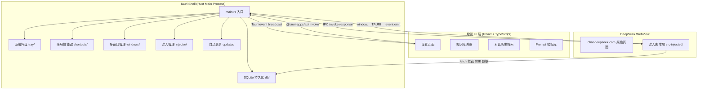

# DeepSeek 桌面客户端 - 技术架构设计文档

> 版本：v1.0 | 更新时间：2026 年 3 月  
> 技术栈：Tauri 2.x + React + TypeScript + Rust  
> 核心思路：WebView 加载 chat.deepseek.com，桌面壳提供增强体验

## 摘要

### 架构总览

本项目是一个基于 Tauri 2.x 的 DeepSeek 第三方桌面客户端。通过系统原生 WebView 加载 chat.deepseek.com，在不违反合规底线的前提下，提供托盘常驻、全局快捷键唤起、对话本地存档与全文搜索、Thinking 链折叠与单独导出、失败自动重试等增强能力。

### 关键决策清单

| # | 决策 | 理由 |
|---|------|------|
| 1 | Tauri 2.x 而非 Electron | 包体 5-8MB vs 60-90MB；内存占用低 3-5 倍；lencx/ChatGPT 已验证 |
| 2 | WebView 直接加载而非 iframe | chat.deepseek.com CSP 禁止跨站 iframe |
| 3 | `initialization_script` 注入而非运行时 eval | 保证在页面 JS 执行前完成 monkey-patch |
| 4 | fetch 拦截 SSE 流而非 DOM 抓取 | 合规（用户 Cookie 自然产生的数据）；稳定（不依赖 DOM 结构） |
| 5 | SQLite + FTS5 而非 IndexedDB | Rust 原生访问；全文搜索性能优异；跨窗口共享 |
| 6 | Zustand 状态管理 | 轻量、TypeScript 友好、无 boilerplate |
| 7 | shadcn/ui + Tailwind CSS | 可定制性强、无运行时开销、与 Tauri 小包体理念一致 |
| 8 | 单一默认 `data_directory`（V2 视需求引入多账号） | MVP 不做多账号——DeepSeek 无 workspace 体系、免费不限量、浏览器 Profile 已能覆盖；架构上预留切换接口 |
| 9 | Tesseract 轻量版打包（30-50MB） | 离线本地 OCR，不依赖网络；中英文模型覆盖主流场景；避免上传截图到第三方 OCR 服务的隐私风险 |
| 10 | 注入式增强采用"探测 + 降级"双层策略 | DeepSeek 改版或官方上线对应功能时自动隐藏增强 UI；不强制关闭让用户自主选择；确保产品可优雅退场 |

---

## 1. 总体架构

### 1.1 高层架构图



### 1.2 进程模型

| 进程 | 职责 | 技术实现 |
|------|------|---------|
| Tauri Main Process (Rust) | 系统能力调度：托盘、快捷键、窗口管理、数据库读写、文件 I/O | 单进程，tokio 异步运行时 |
| DeepSeek WebView 进程 | 渲染 chat.deepseek.com + 运行注入脚本 | Windows: WebView2 (Edge)；macOS: WKWebView；Linux: WebKitGTK |
| 增强 UI 窗口进程 | 渲染 React 增强界面（设置、知识库、Prompt 库） | 独立 WebView，加载本地 dist/ 资源 |

### 1.3 数据流

```
用户操作（快捷键/托盘/浮窗输入）
    ↓
增强 UI (React) 或 注入脚本
    ↓ invoke / event.emit
Tauri IPC 层
    ↓
Rust Command Handler
    ↓
系统能力（SQLite / 文件系统 / 窗口 API / 通知）
    ↓ event broadcast
前端监听更新 UI
```

**关键数据流 - SSE 对话存档**：
```
chat.deepseek.com 发起 fetch → 注入脚本拦截 → 逐 chunk 收集 SSE →
完整消息拼接 → emit("message:captured", payload) → Rust 写入 SQLite
```

## 2. 项目目录结构

```
deepseek-desktop/
├── src-tauri/                    # Rust 后端（Tauri 核心）
│   ├── Cargo.toml                # Rust 依赖与构建配置
│   ├── tauri.conf.json           # Tauri 应用配置（窗口、权限、更新）
│   ├── capabilities/             # Tauri 权限声明（最小权限原则）
│   │   └── default.json
│   ├── icons/                    # 应用图标（各平台各尺寸）
│   ├── src/
│   │   ├── main.rs               # 入口：初始化 Tauri Builder
│   │   ├── lib.rs                # 模块注册与 setup 逻辑
│   │   ├── commands/             # Tauri command handlers（前端可调用的 Rust 函数）
│   │   │   ├── mod.rs
│   │   │   ├── message.rs        # 消息存储/查询/导出
│   │   │   ├── conversation.rs   # 对话管理
│   │   │   ├── search.rs         # 全文搜索
│   │   │   ├── settings.rs       # 设置读写
│   │   │   └── prompt.rs         # Prompt 模板 CRUD
│   │   ├── tray/                 # 系统托盘逻辑
│   │   │   └── mod.rs
│   │   ├── shortcuts/            # 全局快捷键注册与处理
│   │   │   └── mod.rs
│   │   ├── windows/              # 多窗口创建与管理
│   │   │   ├── mod.rs
│   │   │   ├── main_window.rs    # 主窗口（DeepSeek WebView）
│   │   │   ├── quick_window.rs   # 快捷浮窗
│   │   │   ├── settings_window.rs
│   │   │   └── knowledge_window.rs
│   │   ├── db/                   # SQLite 数据库层
│   │   │   ├── mod.rs
│   │   │   ├── migrations/       # 数据库迁移脚本
│   │   │   ├── models.rs         # 数据结构定义
│   │   │   └── queries.rs        # SQL 查询封装
│   │   ├── injector/             # 注入脚本管理
│   │   │   └── mod.rs            # 读取、拼接、版本管理注入脚本
│   │   └── updater/              # 自动更新逻辑
│   │       └── mod.rs
│   └── resources/                # 打包进二进制的静态资源
│       └── inject-scripts/       # 预编译的注入脚本 bundle
├── src/                          # React 增强 UI（Vite + TypeScript）
│   ├── main.tsx                  # React 入口
│   ├── App.tsx                   # 路由根组件
│   ├── routes/                   # 页面路由
│   │   ├── settings/             # 设置页
│   │   ├── knowledge/            # 知识库浏览
│   │   ├── history/              # 对话历史搜索
│   │   └── prompts/              # Prompt 模板管理
│   ├── components/               # 通用 UI 组件（shadcn/ui）
│   ├── hooks/                    # 自定义 React Hooks
│   ├── stores/                   # Zustand 状态管理
│   ├── lib/                      # 工具函数
│   │   ├── tauri.ts              # Tauri API 调用封装
│   │   └── ipc.ts                # IPC 事件监听封装
│   ├── styles/                   # Tailwind CSS 全局样式
│   └── types/                    # TypeScript 类型定义
├── src-injected/                 # 注入到 DeepSeek WebView 的脚本
│   ├── index.ts                  # 注入入口（编译为单文件 IIFE）
│   ├── interceptors/             # 请求拦截器
│   │   ├── fetch.ts              # fetch monkey-patch
│   │   └── sse-parser.ts         # SSE 流解析
│   ├── enhancers/                # DOM/CSS 增强
│   │   ├── immersive.css         # 沉浸式模式样式
│   │   ├── thinking-chain.ts     # Thinking 链折叠优化
│   │   └── theme.ts              # 主题注入
│   ├── bridge/                   # 与 Tauri 后端通信桥
│   │   └── tauri-bridge.ts       # window.__TAURI__ 封装
│   ├── retry/                    # 自动重试逻辑
│   │   └── auto-retry.ts
│   └── utils/                    # 工具函数
│       └── version-detect.ts     # 检测 chat.deepseek.com 版本变化
├── scripts/                      # 构建与开发脚本
│   ├── build-inject.ts           # 编译 src-injected/ 为单文件
│   ├── dev-inject.ts             # 开发模式注入脚本热重载
│   └── generate-icons.ts         # 图标生成
├── docs/                         # 项目文档
│   ├── ARCHITECTURE.md           # 本文档
│   └── research/                 # 调研报告
├── tests/                        # 测试
│   ├── unit/                     # 单元测试（Vitest）
│   ├── e2e/                      # E2E 测试（Playwright）
│   └── inject/                   # 注入脚本回归测试
├── .github/
│   └── workflows/                # GitHub Actions CI/CD
│       ├── ci.yml                # PR 检查
│       └── release.yml           # 构建发布
├── package.json                  # Node.js 依赖
├── pnpm-workspace.yaml           # pnpm workspace 配置
├── vite.config.ts                # Vite 构建配置
├── tailwind.config.ts            # Tailwind CSS 配置
├── tsconfig.json                 # TypeScript 配置
└── README.md                     # 项目说明
```

## 3. 模块拆分

### 3.1 Rust 模块（src-tauri/src/）

#### 入口：main.rs + lib.rs

```rust
// src-tauri/src/main.rs
#![cfg_attr(not(debug_assertions), windows_subsystem = "windows")]

fn main() {
    deepseek_desktop_lib::run();
}
```

```rust
// src-tauri/src/lib.rs
mod commands;
mod tray;
mod shortcuts;
mod windows;
mod db;
mod injector;
mod updater;

use tauri::Manager;

pub fn run() {
    tauri::Builder::default()
        .plugin(tauri_plugin_global_shortcut::Builder::new().build())
        .plugin(tauri_plugin_notification::init())
        .plugin(tauri_plugin_updater::Builder::new().build())
        .plugin(tauri_plugin_fs::init())
        .setup(|app| {
            // 初始化数据库
            db::init(app.handle())?;
            // 初始化系统托盘
            tray::create_tray(app)?;
            // 注册全局快捷键
            shortcuts::register(app)?;
            // 创建主窗口（加载 chat.deepseek.com）
            windows::create_main_window(app)?;
            Ok(())
        })
        .invoke_handler(tauri::generate_handler![
            commands::message::save_message,
            commands::message::get_messages,
            commands::message::export_conversation,
            commands::conversation::list_conversations,
            commands::conversation::delete_conversation,
            commands::search::search_history,
            commands::settings::get_settings,
            commands::settings::update_settings,
            commands::prompt::list_prompts,
            commands::prompt::save_prompt,
        ])
        .run(tauri::generate_context!())
        .expect("error while running tauri application");
}
```

#### commands/ — Tauri Command Handlers

每个 command 是一个 `#[tauri::command]` 标注的异步函数，前端通过 `invoke("command_name", args)` 调用。

```rust
// src-tauri/src/commands/message.rs
use crate::db;
use serde::{Deserialize, Serialize};

#[derive(Debug, Serialize, Deserialize)]
pub struct MessagePayload {
    pub conversation_id: String,
    pub role: String,           // "user" | "assistant"
    pub content: String,        // 原始 Markdown
    pub model: Option<String>,  // "deepseek-v4-pro" 等
    pub thinking: Option<String>, // Thinking 链内容
    pub timestamp: i64,
}

#[tauri::command]
pub async fn save_message(
    app: tauri::AppHandle,
    payload: MessagePayload,
) -> Result<i64, String> {
    db::insert_message(&app, &payload)
        .map_err(|e| e.to_string())
}

#[tauri::command]
pub async fn get_messages(
    app: tauri::AppHandle,
    conversation_id: String,
) -> Result<Vec<MessagePayload>, String> {
    db::get_messages_by_conversation(&app, &conversation_id)
        .map_err(|e| e.to_string())
}

#[tauri::command]
pub async fn export_conversation(
    app: tauri::AppHandle,
    conversation_id: String,
    format: String, // "markdown" | "json" | "pdf"
) -> Result<String, String> {
    // 返回导出文件路径
    db::export_conversation(&app, &conversation_id, &format)
        .map_err(|e| e.to_string())
}
```

#### tray/ — 系统托盘

```rust
// src-tauri/src/tray/mod.rs
use tauri::{
    tray::{MouseButton, MouseButtonState, TrayIconBuilder, TrayIconEvent},
    menu::{Menu, MenuItem},
    Manager, Runtime,
};

pub fn create_tray<R: Runtime>(app: &tauri::App<R>) -> Result<(), Box<dyn std::error::Error>> {
    let show = MenuItem::with_id(app, "show", "显示主窗口", true, None::<&str>)?;
    let quick = MenuItem::with_id(app, "quick", "快捷提问", true, None::<&str>)?;
    let quit = MenuItem::with_id(app, "quit", "退出", true, None::<&str>)?;
    let menu = Menu::with_items(app, &[&show, &quick, &quit])?;

    TrayIconBuilder::new()
        .icon(app.default_window_icon().unwrap().clone())
        .menu(&menu)
        .on_menu_event(|app, event| match event.id.as_ref() {
            "show" => {
                if let Some(window) = app.get_webview_window("main") {
                    let _ = window.show();
                    let _ = window.set_focus();
                }
            }
            "quick" => {
                let _ = app.emit("shortcut:quick-window", ());
            }
            "quit" => {
                app.exit(0);
            }
            _ => {}
        })
        .on_tray_icon_event(|tray, event| {
            if let TrayIconEvent::Click {
                button: MouseButton::Left,
                button_state: MouseButtonState::Up,
                ..
            } = event
            {
                let app = tray.app_handle();
                if let Some(window) = app.get_webview_window("main") {
                    let _ = window.show();
                    let _ = window.set_focus();
                }
            }
        })
        .build(app)?;

    Ok(())
}
```

#### shortcuts/ — 全局快捷键

```rust
// src-tauri/src/shortcuts/mod.rs
use tauri::Manager;
use tauri_plugin_global_shortcut::{Code, GlobalShortcutExt, Modifiers, Shortcut};

pub fn register(app: &tauri::App) -> Result<(), Box<dyn std::error::Error>> {
    // Ctrl+Shift+K (Windows/Linux) / Cmd+Shift+K (macOS) 唤起浮窗
    let shortcut = Shortcut::new(Some(Modifiers::CONTROL | Modifiers::SHIFT), Code::KeyK);

    app.global_shortcut().on_shortcut(shortcut, |app, _scut, event| {
        if event.state == tauri_plugin_global_shortcut::ShortcutState::Pressed {
            let _ = app.emit("shortcut:quick-window", ());
        }
    })?;

    Ok(())
}
```

#### windows/ — 多窗口管理

```rust
// src-tauri/src/windows/main_window.rs
use tauri::{Manager, WebviewUrl, WebviewWindowBuilder};
use crate::injector;

pub fn create_main_window(app: &tauri::App) -> Result<(), Box<dyn std::error::Error>> {
    let inject_script = injector::get_initialization_script(app)?;

    WebviewWindowBuilder::new(app, "main", WebviewUrl::External(
        "https://chat.deepseek.com".parse().unwrap()
    ))
    .title("DeepSeek Desktop")
    .inner_size(1200.0, 800.0)
    .min_inner_size(800.0, 600.0)
    .initialization_script(&inject_script)
    .user_agent("Mozilla/5.0 (Windows NT 10.0; Win64; x64) AppleWebKit/537.36 (KHTML, like Gecko) Chrome/131.0.0.0 Safari/537.36")
    .data_directory(app.path().app_data_dir()?.join("webview-data/default"))
    .build()?;

    Ok(())
}
```

```rust
// src-tauri/src/windows/quick_window.rs
use tauri::{Manager, WebviewUrl, WebviewWindowBuilder, LogicalPosition, LogicalSize};

pub fn toggle_quick_window(app: &tauri::AppHandle) -> Result<(), Box<dyn std::error::Error>> {
    if let Some(window) = app.get_webview_window("quick") {
        if window.is_visible().unwrap_or(false) {
            window.hide()?;
        } else {
            window.show()?;
            window.set_focus()?;
        }
    } else {
        // 首次创建浮窗
        let inject_script = crate::injector::get_initialization_script_for_quick(app)?;

        let window = WebviewWindowBuilder::new(app, "quick", WebviewUrl::External(
            "https://chat.deepseek.com".parse().unwrap()
        ))
        .title("Quick Ask")
        .inner_size(600.0, 500.0)
        .decorations(false)
        .always_on_top(true)
        .skip_taskbar(true)
        .center()
        .initialization_script(&inject_script)
        .build()?;

        // 失焦自动隐藏
        let win_clone = window.clone();
        window.on_window_event(move |event| {
            if let tauri::WindowEvent::Focused(false) = event {
                let _ = win_clone.hide();
            }
        });
    }
    Ok(())
}
```

#### db/ — SQLite 持久化

使用 `rusqlite` crate（编译时静态链接 SQLite，无需系统安装），启用 FTS5 扩展。

```rust
// src-tauri/src/db/mod.rs
pub mod models;
pub mod queries;
mod migrations;

use rusqlite::Connection;
use std::sync::Mutex;
use tauri::{AppHandle, Manager};

pub struct Database(pub Mutex<Connection>);

pub fn init(app: &AppHandle) -> Result<(), Box<dyn std::error::Error>> {
    let db_path = app.path().app_data_dir()?.join("deepseek.db");
    std::fs::create_dir_all(db_path.parent().unwrap())?;

    let conn = Connection::open(&db_path)?;
    // 启用 WAL 模式提升并发性能
    conn.execute_batch("PRAGMA journal_mode=WAL; PRAGMA foreign_keys=ON;")?;
    // 运行迁移
    migrations::run(&conn)?;

    app.manage(Database(Mutex::new(conn)));
    Ok(())
}
```

#### injector/ — 注入脚本管理

```rust
// src-tauri/src/injector/mod.rs
use tauri::AppHandle;

/// 读取预编译的注入脚本 bundle
/// 开发模式从文件系统读取，生产模式从 resources 读取
pub fn get_initialization_script(app: &AppHandle) -> Result<String, Box<dyn std::error::Error>> {
    let script_path = if cfg!(debug_assertions) {
        // 开发模式：从 src-injected 编译输出读取
        std::path::PathBuf::from("../dist-injected/bundle.js")
    } else {
        // 生产模式：从打包资源读取
        app.path().resource_dir()?.join("inject-scripts/bundle.js")
    };

    let script = std::fs::read_to_string(&script_path)
        .unwrap_or_else(|_| include_str!("../../resources/inject-scripts/bundle.js").to_string());

    Ok(script)
}

pub fn get_initialization_script_for_quick(app: &AppHandle) -> Result<String, Box<dyn std::error::Error>> {
    let mut script = get_initialization_script(app)?;
    // 浮窗模式额外注入沉浸式 CSS
    script.push_str("\n__DEEPSEEK_DESKTOP__.enableImmersiveMode();");
    Ok(script)
}
```

#### 关于多账号 — MVP 不实现，但架构预留

**MVP 决策**：不引入多账号管理。理由：DeepSeek 没有 workspace 体系（A 账号与 B 账号能力完全一样）、网页版免费不限量（无薅羊毛动机）、浏览器 Profile 已能覆盖少数"工作/个人分离"用户。强行做反而抬高数据模型与切换交互的复杂度，分散 MVP 注意力。

**架构预留**：所有涉及账号上下文的代码（`data_directory` 路径、SQLite `conversations.account_id` 字段、IPC 接口）都按"未来可能扩展为多账号"的形态写就，但 MVP 阶段固定使用 `account_id = "default"`：

```rust
// src-tauri/src/account/mod.rs - MVP 简化实现
pub const DEFAULT_ACCOUNT_ID: &str = "default";

/// 返回 WebView 的 data_directory。MVP 固定返回 default 路径，
/// V2 引入多账号后改为按 account_id 路由。
pub fn get_data_directory(app: &tauri::AppHandle) -> std::path::PathBuf {
    app.path().app_data_dir()
        .unwrap()
        .join("webview-data")
        .join(DEFAULT_ACCOUNT_ID)
}
```

**升级路径**：V2 若引入多账号，只需扩展 `get_data_directory(app, account_id)` 接口、增加 `accounts` 表的 CRUD、加托盘菜单的切换器，**数据库 schema 与 IPC 协议都不需要破坏性变更**。

### 3.2 React 增强 UI（src/）

#### 路由结构

```typescript
// src/App.tsx
import { BrowserRouter, Routes, Route } from 'react-router-dom';
import { SettingsPage } from './routes/settings';
import { KnowledgePage } from './routes/knowledge';
import { HistoryPage } from './routes/history';
import { PromptsPage } from './routes/prompts';

export function App() {
  return (
    <BrowserRouter>
      <Routes>
        <Route path="/settings" element={<SettingsPage />} />
        <Route path="/knowledge" element={<KnowledgePage />} />
        <Route path="/history" element={<HistoryPage />} />
        <Route path="/prompts" element={<PromptsPage />} />
      </Routes>
    </BrowserRouter>
  );
}
```

#### 状态管理（Zustand）

选择 Zustand 而非 Redux/Jotai 的理由：API 极简、TypeScript 推断完美、无 Provider 包裹、支持 persist 中间件。

```typescript
// src/stores/settings.ts
import { create } from 'zustand';
import { persist } from 'zustand/middleware';
import { invoke } from '@tauri-apps/api/core';

interface SettingsState {
  theme: 'system' | 'light' | 'dark';
  immersiveMode: boolean;
  autoRetry: boolean;
  retryMaxAttempts: number;
  quickWindowShortcut: string;
  setTheme: (theme: SettingsState['theme']) => void;
  toggleImmersive: () => void;
  syncFromRust: () => Promise<void>;
}

export const useSettingsStore = create<SettingsState>()(
  persist(
    (set) => ({
      theme: 'system',
      immersiveMode: false,
      autoRetry: true,
      retryMaxAttempts: 5,
      quickWindowShortcut: 'Ctrl+Shift+K',
      setTheme: (theme) => set({ theme }),
      toggleImmersive: () => set((s) => ({ immersiveMode: !s.immersiveMode })),
      syncFromRust: async () => {
        const settings = await invoke<Record<string, unknown>>('get_settings');
        set(settings as Partial<SettingsState>);
      },
    }),
    { name: 'deepseek-settings' }
  )
);
```

#### Tauri API 调用层

```typescript
// src/lib/tauri.ts
import { invoke } from '@tauri-apps/api/core';
import { listen, emit } from '@tauri-apps/api/event';

export const api = {
  // 对话相关
  searchHistory: (query: string, limit?: number) =>
    invoke<SearchResult[]>('search_history', { query, limit: limit ?? 50 }),

  getMessages: (conversationId: string) =>
    invoke<Message[]>('get_messages', { conversationId }),

  exportConversation: (conversationId: string, format: 'markdown' | 'json' | 'pdf') =>
    invoke<string>('export_conversation', { conversationId, format }),

  // 设置相关
  getSettings: () => invoke<Settings>('get_settings'),
  updateSettings: (settings: Partial<Settings>) =>
    invoke('update_settings', { settings }),

  // Prompt 相关
  listPrompts: () => invoke<Prompt[]>('list_prompts'),
  savePrompt: (prompt: Prompt) => invoke('save_prompt', { prompt }),
};

// 事件监听
export const events = {
  onMessageCaptured: (handler: (msg: Message) => void) =>
    listen<Message>('message:captured', (e) => handler(e.payload)),

  onConversationUpdated: (handler: (id: string) => void) =>
    listen<string>('conversation:updated', (e) => handler(e.payload)),
};
```

#### UI 组件库选型

**推荐：shadcn/ui + Tailwind CSS**

| 对比项 | shadcn/ui + Tailwind | Ant Design 5 |
|--------|---------------------|---------------|
| 包体影响 | 零运行时（编译时 CSS） | ~200KB+ JS runtime |
| 定制性 | 源码级定制，完全可控 | 主题 token 定制，深度定制需 hack |
| 与 Tauri 理念 | 一致（极小包体） | 冲突（引入大量 JS） |
| 组件质量 | 基于 Radix UI，无障碍优秀 | 企业级完善 |
| 学习曲线 | 低（就是 Tailwind class） | 中（API 多） |

shadcn/ui 的核心优势：组件代码直接复制到项目中，不是 npm 依赖，可以随意修改，不会因为上游更新而 break。

### 3.3 注入脚本（src-injected/）

注入脚本是本项目的核心差异化所在。它运行在 chat.deepseek.com 的页面上下文中，但通过 `window.__TAURI__` 与 Rust 后端通信。

#### 入口文件

```typescript
// src-injected/index.ts
import { setupFetchInterceptor } from './interceptors/fetch';
import { setupAutoRetry } from './retry/auto-retry';
import { setupTheme } from './enhancers/theme';
import { setupThinkingChain } from './enhancers/thinking-chain';
import { setupBridge } from './bridge/tauri-bridge';
import { detectVersionChange } from './utils/version-detect';

// 全局命名空间，避免污染
(window as any).__DEEPSEEK_DESKTOP__ = {
  version: '__BUILD_VERSION__',
  initialized: false,

  async init() {
    try {
      // 1. 建立与 Tauri 后端的通信桥
      await setupBridge();

      // 2. 安装 fetch 拦截器（必须在页面 JS 执行前）
      setupFetchInterceptor();

      // 3. 安装自动重试
      setupAutoRetry();

      // 4. 注入主题 CSS
      setupTheme();

      // 5. Thinking 链增强（等 DOM ready）
      if (document.readyState === 'loading') {
        document.addEventListener('DOMContentLoaded', setupThinkingChain);
      } else {
        setupThinkingChain();
      }

      // 6. 版本变化检测
      detectVersionChange();

      this.initialized = true;
      console.log('[DeepSeek Desktop] Injected script initialized');
    } catch (err) {
      console.error('[DeepSeek Desktop] Init failed:', err);
      // 优雅失败：不影响原始页面功能
    }
  },

  enableImmersiveMode() {
    document.documentElement.classList.add('ds-immersive');
  },
};

// 立即执行初始化
(window as any).__DEEPSEEK_DESKTOP__.init();
```

#### fetch/XHR 拦截器

```typescript
// src-injected/interceptors/fetch.ts
import { parseSSEStream } from './sse-parser';
import { bridge } from '../bridge/tauri-bridge';

const originalFetch = window.fetch;

export function setupFetchInterceptor() {
  window.fetch = async function (input: RequestInfo | URL, init?: RequestInit) {
    const url = typeof input === 'string' ? input : input instanceof URL ? input.href : input.url;

    // 只拦截 DeepSeek 的 chat 接口
    if (!url.includes('/api/v0/chat/completion')) {
      return originalFetch.call(this, input, init);
    }

    const response = await originalFetch.call(this, input, init);

    // 克隆 response 以便同时读取（原始消费给页面，克隆给我们）
    const clonedResponse = response.clone();

    // 异步处理，不阻塞页面
    processSSEResponse(clonedResponse, url, init).catch((err) => {
      console.warn('[DeepSeek Desktop] SSE capture error:', err);
    });

    return response;
  };
}

async function processSSEResponse(response: Response, url: string, init?: RequestInit) {
  if (!response.body) return;

  // 从请求体提取用户消息
  const requestBody = init?.body ? JSON.parse(init.body as string) : null;
  const conversationId = requestBody?.conversation_id || 'unknown';
  const userMessage = requestBody?.messages?.slice(-1)?.[0]?.content || '';

  // 先保存用户消息
  await bridge.emit('message:captured', {
    conversation_id: conversationId,
    role: 'user',
    content: userMessage,
    timestamp: Date.now(),
  });

  // 解析 SSE 流，收集完整的 assistant 回复
  const result = await parseSSEStream(response.body);

  // 保存 assistant 回复
  await bridge.emit('message:captured', {
    conversation_id: conversationId,
    role: 'assistant',
    content: result.content,
    thinking: result.thinking || null,
    model: result.model || null,
    timestamp: Date.now(),
  });
}
```

#### SSE 流解析

```typescript
// src-injected/interceptors/sse-parser.ts

interface SSEResult {
  content: string;
  thinking: string;
  model: string | null;
}

export async function parseSSEStream(body: ReadableStream<Uint8Array>): Promise<SSEResult> {
  const reader = body.getReader();
  const decoder = new TextDecoder();
  let buffer = '';
  let content = '';
  let thinking = '';
  let model: string | null = null;

  try {
    while (true) {
      const { done, value } = await reader.read();
      if (done) break;

      buffer += decoder.decode(value, { stream: true });
      const lines = buffer.split('\n');
      buffer = lines.pop() || ''; // 保留不完整的最后一行

      for (const line of lines) {
        if (!line.startsWith('data: ')) continue;
        const data = line.slice(6).trim();
        if (data === '[DONE]') continue;

        try {
          const parsed = JSON.parse(data);
          const delta = parsed.choices?.[0]?.delta;
          if (!delta) continue;

          // DeepSeek 的 SSE 格式：content 是正文，reasoning_content 是思考链
          if (delta.content) {
            content += delta.content;
          }
          if (delta.reasoning_content) {
            thinking += delta.reasoning_content;
          }
          if (parsed.model) {
            model = parsed.model;
          }
        } catch {
          // 忽略解析失败的行
        }
      }
    }
  } finally {
    reader.releaseLock();
  }

  return { content, thinking, model };
}
```

#### 与 Rust 后端的通信桥

```typescript
// src-injected/bridge/tauri-bridge.ts

interface TauriBridge {
  emit: (event: string, payload: unknown) => Promise<void>;
  listen: (event: string, handler: (payload: unknown) => void) => Promise<() => void>;
  ready: boolean;
}

export const bridge: TauriBridge = {
  ready: false,

  async emit(event: string, payload: unknown) {
    if (!(window as any).__TAURI__) {
      console.warn('[DeepSeek Desktop] Tauri API not available');
      return;
    }
    try {
      await (window as any).__TAURI__.event.emit(event, payload);
    } catch (err) {
      console.error(`[DeepSeek Desktop] emit(${event}) failed:`, err);
    }
  },

  async listen(event: string, handler: (payload: unknown) => void) {
    if (!(window as any).__TAURI__) {
      return () => {};
    }
    return (window as any).__TAURI__.event.listen(event, (e: { payload: unknown }) => {
      handler(e.payload);
    });
  },
};

export async function setupBridge() {
  // 等待 __TAURI__ 可用（initialization_script 保证在页面 JS 前执行，
  // 但 __TAURI__ 对象可能稍后注入）
  let attempts = 0;
  while (!(window as any).__TAURI__ && attempts < 50) {
    await new Promise((r) => setTimeout(r, 100));
    attempts++;
  }

  if ((window as any).__TAURI__) {
    bridge.ready = true;
    await bridge.emit('injected:ready', { version: (window as any).__DEEPSEEK_DESKTOP__.version });
  } else {
    console.warn('[DeepSeek Desktop] Tauri bridge timeout, running in degraded mode');
  }
}
```

## 4. 关键技术方案

### 4.1 WebView 加载与 Cookie 持久化

#### Tauri 2 WebView 配置

```json
// src-tauri/tauri.conf.json 关键配置
{
  "app": {
    "windows": [
      {
        "label": "main",
        "url": "https://chat.deepseek.com",
        "title": "DeepSeek Desktop",
        "width": 1200,
        "height": 800,
        "minWidth": 800,
        "minHeight": 600,
        "userAgent": "Mozilla/5.0 (Windows NT 10.0; Win64; x64) AppleWebKit/537.36"
      }
    ]
  }
}
```

关键点：
- `url` 设为外部 URL，Tauri 会用系统 WebView 直接加载
- `userAgent` 使用标准 Chrome UA，避免被 DeepSeek 识别为非浏览器
- `initialization_script` 在代码中动态设置（见 windows/main_window.rs）

#### Cookie 容器策略

#### Cookie 持久化方案（MVP：单一容器）

**MVP 决策**：使用单一固定的 `data_directory`，路径为 `app_data_dir/webview-data/default`，确保用户登录态在重启后保持。多账号能力**不在 MVP 范围**（理由见 3.1 末尾），但代码以"按 account_id 路由"的形态写就，为 V2 平滑升级预留：

```rust
// MVP 实现 — 固定容器
let data_dir = app.path().app_data_dir()?
    .join("webview-data/default");

WebviewWindowBuilder::new(app, "main", url)
    .data_directory(data_dir)  // Cookie、localStorage、Cache 持久化
    .build()?;
```

**V2 多账号升级路径**（不破坏 MVP）：将固定路径替换为按 `account_id` 拼接，并在切换账号时关闭当前 WebView + 用新 `data_directory` 重开：

```rust
// V2 多账号扩展（仅作前瞻示意，不进 MVP）
let data_dir = app.path().app_data_dir()?
    .join(format!("webview-data/{}", account_id));
```

**为什么不用 Cookie 命名空间**：WebView2/WKWebView 不提供细粒度 Cookie 分区 API，`data_directory` 是唯一可靠的完全隔离方案——MVP 阶段不消费这一能力，但选择它是为了 V2 升级时无需更换底层方案。

#### 跨平台差异

| 平台 | WebView 引擎 | Cookie 持久化 | 注意事项 |
|------|-------------|--------------|---------|
| Windows | WebView2 (Edge) | 自动持久化到 data_directory | 需要 WebView2 Runtime（Win10+ 预装） |
| macOS | WKWebView | 自动持久化到 WKWebsiteDataStore | `data_directory` 映射到独立 DataStore |
| Linux | WebKitGTK | 自动持久化 | 需安装 `libwebkit2gtk-4.1`；部分发行版版本较旧 |

### 4.2 注入脚本架构

#### 注入时机

| 方式 | 时机 | 适用场景 |
|------|------|---------|
| `initialization_script` | WebView 创建时，**在任何页面 JS 执行前** | ✅ 首选。monkey-patch fetch/XHR 必须在页面代码执行前完成 |
| `WebviewWindow::eval()` | 运行时动态执行 | 适合响应用户操作的一次性脚本（如切换主题） |
| page-load 事件 | 页面加载完成后 | 太晚，无法拦截已发出的请求 |

**结论**：核心拦截逻辑必须用 `initialization_script`，确保 fetch monkey-patch 在 chat.deepseek.com 的 JS bundle 执行前就位。

#### 注入脚本与 Tauri 后端的通信

Tauri 2.x 在 WebView 中自动注入 `window.__TAURI__` 对象（前提是 capabilities 中授权了对应权限）。注入脚本通过它与 Rust 后端双向通信：

```typescript
// 注入脚本 → Rust：发送事件
await window.__TAURI__.event.emit('message:captured', payload);

// Rust → 注入脚本：监听事件
window.__TAURI__.event.listen('settings:updated', (event) => {
  applySettings(event.payload);
});
```

**安全约束**：必须在 `capabilities/default.json` 中显式声明允许哪些事件和 command，否则调用会被拒绝。

#### 注入脚本的版本与热更新

```typescript
// src-injected/utils/version-detect.ts

const KNOWN_SELECTORS = {
  chatInput: '[data-testid="chat-input"], .chat-input, #chat-input',
  messageList: '.message-list, [data-testid="message-list"]',
  sidebar: '.sidebar, nav[class*="sidebar"]',
};

export function detectVersionChange() {
  // 定期检查关键 DOM 元素是否存在
  const observer = new MutationObserver(() => {
    const missing = Object.entries(KNOWN_SELECTORS).filter(
      ([_, selector]) => !document.querySelector(selector)
    );

    if (missing.length > 0) {
      console.warn('[DeepSeek Desktop] DOM structure changed, some features may not work:', missing.map(([k]) => k));
      // 通知 Rust 后端
      bridge.emit('inject:version-mismatch', {
        missing: missing.map(([k]) => k),
        url: location.href,
      });
    }
  });

  // 页面加载完成后开始监控
  window.addEventListener('load', () => {
    observer.observe(document.body, { childList: true, subtree: true });
    // 5 秒后停止（只检测初始加载）
    setTimeout(() => observer.disconnect(), 5000);
  });
}
```

#### 优雅失败策略

注入脚本的每个功能模块都独立 try-catch，单个模块失败不影响其他模块和原始页面：

```typescript
const modules = [
  { name: 'fetch-interceptor', init: setupFetchInterceptor },
  { name: 'auto-retry', init: setupAutoRetry },
  { name: 'theme', init: setupTheme },
  { name: 'thinking-chain', init: setupThinkingChain },
];

for (const mod of modules) {
  try {
    mod.init();
  } catch (err) {
    console.error(`[DeepSeek Desktop] Module "${mod.name}" failed:`, err);
    bridge.emit('inject:module-error', { module: mod.name, error: String(err) });
    // 继续初始化其他模块
  }
}
```

### 4.3 SSE 流拦截与对话存档

#### 拦截策略

重写 `window.fetch`，仅拦截匹配 DeepSeek chat completion 端点的请求：

```typescript
// 匹配规则（宽松匹配，适应 URL 变化）
const SSE_ENDPOINTS = [
  '/api/v0/chat/completion',
  '/api/v1/chat/completions',
];

function shouldIntercept(url: string): boolean {
  return SSE_ENDPOINTS.some(ep => url.includes(ep));
}
```

#### 流式响应逐 chunk 收集策略

```
原始 fetch 返回 Response
    ↓ response.clone()
┌─────────────────────────────────────┐
│ 原始 Response → 交给页面正常消费      │
│ 克隆 Response → 我们异步读取 SSE 流   │
└─────────────────────────────────────┘
    ↓ ReadableStream.getReader()
逐 chunk 解码 → 按 \n 分割 → 解析 data: JSON
    ↓
累积 content + reasoning_content
    ↓ 流结束（done=true 或 data: [DONE]）
组装完整消息 → emit 到 Rust 后端 → 写入 SQLite
```

**关键设计**：使用 `response.clone()` 而非 tee，因为 tee 会在一端消费慢时 backpressure 另一端。clone 让页面和我们的处理完全独立。

#### 存储模型设计

```sql
-- 对话表
CREATE TABLE conversations (
    id TEXT PRIMARY KEY,              -- 对应 DeepSeek 服务器的 conversation_id
    title TEXT,                       -- 对话标题（从首条消息截取或用户重命名）
    account_id TEXT NOT NULL,         -- 关联账号
    model TEXT,                       -- 使用的模型
    message_count INTEGER DEFAULT 0,
    created_at INTEGER NOT NULL,      -- Unix timestamp (ms)
    updated_at INTEGER NOT NULL,
    is_archived INTEGER DEFAULT 0,    -- 是否归档
    tags TEXT                         -- JSON 数组 ["tag1", "tag2"]
);

-- 消息表
CREATE TABLE messages (
    id INTEGER PRIMARY KEY AUTOINCREMENT,
    conversation_id TEXT NOT NULL REFERENCES conversations(id) ON DELETE CASCADE,
    role TEXT NOT NULL,               -- 'user' | 'assistant' | 'system'
    content TEXT NOT NULL,            -- 原始 Markdown 内容
    thinking TEXT,                    -- Thinking 链内容（仅 assistant）
    model TEXT,                       -- 具体模型版本
    token_count INTEGER,             -- 估算 token 数
    timestamp INTEGER NOT NULL,
    created_at INTEGER NOT NULL DEFAULT (strftime('%s','now') * 1000)
);

CREATE INDEX idx_messages_conversation ON messages(conversation_id, timestamp);
CREATE INDEX idx_conversations_account ON conversations(account_id, updated_at DESC);
```

#### SQLite FTS5 全文搜索

```sql
-- FTS5 虚拟表（中文分词使用 unicode61 tokenizer + 自定义前缀索引）
CREATE VIRTUAL TABLE messages_fts USING fts5(
    content,
    thinking,
    content=messages,
    content_rowid=id,
    tokenize='unicode61 remove_diacritics 2'
);

-- 触发器：消息插入时自动更新 FTS 索引
CREATE TRIGGER messages_ai AFTER INSERT ON messages BEGIN
    INSERT INTO messages_fts(rowid, content, thinking)
    VALUES (new.id, new.content, new.thinking);
END;

-- 搜索查询
SELECT m.*, c.title as conversation_title,
       highlight(messages_fts, 0, '<mark>', '</mark>') as highlighted
FROM messages_fts
JOIN messages m ON m.id = messages_fts.rowid
JOIN conversations c ON c.id = m.conversation_id
WHERE messages_fts MATCH ?
ORDER BY rank
LIMIT 50;
```

**Rust crate 选择**：`rusqlite` + `bundled` feature（静态编译 SQLite，自带 FTS5）。

```toml
# src-tauri/Cargo.toml
[dependencies]
rusqlite = { version = "0.32", features = ["bundled", "fts5"] }
```

为什么不用 `tauri-plugin-sql`：它是通用 SQL 插件，不支持 FTS5 虚拟表创建和自定义 tokenizer 配置。直接用 rusqlite 更灵活。

#### 对话 ID 映射策略

DeepSeek 的 `conversation_id` 在 SSE 请求体中传递。我们直接使用它作为本地主键，保持与服务器的映射关系：

```typescript
// 从 fetch 请求体提取
const requestBody = JSON.parse(init.body as string);
const conversationId = requestBody.chat_session_id || requestBody.conversation_id;
```

如果用户在网页上删除了对话，本地存档仍然保留（这正是"本地存档"的价值）。

### 4.4 系统托盘与全局快捷键

#### 插件依赖

```toml
# src-tauri/Cargo.toml
[dependencies]
tauri-plugin-global-shortcut = "2"
tauri-plugin-notification = "2"
```

```json
// src-tauri/capabilities/default.json（部分）
{
  "permissions": [
    "global-shortcut:allow-register",
    "global-shortcut:allow-unregister",
    "notification:default"
  ]
}
```

#### 全局快捷键唤起浮窗方案

```rust
// 快捷键触发 → 发送事件 → 事件处理器 toggle 浮窗
app.global_shortcut().on_shortcut(shortcut, |app, _scut, event| {
    if event.state == ShortcutState::Pressed {
        // 在主线程中 toggle 浮窗
        let app = app.clone();
        tauri::async_runtime::spawn(async move {
            if let Err(e) = crate::windows::quick_window::toggle_quick_window(&app) {
                eprintln!("Failed to toggle quick window: {}", e);
            }
        });
    }
});
```

#### 浮窗位置策略

| 策略 | 实现 | 适用场景 |
|------|------|---------|
| 屏幕中央 | `.center()` | 默认策略，最稳定 |
| 鼠标位置 | 获取 cursor position → `.position()` | 适合划词场景 |
| 上次位置 | 持久化窗口位置到 settings | 用户习惯记忆 |

```rust
// 鼠标位置策略（划词唤起时使用）
fn get_cursor_position() -> Option<(f64, f64)> {
    #[cfg(target_os = "windows")]
    {
        use windows::Win32::UI::WindowsAndMessaging::GetCursorPos;
        use windows::Win32::Foundation::POINT;
        let mut point = POINT::default();
        unsafe { GetCursorPos(&mut point).ok()? };
        Some((point.x as f64, point.y as f64))
    }
    #[cfg(target_os = "macos")]
    {
        // macOS 通过 CGEvent 获取
        None // 简化示例
    }
}
```

#### IME 输入法兼容性

浮窗使用标准 WebView 输入框，IME 兼容性由系统 WebView 保证。已知问题：
- Windows：WebView2 对 IME 支持完善，无已知问题
- macOS：WKWebView 在 `decorations: false` 窗口中 IME 候选框位置可能偏移 → 解决方案：保留最小 titlebar 或使用 `titleBarStyle: "overlay"`
- Linux：WebKitGTK 的 fcitx5/ibus 兼容性取决于系统版本

### 4.5 自动更新

#### tauri-plugin-updater 配置

```json
// src-tauri/tauri.conf.json
{
  "plugins": {
    "updater": {
      "endpoints": [
        "https://github.com/YOUR_ORG/deepseek-desktop/releases/latest/download/latest.json"
      ],
      "pubkey": "dW50cnVzdGVkIGNvbW1lbnQ...",
      "windows": {
        "installMode": "passive"
      }
    }
  }
}
```

#### 更新策略

| 更新类型 | 方式 | 大小 | 频率 |
|---------|------|------|------|
| 应用主体 | tauri-plugin-updater（增量 diff） | 1-5 MB | 每 1-2 周 |
| 注入脚本 | 独立热更新（从 CDN 拉取新版 bundle.js） | 10-50 KB | 随时（chat.deepseek.com 改版时） |

#### 注入脚本独立热更新

```rust
// src-tauri/src/updater/mod.rs
use reqwest;
use std::fs;

const INJECT_SCRIPT_URL: &str = "https://cdn.example.com/inject-scripts/latest/bundle.js";
const INJECT_SCRIPT_VERSION_URL: &str = "https://cdn.example.com/inject-scripts/latest/version.json";

pub async fn check_inject_update(app: &tauri::AppHandle) -> Result<bool, Box<dyn std::error::Error>> {
    let version_info: serde_json::Value = reqwest::get(INJECT_SCRIPT_VERSION_URL)
        .await?
        .json()
        .await?;

    let remote_version = version_info["version"].as_str().unwrap_or("0.0.0");
    let local_version = get_local_inject_version(app)?;

    if remote_version != local_version {
        // 下载新版注入脚本
        let script = reqwest::get(INJECT_SCRIPT_URL).await?.text().await?;
        let script_path = app.path().app_data_dir()?.join("inject-scripts/bundle.js");
        fs::create_dir_all(script_path.parent().unwrap())?;
        fs::write(&script_path, &script)?;

        // 通知前端需要刷新 WebView
        app.emit("inject:updated", remote_version)?;
        return Ok(true);
    }
    Ok(false)
}
```

这样当 chat.deepseek.com 改版导致注入脚本失效时，可以在几小时内推送修复，无需用户更新整个应用。

### 4.6 失败自动重试与断网恢复

#### 设计原则

- 仅在 fetch 拦截层做，不做协议层代理（合规）
- 只重试特定错误（服务器繁忙、网络超时），不重试 4xx 客户端错误
- 用户可见的状态指示
- 可配置开关

#### 实现

```typescript
// src-injected/retry/auto-retry.ts
import { bridge } from '../bridge/tauri-bridge';

interface RetryConfig {
  enabled: boolean;
  maxAttempts: number;
  initialDelay: number;  // ms
  maxDelay: number;      // ms
  retryableCodes: number[];
}

const DEFAULT_CONFIG: RetryConfig = {
  enabled: true,
  maxAttempts: 5,
  initialDelay: 1000,
  maxDelay: 30000,
  retryableCodes: [429, 500, 502, 503, 504],
};

let config = { ...DEFAULT_CONFIG };

// 监听设置变更
bridge.listen('settings:retry-config', (payload) => {
  config = { ...DEFAULT_CONFIG, ...(payload as Partial<RetryConfig>) };
});

export function setupAutoRetry() {
  const originalFetch = window.fetch;

  window.fetch = async function (input: RequestInfo | URL, init?: RequestInit) {
    const url = typeof input === 'string' ? input : input instanceof URL ? input.href : input.url;

    // 只对 DeepSeek API 请求做重试
    if (!url.includes('deepseek.com/api/')) {
      return originalFetch.call(this, input, init);
    }

    if (!config.enabled) {
      return originalFetch.call(this, input, init);
    }

    let lastError: Error | null = null;
    let attempt = 0;

    while (attempt < config.maxAttempts) {
      try {
        const response = await originalFetch.call(this, input, init);

        if (config.retryableCodes.includes(response.status)) {
          attempt++;
          if (attempt >= config.maxAttempts) return response;

          const delay = Math.min(
            config.initialDelay * Math.pow(2, attempt - 1) + Math.random() * 500,
            config.maxDelay
          );

          // 通知 UI 显示重试状态
          showRetryIndicator(attempt, config.maxAttempts, delay);
          bridge.emit('retry:attempt', { attempt, maxAttempts: config.maxAttempts, delay });

          await sleep(delay);
          continue;
        }

        // 成功，清除重试指示器
        hideRetryIndicator();
        return response;
      } catch (err) {
        lastError = err as Error;
        attempt++;

        if (attempt >= config.maxAttempts) break;

        // 网络错误也重试
        const delay = Math.min(
          config.initialDelay * Math.pow(2, attempt - 1),
          config.maxDelay
        );
        showRetryIndicator(attempt, config.maxAttempts, delay);
        await sleep(delay);
      }
    }

    hideRetryIndicator();
    throw lastError || new Error('Max retry attempts reached');
  };
}

// 注入 UI 元素显示重试状态
function showRetryIndicator(attempt: number, max: number, delay: number) {
  let indicator = document.getElementById('ds-retry-indicator');
  if (!indicator) {
    indicator = document.createElement('div');
    indicator.id = 'ds-retry-indicator';
    indicator.style.cssText = `
      position: fixed; bottom: 20px; right: 20px; z-index: 99999;
      background: #1a1a2e; color: #e0e0e0; padding: 12px 20px;
      border-radius: 8px; font-size: 14px; box-shadow: 0 4px 12px rgba(0,0,0,0.3);
      display: flex; align-items: center; gap: 8px;
      animation: slideIn 0.3s ease;
    `;
    document.body.appendChild(indicator);
  }
  indicator.innerHTML = `
    <span style="animation: spin 1s linear infinite; display: inline-block;">⟳</span>
    服务器繁忙，正在重试 (${attempt}/${max})...
    <span style="opacity: 0.6; font-size: 12px;">${Math.round(delay/1000)}s 后</span>
  `;
}

function hideRetryIndicator() {
  document.getElementById('ds-retry-indicator')?.remove();
}

function sleep(ms: number) {
  return new Promise(resolve => setTimeout(resolve, ms));
}
```

#### "服务器繁忙"特殊错误码识别

DeepSeek 返回 "服务器繁忙" 时的特征：
- HTTP 429 (Too Many Requests)
- HTTP 503 (Service Unavailable)
- 响应体包含 `"server is busy"` 或 `"请稍后再试"`

```typescript
// 额外检查响应体中的错误信息
if (response.status === 200) {
  const cloned = response.clone();
  const text = await cloned.text();
  if (text.includes('server is busy') || text.includes('请稍后再试')) {
    // 视为可重试错误
    attempt++;
    continue;
  }
}
```

### 4.7 多窗口管理

#### 窗口类型

| 窗口 | label | URL | 特性 |
|------|-------|-----|------|
| 主窗口 | `main` | `https://chat.deepseek.com` | 标准窗口，可最大化 |
| 设置窗 | `settings` | 本地 `/settings` | 固定大小，居中 |
| 知识库窗 | `knowledge` | 本地 `/knowledge` | 可调大小 |
| 快捷浮窗 | `quick` | `https://chat.deepseek.com` | 无边框、置顶、失焦隐藏 |

#### 窗口间通信

所有窗口通过 Tauri event 系统通信，Rust 后端作为消息总线：

```rust
// Rust 端广播事件到所有窗口
app.emit("conversation:updated", conversation_id)?;

// 或定向发送到特定窗口
if let Some(window) = app.get_webview_window("main") {
    window.emit("navigate:conversation", conversation_id)?;
}
```

```typescript
// 前端监听
import { listen } from '@tauri-apps/api/event';

listen('conversation:updated', (event) => {
  refreshConversationList();
});
```

#### 窗口状态持久化

```rust
// 窗口关闭前保存位置和大小
window.on_window_event(|event| {
    if let WindowEvent::CloseRequested { .. } = event {
        if let Ok(position) = window.outer_position() {
            if let Ok(size) = window.outer_size() {
                let state = WindowState {
                    x: position.x,
                    y: position.y,
                    width: size.width,
                    height: size.height,
                    maximized: window.is_maximized().unwrap_or(false),
                };
                // 保存到 settings
                save_window_state(&app, &label, &state);
            }
        }
    }
});
```

### 4.8 数据安全

#### SQLite 加密

**MVP 阶段不加密**，理由：
1. 本地桌面应用，数据在用户自己的文件系统中
2. SQLCipher 集成增加 ~2MB 包体和编译复杂度
3. 用户更关心"数据不上传"而非"本地加密"

**后续可选方案**：
```toml
# 如需加密，替换 rusqlite 为 rusqlite + sqlcipher feature
rusqlite = { version = "0.32", features = ["bundled-sqlcipher"] }
```

#### 用户数据导出/导入

```rust
#[tauri::command]
pub async fn export_all_data(app: tauri::AppHandle, path: String) -> Result<(), String> {
    let db = app.state::<Database>();
    let conn = db.0.lock().unwrap();

    // 导出为 JSON（包含所有对话和消息）
    let conversations = queries::get_all_conversations(&conn)?;
    let export = serde_json::json!({
        "version": 1,
        "exported_at": chrono::Utc::now().to_rfc3339(),
        "conversations": conversations,
    });

    std::fs::write(&path, serde_json::to_string_pretty(&export).unwrap())
        .map_err(|e| e.to_string())
}

#[tauri::command]
pub async fn clear_all_data(app: tauri::AppHandle) -> Result<(), String> {
    let db = app.state::<Database>();
    let conn = db.0.lock().unwrap();
    conn.execute_batch("
        DELETE FROM messages;
        DELETE FROM conversations;
        DELETE FROM prompts;
        VACUUM;
    ").map_err(|e| e.to_string())?;

    // 同时清除 WebView 数据
    // 注意：需要关闭 WebView 后删除 data_directory
    Ok(())
}
```

#### 安全要点

- 本地数据不上传任何第三方服务器
- 自动更新的注入脚本通过 HTTPS + 内容哈希校验
- 用户 Cookie 仅存在于 WebView data_directory 中，Rust 代码不主动读取

### 4.9 Mermaid 渲染注入

#### 设计目标

chat.deepseek.com 不渲染 Mermaid 代码块，仅显示为普通代码高亮。DeepDesk 通过注入脚本识别 ` ```mermaid ` 代码块并调用 Mermaid.js 实时渲染为 SVG，渲染失败时降级为原始代码块。

#### Mermaid.js 打包策略

| 方案 | 优点 | 缺点 | 结论 |
|------|------|------|------|
| 打包进注入脚本 bundle | 离线可用、零延迟 | 增加 bundle 约 800KB（gzip 后 ~250KB） | ✅ 选用 |
| CDN 动态加载 | 不增加包体 | 首次渲染延迟、离线不可用、CDN 被墙 | ❌ |
| 本地 resources 目录 | 离线可用 | 需额外加载逻辑 | 备选 |

选择打包方案：使用 `mermaid/dist/mermaid.min.js`（ESM tree-shake 后约 600KB），通过 esbuild 与注入脚本一起编译为 IIFE。

#### 代码块识别与渲染流程

```typescript
// src-injected/enhancers/mermaid-renderer.ts
import mermaid from 'mermaid';

// Mermaid 初始化配置
mermaid.initialize({
  startOnLoad: false,
  theme: 'default',
  securityLevel: 'strict',  // 禁止 HTML 标签防 XSS
  fontFamily: 'system-ui, -apple-system, sans-serif',
  flowchart: { useMaxWidth: true },
  sequence: { useMaxWidth: true },
});

// 渲染模式：用户可在设置中切换
type RenderMode = 'auto' | 'button-only';
let renderMode: RenderMode = 'auto';

// 监听设置变更
bridge.listen('settings:mermaid-mode', (payload) => {
  renderMode = (payload as { mode: RenderMode }).mode;
});

/**
 * 识别并渲染 Mermaid 代码块
 * 使用 MutationObserver 监听 DOM 变化，实时捕获新出现的代码块
 */
export function setupMermaidRenderer() {
  const observer = new MutationObserver((mutations) => {
    for (const mutation of mutations) {
      for (const node of mutation.addedNodes) {
        if (node instanceof HTMLElement) {
          processMermaidBlocks(node);
        }
      }
    }
  });

  // 监听消息列表区域
  const waitForMessageList = () => {
    const messageContainer = document.querySelector(
      '[class*="message"], [data-testid="message-list"], .markdown-body'
    );
    if (messageContainer) {
      observer.observe(messageContainer, { childList: true, subtree: true });
      // 处理已有的代码块
      processMermaidBlocks(document.body);
    } else {
      setTimeout(waitForMessageList, 500);
    }
  };

  if (document.readyState === 'loading') {
    document.addEventListener('DOMContentLoaded', waitForMessageList);
  } else {
    waitForMessageList();
  }
}

/**
 * 扫描元素内的 mermaid 代码块并渲染
 */
function processMermaidBlocks(root: HTMLElement) {
  // DeepSeek 的代码块结构：<pre><code class="language-mermaid">...</code></pre>
  const codeBlocks = root.querySelectorAll(
    'pre > code.language-mermaid, pre > code[class*="mermaid"]'
  );

  for (const codeEl of codeBlocks) {
    const preEl = codeEl.parentElement as HTMLPreElement;
    if (!preEl || preEl.dataset.dsMermaidProcessed) continue;
    preEl.dataset.dsMermaidProcessed = 'true';

    const source = codeEl.textContent?.trim() || '';
    if (!source) continue;

    if (renderMode === 'auto') {
      renderMermaidBlock(preEl, source);
    } else {
      injectRenderButton(preEl, source);
    }
  }
}

/**
 * 渲染单个 Mermaid 代码块
 */
async function renderMermaidBlock(preEl: HTMLPreElement, source: string) {
  const containerId = `ds-mermaid-${Date.now()}-${Math.random().toString(36).slice(2, 8)}`;

  try {
    // 验证语法是否合法
    const isValid = await mermaid.parse(source);
    if (!isValid) throw new Error('Invalid mermaid syntax');

    // 创建渲染容器
    const container = document.createElement('div');
    container.id = containerId;
    container.className = 'ds-mermaid-container';
    container.style.cssText = `
      background: var(--ds-mermaid-bg, #f8f9fa);
      border-radius: 8px;
      padding: 16px;
      margin: 8px 0;
      overflow-x: auto;
      position: relative;
    `;

    // 渲染 SVG
    const { svg } = await mermaid.render(containerId + '-svg', source);
    container.innerHTML = svg;

    // 添加工具栏：复制源码 + 切换回代码视图
    const toolbar = createMermaidToolbar(preEl, source, container);
    container.prepend(toolbar);

    // 替换原始代码块
    preEl.style.display = 'none';
    preEl.insertAdjacentElement('afterend', container);

    // 通知 Rust 端渲染成功
    bridge.emit('mermaid:rendered', { id: containerId, success: true });
  } catch (err) {
    // 降级：保留原始代码块，添加错误提示
    console.warn('[DeepSeek Desktop] Mermaid render failed:', err);
    const errorBadge = document.createElement('span');
    errorBadge.className = 'ds-mermaid-error';
    errorBadge.textContent = '⚠ 图表语法有误，显示源码';
    errorBadge.style.cssText = `
      position: absolute; top: 4px; right: 4px;
      font-size: 11px; color: #e67e22; background: #fef9e7;
      padding: 2px 6px; border-radius: 4px;
    `;
    preEl.style.position = 'relative';
    preEl.appendChild(errorBadge);

    bridge.emit('mermaid:rendered', { id: containerId, success: false, error: String(err) });
  }
}

/**
 * "仅按钮触发"模式：在代码块上方添加"渲染图表"按钮
 */
function injectRenderButton(preEl: HTMLPreElement, source: string) {
  const btn = document.createElement('button');
  btn.className = 'ds-mermaid-render-btn';
  btn.textContent = '▶ 渲染图表';
  btn.style.cssText = `
    position: absolute; top: 4px; right: 60px; z-index: 10;
    background: #4a6cf7; color: white; border: none;
    padding: 4px 10px; border-radius: 4px; cursor: pointer;
    font-size: 12px;
  `;
  btn.onclick = () => {
    btn.remove();
    renderMermaidBlock(preEl, source);
  };
  preEl.style.position = 'relative';
  preEl.appendChild(btn);
}

/**
 * Mermaid 图表工具栏
 */
function createMermaidToolbar(
  originalPre: HTMLPreElement,
  source: string,
  container: HTMLDivElement
): HTMLDivElement {
  const toolbar = document.createElement('div');
  toolbar.style.cssText = `
    display: flex; gap: 8px; margin-bottom: 8px;
    justify-content: flex-end;
  `;

  // 复制源码按钮
  const copyBtn = document.createElement('button');
  copyBtn.textContent = '📋 复制源码';
  copyBtn.className = 'ds-mermaid-toolbar-btn';
  copyBtn.onclick = () => navigator.clipboard.writeText(source);

  // 切换回代码视图
  const toggleBtn = document.createElement('button');
  toggleBtn.textContent = '< > 源码';
  toggleBtn.className = 'ds-mermaid-toolbar-btn';
  toggleBtn.onclick = () => {
    container.style.display = 'none';
    originalPre.style.display = '';
  };

  toolbar.append(copyBtn, toggleBtn);
  return toolbar;
}
```

#### 暗色主题适配

```typescript
// 监听主题变化，动态切换 Mermaid 主题
bridge.listen('settings:theme-changed', (payload) => {
  const theme = (payload as { theme: string }).theme;
  const mermaidTheme = theme === 'dark' ? 'dark' : 'default';
  mermaid.initialize({ theme: mermaidTheme });
  // 重新渲染所有已渲染的图表
  document.querySelectorAll('.ds-mermaid-container').forEach(el => el.remove());
  document.querySelectorAll('[data-ds-mermaid-processed]').forEach(el => {
    delete (el as HTMLElement).dataset.dsMermaidProcessed;
  });
  processMermaidBlocks(document.body);
});
```

#### 降级策略总结

| 场景 | 行为 |
|------|------|
| Mermaid 语法正确 | 渲染为 SVG，隐藏原代码块 |
| Mermaid 语法错误 | 保留原代码块 + 右上角错误提示 badge |
| Mermaid.js 加载失败 | 完全不处理，用户看到原始代码块（等价于无增强） |
| 用户设置"仅按钮触发" | 代码块上方显示"渲染图表"按钮，点击后渲染 |
| DeepSeek 官方上线 Mermaid 渲染 | 探测到官方渲染容器后自动跳过（见 10.9 退场策略） |

### 4.10 Prompt 模板库与 Slash 命令架构

#### 整体数据流

```
用户在 DeepSeek 输入框键入 "/"
    ↓ 注入脚本 keydown 监听
判断是否为 Slash 触发（前面无非空字符）
    ↓
弹出模板选择器（注入的 React 组件，挂载到独立 Shadow DOM）
    ↓ 用户选择模板
变量替换引擎处理 {{selection}}/{{clipboard}}/{{datetime}}/{{file}}
    ↓
替换后的文本写入 DeepSeek 输入框（模拟用户输入）
    ↓
如果启用了自定义指令 → 在首条消息前 prepend 指令文本
```

#### 输入框监听策略（不破坏 DeepSeek 原有事件）

```typescript
// src-injected/enhancers/slash-command.ts

/**
 * 核心难点：DeepSeek 输入框是 React 受控组件，
 * 直接修改 value 不会触发 React 状态更新。
 * 
 * 解决方案：使用 React 内部 fiber 的 setter 或 InputEvent 模拟。
 */

let slashMenuVisible = false;
let slashMenuRoot: HTMLDivElement | null = null;

export function setupSlashCommand() {
  // 等待输入框出现
  const waitForInput = () => {
    const textarea = findDeepSeekTextarea();
    if (textarea) {
      attachSlashListener(textarea);
      // 输入框可能因页面导航重建，持续监控
      observeTextareaChanges();
    } else {
      setTimeout(waitForInput, 1000);
    }
  };
  waitForInput();
}

/**
 * 查找 DeepSeek 的输入框（多版本选择器兼容）
 */
function findDeepSeekTextarea(): HTMLTextAreaElement | null {
  const selectors = [
    'textarea[data-testid="chat-input"]',
    'textarea.chat-input',
    '#chat-input textarea',
    'textarea[placeholder*="发送"]',
    'textarea[placeholder*="Send"]',
  ];
  for (const sel of selectors) {
    const el = document.querySelector<HTMLTextAreaElement>(sel);
    if (el) return el;
  }
  return null;
}

/**
 * 监听输入框的 keydown 事件
 * 使用 capture 阶段确保在 DeepSeek 自己的 handler 之前执行
 */
function attachSlashListener(textarea: HTMLTextAreaElement) {
  if ((textarea as any).__dsSlashAttached) return;
  (textarea as any).__dsSlashAttached = true;

  textarea.addEventListener('keydown', (e: KeyboardEvent) => {
    // 检测 "/" 输入
    if (e.key === '/' && !e.ctrlKey && !e.metaKey && !e.altKey) {
      const value = textarea.value;
      const cursorPos = textarea.selectionStart || 0;
      // 只在行首或前面是空白时触发
      const beforeCursor = value.slice(0, cursorPos);
      const lastLine = beforeCursor.split('\n').pop() || '';
      if (lastLine.trim() === '') {
        // 延迟一帧，等 "/" 字符写入后再弹菜单
        requestAnimationFrame(() => {
          showSlashMenu(textarea);
        });
      }
    }

    // ESC 关闭菜单
    if (e.key === 'Escape' && slashMenuVisible) {
      hideSlashMenu();
      e.stopPropagation();
    }

    // 方向键和回车在菜单打开时拦截
    if (slashMenuVisible && ['ArrowUp', 'ArrowDown', 'Enter', 'Tab'].includes(e.key)) {
      e.preventDefault();
      e.stopPropagation();
      handleSlashMenuNavigation(e.key);
    }
  }, { capture: true });

  // 输入变化时过滤菜单
  textarea.addEventListener('input', () => {
    if (slashMenuVisible) {
      const value = textarea.value;
      const cursorPos = textarea.selectionStart || 0;
      const beforeCursor = value.slice(0, cursorPos);
      const match = beforeCursor.match(/\/([^\s]*)$/);
      if (match) {
        filterSlashMenu(match[1]);
      } else {
        hideSlashMenu();
      }
    }
  });
}

/**
 * 监听 DOM 变化，输入框被 React 重建时重新绑定
 */
function observeTextareaChanges() {
  const observer = new MutationObserver(() => {
    const textarea = findDeepSeekTextarea();
    if (textarea && !(textarea as any).__dsSlashAttached) {
      attachSlashListener(textarea);
    }
  });
  observer.observe(document.body, { childList: true, subtree: true });
}
```

#### 模板选择器 UI（Shadow DOM 隔离）

```typescript
// src-injected/enhancers/slash-menu-ui.ts

/**
 * 使用 Shadow DOM 挂载 React 组件，确保样式不与 DeepSeek 页面冲突
 */
function showSlashMenu(textarea: HTMLTextAreaElement) {
  if (slashMenuRoot) {
    slashMenuRoot.style.display = 'block';
    slashMenuVisible = true;
    bridge.emit('slash:menu_opened', {});
    return;
  }

  // 创建 Shadow DOM 容器
  slashMenuRoot = document.createElement('div');
  slashMenuRoot.id = 'ds-slash-menu-host';
  const shadow = slashMenuRoot.attachShadow({ mode: 'closed' });

  // 注入隔离样式
  const style = document.createElement('style');
  style.textContent = `
    .ds-slash-menu {
      position: fixed;
      z-index: 100000;
      background: var(--ds-bg, #ffffff);
      border: 1px solid var(--ds-border, #e0e0e0);
      border-radius: 8px;
      box-shadow: 0 8px 24px rgba(0,0,0,0.12);
      max-height: 320px;
      width: 360px;
      overflow-y: auto;
      font-family: system-ui, -apple-system, sans-serif;
    }
    .ds-slash-item {
      padding: 10px 14px;
      cursor: pointer;
      display: flex;
      align-items: center;
      gap: 10px;
      border-bottom: 1px solid #f0f0f0;
    }
    .ds-slash-item:hover, .ds-slash-item.active {
      background: #f0f4ff;
    }
    .ds-slash-item-title {
      font-weight: 500;
      font-size: 14px;
    }
    .ds-slash-item-desc {
      font-size: 12px;
      color: #666;
      margin-top: 2px;
    }
    .ds-slash-category {
      padding: 6px 14px;
      font-size: 11px;
      color: #999;
      text-transform: uppercase;
      letter-spacing: 0.5px;
    }
  `;
  shadow.appendChild(style);

  // 菜单容器
  const menu = document.createElement('div');
  menu.className = 'ds-slash-menu';
  shadow.appendChild(menu);

  // 定位到输入框上方
  const rect = textarea.getBoundingClientRect();
  slashMenuRoot.style.cssText = `
    position: fixed;
    left: ${rect.left}px;
    bottom: ${window.innerHeight - rect.top + 8}px;
    z-index: 100000;
  `;

  document.body.appendChild(slashMenuRoot);
  slashMenuVisible = true;

  // 从 Rust 端加载模板列表
  loadAndRenderTemplates(menu);
  bridge.emit('slash:menu_opened', {});
}

/**
 * 从 Rust 后端加载模板并渲染菜单项
 */
async function loadAndRenderTemplates(menu: HTMLElement) {
  try {
    const templates = await (window as any).__TAURI__.core.invoke('list_prompt_templates', {});
    renderMenuItems(menu, templates);
  } catch (err) {
    menu.innerHTML = '<div style="padding:12px;color:#999;">加载模板失败</div>';
  }
}
```

#### 变量替换引擎

```typescript
// src-injected/enhancers/template-engine.ts

interface TemplateVariable {
  name: string;
  resolver: () => Promise<string>;
}

const BUILTIN_VARIABLES: TemplateVariable[] = [
  {
    name: 'selection',
    resolver: async () => {
      // 获取页面当前选中文本
      return window.getSelection()?.toString() || '';
    },
  },
  {
    name: 'clipboard',
    resolver: async () => {
      try {
        return await navigator.clipboard.readText();
      } catch {
        return '[剪贴板读取失败，请授权]';
      }
    },
  },
  {
    name: 'datetime',
    resolver: async () => {
      return new Date().toLocaleString('zh-CN', {
        year: 'numeric', month: '2-digit', day: '2-digit',
        hour: '2-digit', minute: '2-digit',
      });
    },
  },
  {
    name: 'date',
    resolver: async () => {
      return new Date().toLocaleDateString('zh-CN');
    },
  },
  {
    name: 'file',
    resolver: async () => {
      // 调用 Rust 端文件选择对话框
      try {
        const content = await (window as any).__TAURI__.core.invoke('pick_and_read_file', {});
        return content || '';
      } catch {
        return '[文件读取取消]';
      }
    },
  },
];

/**
 * 解析模板中的变量并替换
 * 支持格式：{{variable}} 和 {{variable:fallback}}
 */
export async function renderTemplate(template: string): Promise<string> {
  const variablePattern = /\{\{(\w+)(?::([^}]*))?\}\}/g;
  let result = template;
  const matches = [...template.matchAll(variablePattern)];

  for (const match of matches) {
    const [fullMatch, varName, fallback] = match;
    const variable = BUILTIN_VARIABLES.find(v => v.name === varName);

    if (variable) {
      const value = await variable.resolver();
      result = result.replace(fullMatch, value || fallback || '');
    } else if (fallback) {
      result = result.replace(fullMatch, fallback);
    }
    // 未知变量且无 fallback 则保留原样
  }

  return result;
}
```

#### 写入 DeepSeek 输入框（React 受控组件兼容）

```typescript
// src-injected/enhancers/input-writer.ts

/**
 * 向 React 受控的 textarea 写入文本
 * 
 * React 使用合成事件系统，直接设置 .value 不会触发 onChange。
 * 需要通过 Object.getOwnPropertyDescriptor 获取原生 setter，
 * 然后 dispatch InputEvent 让 React 感知变化。
 */
export function writeToDeepSeekInput(textarea: HTMLTextAreaElement, text: string) {
  // 获取原生 value setter
  const nativeInputValueSetter = Object.getOwnPropertyDescriptor(
    HTMLTextAreaElement.prototype, 'value'
  )?.set;

  if (nativeInputValueSetter) {
    nativeInputValueSetter.call(textarea, text);
  } else {
    textarea.value = text;
  }

  // 触发 React 能感知的事件序列
  textarea.dispatchEvent(new Event('input', { bubbles: true }));
  textarea.dispatchEvent(new Event('change', { bubbles: true }));

  // 聚焦并将光标移到末尾
  textarea.focus();
  textarea.setSelectionRange(text.length, text.length);
}

/**
 * 在现有内容的光标位置插入文本（替换 slash 命令部分）
 */
export function insertAtCursor(textarea: HTMLTextAreaElement, text: string) {
  const start = textarea.selectionStart || 0;
  const end = textarea.selectionEnd || 0;
  const value = textarea.value;

  // 找到 "/" 的位置并替换整个 slash 命令
  const beforeCursor = value.slice(0, start);
  const slashIndex = beforeCursor.lastIndexOf('/');
  const newValue = value.slice(0, slashIndex) + text + value.slice(end);

  writeToDeepSeekInput(textarea, newValue);
  // 光标定位到插入文本末尾
  const newCursorPos = slashIndex + text.length;
  textarea.setSelectionRange(newCursorPos, newCursorPos);
}
```

#### 自定义指令（Custom Instructions）实现

```typescript
// src-injected/enhancers/custom-instructions.ts

/**
 * 自定义指令的实现策略：
 * 在用户发送新对话的首条消息时，自动在输入框内容前 prepend 指令文本。
 * 
 * 关键合规点：
 * - 不修改 HTTP 请求体（不在 fetch 拦截层动手脚）
 * - 等价于用户自己在输入框头部敲了那段文字
 * - 用户可以在发送前看到完整内容（透明）
 */

let customInstructions: string = '';
let isNewConversation: boolean = true;

// 从 Rust 端加载自定义指令
async function loadCustomInstructions() {
  try {
    const result = await (window as any).__TAURI__.core.invoke('get_custom_instructions', {});
    customInstructions = result?.content || '';
  } catch {
    customInstructions = '';
  }
}

/**
 * 监听发送按钮点击 / Enter 提交
 * 在提交前检查是否需要 prepend 自定义指令
 */
export function setupCustomInstructions() {
  loadCustomInstructions();

  // 监听设置变更
  bridge.listen('settings:custom-instructions-updated', (payload) => {
    customInstructions = (payload as { content: string }).content;
  });

  // 检测新对话：URL 变化或对话列表点击
  const urlObserver = new MutationObserver(() => {
    const currentUrl = location.href;
    if (currentUrl.includes('/new') || !currentUrl.includes('/chat/')) {
      isNewConversation = true;
    }
  });
  urlObserver.observe(document.querySelector('title') || document.head, {
    childList: true, subtree: true, characterData: true
  });

  // 拦截表单提交
  document.addEventListener('keydown', (e) => {
    if (e.key === 'Enter' && !e.shiftKey && !e.isComposing) {
      maybeInjectInstructions();
    }
  }, { capture: true });

  // 监听发送按钮点击
  const observer = new MutationObserver(() => {
    const sendBtn = document.querySelector(
      'button[data-testid="send-button"], button[aria-label*="发送"], button[aria-label*="Send"]'
    );
    if (sendBtn && !(sendBtn as any).__dsInstructionsAttached) {
      (sendBtn as any).__dsInstructionsAttached = true;
      sendBtn.addEventListener('click', () => maybeInjectInstructions(), { capture: true });
    }
  });
  observer.observe(document.body, { childList: true, subtree: true });
}

function maybeInjectInstructions() {
  if (!customInstructions || !isNewConversation) return;

  const textarea = findDeepSeekTextarea();
  if (!textarea || !textarea.value.trim()) return;

  // Prepend 指令到输入框（用户可见）
  const separator = '\n\n---\n\n';
  const currentContent = textarea.value;
  const newContent = customInstructions + separator + currentContent;

  writeToDeepSeekInput(textarea, newContent);
  isNewConversation = false; // 本对话后续消息不再注入
}
```

#### 角色卡片库

角色卡片本质是"预设的自定义指令 + 模板组合"。数据存储在 `role_cards` 表，用户选择角色卡后：
1. 临时覆盖当前自定义指令
2. 可选自动应用关联的 prompt 模板

```typescript
// Rust 端 command
#[tauri::command]
pub async fn apply_role_card(
    app: tauri::AppHandle,
    card_id: i64,
) -> Result<(), String> {
    let db = app.state::<Database>();
    let conn = db.0.lock().unwrap();
    let card = queries::get_role_card(&conn, card_id)
        .map_err(|e| e.to_string())?;

    // 临时设置自定义指令为角色卡的 system_prompt
    app.emit("settings:custom-instructions-updated", serde_json::json!({
        "content": card.system_prompt,
        "source": "role_card",
        "card_name": card.name,
    })).map_err(|e| e.to_string())?;

    Ok(())
}
```

### 4.11 截图 + OCR 流程

#### 完整流程图

```
用户按 Cmd/Ctrl+Shift+Q（全局快捷键）
    ↓
Rust 主进程调用 OS 截图 API
    ↓ 截图完成，图片保存到临时文件
弹出截图预览小窗（独立 WebView 窗口）
    ↓ 用户选择操作
┌─────────────────────────────────────────────┐
│  [识别为文字填入]          [作为图片上传]      │
└─────────────────────────────────────────────┘
    ↓                              ↓
本地 Tesseract OCR              注入脚本将图片
    ↓                           注入到 DeepSeek
识别结果写入                    的 file input
DeepSeek 输入框                     ↓
    ↓                           触发上传流程
完成                            完成
```

#### 跨平台截图 API

```rust
// src-tauri/src/commands/screenshot.rs
use std::process::Command;
use std::path::PathBuf;
use tauri::AppHandle;

#[tauri::command]
pub async fn take_screenshot(app: AppHandle) -> Result<String, String> {
    let temp_dir = app.path().app_cache_dir()
        .map_err(|e| e.to_string())?;
    std::fs::create_dir_all(&temp_dir).map_err(|e| e.to_string())?;

    let filename = format!("screenshot_{}.png", chrono::Utc::now().timestamp_millis());
    let output_path = temp_dir.join(&filename);
    let output_str = output_path.to_string_lossy().to_string();

    #[cfg(target_os = "macos")]
    {
        // macOS: screencapture -i (交互式区域选择) -s (选择模式)
        let status = Command::new("screencapture")
            .args(["-i", "-s", &output_str])
            .status()
            .map_err(|e| format!("screencapture failed: {}", e))?;

        if !status.success() {
            return Err("用户取消了截图".into());
        }
    }

    #[cfg(target_os = "windows")]
    {
        // Windows: 使用 PowerShell + .NET 的 Screen Capture
        // 或调用 Snipping Tool 的命令行接口
        let ps_script = format!(
            r#"
            Add-Type -AssemblyName System.Windows.Forms
            $screen = [System.Windows.Forms.Screen]::PrimaryScreen
            $bitmap = New-Object System.Drawing.Bitmap($screen.Bounds.Width, $screen.Bounds.Height)
            $graphics = [System.Drawing.Graphics]::FromImage($bitmap)
            $graphics.CopyFromScreen($screen.Bounds.Location, [System.Drawing.Point]::Empty, $screen.Bounds.Size)
            $bitmap.Save('{}')
            $graphics.Dispose()
            $bitmap.Dispose()
            "#,
            output_str.replace('\\', "\\\\")
        );

        // 优先尝试 Windows 11 的 Snipping Tool 区域截图
        let snip_result = Command::new("SnippingTool")
            .arg("/clip")
            .status();

        match snip_result {
            Ok(status) if status.success() => {
                // 从剪贴板保存图片
                save_clipboard_image_win(&output_path)?;
            }
            _ => {
                // 降级：全屏截图
                Command::new("powershell")
                    .args(["-Command", &ps_script])
                    .status()
                    .map_err(|e| format!("PowerShell screenshot failed: {}", e))?;
            }
        }
    }

    #[cfg(target_os = "linux")]
    {
        // Linux: 优先 grim (Wayland) → scrot (X11) → gnome-screenshot
        let tools = [
            ("grim", vec!["-g", "$(slurp)", &output_str]),  // Wayland
            ("scrot", vec!["-s", &output_str]),              // X11
            ("gnome-screenshot", vec!["-a", "-f", &output_str]),
        ];

        let mut success = false;
        for (tool, args) in &tools {
            if let Ok(status) = Command::new(tool).args(args).status() {
                if status.success() {
                    success = true;
                    break;
                }
            }
        }

        if !success {
            return Err("未找到可用的截图工具（需要 grim/scrot/gnome-screenshot）".into());
        }
    }

    // 验证文件存在
    if !output_path.exists() {
        return Err("截图文件未生成".into());
    }

    // 发送事件通知前端
    app.emit("screenshot:captured", &output_str).map_err(|e| e.to_string())?;

    Ok(output_str)
}

#[cfg(target_os = "windows")]
fn save_clipboard_image_win(path: &PathBuf) -> Result<(), String> {
    use std::process::Command;
    let ps = format!(
        r#"
        Add-Type -AssemblyName System.Windows.Forms
        $img = [System.Windows.Forms.Clipboard]::GetImage()
        if ($img) {{ $img.Save('{}') }}
        "#,
        path.to_string_lossy().replace('\\', "\\\\")
    );
    Command::new("powershell")
        .args(["-Command", &ps])
        .status()
        .map_err(|e| format!("Clipboard save failed: {}", e))?;
    Ok(())
}
```

#### Tesseract Rust 绑定选型

| Crate | 优点 | 缺点 | 结论 |
|-------|------|------|------|
| `rusty-tesseract` | 纯 Rust 封装，API 简洁 | 依赖系统安装 Tesseract CLI | ❌ 不适合打包分发 |
| `leptess` (leptonica + tesseract-sys) | 直接链接 C 库，无需 CLI | 编译复杂，需要 vcpkg/pkg-config | ⚠️ 备选 |
| `tesseract-rs` | 较新的绑定，支持静态链接 | 社区较小 | ⚠️ 备选 |
| **自行打包 Tesseract 二进制 + CLI 调用** | 最简单可靠，跨平台一致 | 包体增加 30-50MB | ✅ 选用 |

**最终方案**：将 Tesseract 预编译二进制（含 `chi_sim` + `eng` 训练数据）打包到 `resources/tesseract/` 目录，通过 `std::process::Command` 调用。理由：
1. 避免 C 库编译地狱（尤其 Windows 上 leptonica 编译极其痛苦）
2. 训练数据文件可按需下载（首次使用时提示下载，减小初始安装包）
3. 升级 Tesseract 版本只需替换二进制，不影响 Rust 代码

```rust
// src-tauri/src/commands/ocr.rs
use std::process::Command;
use tauri::AppHandle;

#[tauri::command]
pub async fn run_ocr(
    app: AppHandle,
    image_path: String,
    lang: Option<String>,
) -> Result<String, String> {
    let lang = lang.unwrap_or_else(|| "chi_sim+eng".to_string());

    // 获取打包的 Tesseract 路径
    let tesseract_bin = get_tesseract_path(&app)?;
    let tessdata_dir = get_tessdata_path(&app)?;

    // 调用 Tesseract CLI
    let output = Command::new(&tesseract_bin)
        .env("TESSDATA_PREFIX", &tessdata_dir)
        .args([
            &image_path,
            "stdout",           // 输出到 stdout
            "-l", &lang,        // 语言
            "--psm", "3",       // 自动页面分割
            "--oem", "1",       // LSTM 引擎
        ])
        .output()
        .map_err(|e| format!("Tesseract 执行失败: {}", e))?;

    if !output.status.success() {
        let stderr = String::from_utf8_lossy(&output.stderr);
        return Err(format!("OCR 识别失败: {}", stderr));
    }

    let text = String::from_utf8_lossy(&output.stdout).trim().to_string();

    // 发送完成事件
    app.emit("ocr:completed", serde_json::json!({
        "text": &text,
        "image_path": &image_path,
        "lang": &lang,
    })).map_err(|e| e.to_string())?;

    Ok(text)
}

fn get_tesseract_path(app: &AppHandle) -> Result<String, String> {
    let resource_dir = app.path().resource_dir().map_err(|e| e.to_string())?;

    #[cfg(target_os = "windows")]
    let bin_name = "tesseract.exe";
    #[cfg(not(target_os = "windows"))]
    let bin_name = "tesseract";

    let path = resource_dir.join("tesseract").join(bin_name);
    if path.exists() {
        Ok(path.to_string_lossy().to_string())
    } else {
        // 降级：尝试系统 PATH 中的 tesseract
        Ok("tesseract".to_string())
    }
}

fn get_tessdata_path(app: &AppHandle) -> Result<String, String> {
    let resource_dir = app.path().resource_dir().map_err(|e| e.to_string())?;
    let tessdata = resource_dir.join("tesseract").join("tessdata");
    Ok(tessdata.to_string_lossy().to_string())
}
```

#### 图片注入到 DeepSeek 文件上传区

```typescript
// src-injected/enhancers/file-injector.ts

/**
 * 将截图文件注入到 DeepSeek 的文件上传 input
 * 
 * 原理：找到页面中的 <input type="file">，构造 File 对象，
 * 通过 DataTransfer API 设置 files 属性并 dispatch change 事件。
 */
export async function injectImageToUpload(imagePath: string): Promise<boolean> {
  // 1. 从 Rust 端读取图片为 base64
  const base64Data = await (window as any).__TAURI__.core.invoke(
    'read_file_base64', { path: imagePath }
  );

  // 2. 转换为 File 对象
  const byteString = atob(base64Data);
  const ab = new ArrayBuffer(byteString.length);
  const ia = new Uint8Array(ab);
  for (let i = 0; i < byteString.length; i++) {
    ia[i] = byteString.charCodeAt(i);
  }
  const blob = new Blob([ab], { type: 'image/png' });
  const file = new File([blob], `screenshot_${Date.now()}.png`, {
    type: 'image/png',
    lastModified: Date.now(),
  });

  // 3. 找到 DeepSeek 的文件上传 input
  const fileInput = findFileInput();
  if (!fileInput) {
    console.warn('[DeepSeek Desktop] File input not found, trying drag-drop');
    return injectViaDragDrop(file);
  }

  // 4. 使用 DataTransfer 设置 files
  const dataTransfer = new DataTransfer();
  dataTransfer.items.add(file);

  // 直接设置 files 属性（部分浏览器支持）
  Object.defineProperty(fileInput, 'files', {
    value: dataTransfer.files,
    writable: true,
  });

  // 5. 触发事件让 React 感知
  fileInput.dispatchEvent(new Event('change', { bubbles: true }));
  fileInput.dispatchEvent(new Event('input', { bubbles: true }));

  return true;
}

/**
 * 备选方案：通过拖拽事件注入文件
 */
function injectViaDragDrop(file: File): boolean {
  const dropZone = document.querySelector(
    '[data-testid="file-upload-area"], .upload-area, [class*="dropzone"]'
  ) || document.querySelector('textarea');

  if (!dropZone) return false;

  const dataTransfer = new DataTransfer();
  dataTransfer.items.add(file);

  const events = ['dragenter', 'dragover', 'drop'];
  for (const eventType of events) {
    const event = new DragEvent(eventType, {
      bubbles: true,
      cancelable: true,
      dataTransfer,
    });
    dropZone.dispatchEvent(event);
  }

  return true;
}

function findFileInput(): HTMLInputElement | null {
  const selectors = [
    'input[type="file"][accept*="image"]',
    'input[type="file"]',
    '[data-testid="file-input"]',
  ];
  for (const sel of selectors) {
    const el = document.querySelector<HTMLInputElement>(sel);
    if (el) return el;
  }
  return null;
}
```

#### 截图预览窗口

```rust
// src-tauri/src/windows/screenshot_preview.rs
use tauri::{AppHandle, Manager, WebviewUrl, WebviewWindowBuilder};

pub fn show_screenshot_preview(
    app: &AppHandle,
    image_path: &str,
) -> Result<(), Box<dyn std::error::Error>> {
    // 如果预览窗口已存在，更新内容
    if let Some(window) = app.get_webview_window("screenshot-preview") {
        window.eval(&format!(
            "window.__updateScreenshot('{}')",
            image_path.replace('\\', "\\\\")
        ))?;
        window.show()?;
        window.set_focus()?;
        return Ok(());
    }

    // 创建预览窗口
    WebviewWindowBuilder::new(
        app,
        "screenshot-preview",
        WebviewUrl::App("/screenshot-preview".into()),
    )
    .title("截图预览")
    .inner_size(500.0, 400.0)
    .resizable(false)
    .always_on_top(true)
    .center()
    .build()?;

    Ok(())
}
```

#### 全局快捷键注册

```rust
// 在 shortcuts/mod.rs 中追加截图快捷键
let screenshot_shortcut = Shortcut::new(
    Some(Modifiers::CONTROL | Modifiers::SHIFT),
    Code::KeyQ
);

app.global_shortcut().on_shortcut(screenshot_shortcut, |app, _scut, event| {
    if event.state == ShortcutState::Pressed {
        let app = app.clone();
        tauri::async_runtime::spawn(async move {
            match crate::commands::screenshot::take_screenshot(app.clone()).await {
                Ok(path) => {
                    let _ = crate::windows::screenshot_preview::show_screenshot_preview(
                        &app, &path
                    );
                }
                Err(e) => {
                    eprintln!("Screenshot failed: {}", e);
                }
            }
        });
    }
})?;
```

### 4.12 失败兜底套件

本节覆盖三个紧密关联的子系统：输入草稿持久化、长回答自动接续、SSE 缓存与重放。

#### 4.12.1 输入草稿持久化

**问题**：用户在输入框写了大段文字，浏览器崩溃/误关/断网后内容丢失。

**方案**：注入脚本监听输入框变更 → 防抖写入 SQLite `drafts` 表 → 启动时恢复。

**IndexedDB vs SQLite 选型**：

| 维度 | IndexedDB（注入脚本直接用） | SQLite（通过 IPC 写入） |
|------|--------------------------|----------------------|
| 延迟 | ~1ms（同进程） | ~5-10ms（IPC 往返） |
| 可靠性 | 中（WebView 崩溃可能丢失未 flush 数据） | 高（WAL 模式，独立进程） |
| 跨窗口共享 | 需要 BroadcastChannel | 天然共享 |
| 数据统一管理 | 分散在 WebView 存储中 | 与其他数据统一在一个 db |

**结论**：选 SQLite。虽然 IPC 有几毫秒延迟，但防抖间隔本身就是 1-2 秒，完全可接受。且 SQLite 在 WebView 崩溃时数据不丢。

```typescript
// src-injected/enhancers/draft-persistence.ts

let draftSaveTimer: ReturnType<typeof setTimeout> | null = null;
const DEBOUNCE_MS = 1500; // 1.5 秒防抖

export function setupDraftPersistence() {
  const textarea = findDeepSeekTextarea();
  if (!textarea) {
    setTimeout(setupDraftPersistence, 1000);
    return;
  }

  // 启动时恢复草稿
  restoreDraft(textarea);

  // 监听输入变化
  textarea.addEventListener('input', () => {
    if (draftSaveTimer) clearTimeout(draftSaveTimer);
    draftSaveTimer = setTimeout(() => {
      saveDraft(textarea.value);
    }, DEBOUNCE_MS);
  });

  // 发送成功后清除草稿
  bridge.listen('message:captured', (payload: any) => {
    if (payload.role === 'user') {
      clearDraft();
    }
  });
}

async function saveDraft(content: string) {
  if (!content.trim()) return;
  const conversationId = getCurrentConversationId();
  try {
    await (window as any).__TAURI__.core.invoke('save_draft', {
      conversationId: conversationId || null,
      content,
    });
    bridge.emit('draft:saved', { conversationId, length: content.length });
  } catch (err) {
    console.warn('[DeepSeek Desktop] Draft save failed:', err);
  }
}

async function restoreDraft(textarea: HTMLTextAreaElement) {
  const conversationId = getCurrentConversationId();
  try {
    const draft = await (window as any).__TAURI__.core.invoke('load_draft', {
      conversationId: conversationId || null,
    });
    if (draft?.content && !textarea.value.trim()) {
      writeToDeepSeekInput(textarea, draft.content);
      // 显示恢复提示
      showDraftRestoredToast(draft.content.length);
    }
  } catch {
    // 静默失败
  }
}

async function clearDraft() {
  const conversationId = getCurrentConversationId();
  await (window as any).__TAURI__.core.invoke('save_draft', {
    conversationId: conversationId || null,
    content: '',
  });
}

function getCurrentConversationId(): string | null {
  // 从 URL 提取对话 ID
  const match = location.pathname.match(/\/chat\/([a-f0-9-]+)/);
  return match?.[1] || null;
}
```

#### 4.12.2 长回答自动接续

**问题**：DeepSeek 长输出经常被截断，页面显示"继续生成"按钮，用户需手动点击。

**方案**：DOM Observer 检测"继续生成"按钮出现 → 自动点击 → 安全计数器限制最多 3 次 → 超过后停下让用户决定。

```typescript
// src-injected/enhancers/auto-continue.ts

const MAX_AUTO_CONTINUES = 3;
let continueCount = 0;
let currentConversationId: string | null = null;

export function setupAutoContinue() {
  const observer = new MutationObserver((mutations) => {
    for (const mutation of mutations) {
      for (const node of mutation.addedNodes) {
        if (node instanceof HTMLElement) {
          checkForContinueButton(node);
        }
      }
    }
  });

  observer.observe(document.body, { childList: true, subtree: true });

  // 新对话时重置计数器
  bridge.listen('message:captured', (payload: any) => {
    if (payload.role === 'user') {
      const newConvId = payload.conversation_id;
      if (newConvId !== currentConversationId) {
        currentConversationId = newConvId;
        continueCount = 0;
      }
    }
  });
}

function checkForContinueButton(root: HTMLElement) {
  // DeepSeek "继续生成" 按钮的多版本选择器
  const selectors = [
    'button:has(> span:contains("继续生成"))',
    'button[class*="continue"]',
    '[data-testid="continue-generating"]',
  ];

  // 使用文本内容匹配（更可靠）
  const buttons = root.querySelectorAll('button');
  for (const btn of buttons) {
    const text = btn.textContent?.trim() || '';
    if (text.includes('继续生成') || text.includes('Continue generating')) {
      handleContinueButton(btn as HTMLButtonElement);
      return;
    }
  }
}

function handleContinueButton(btn: HTMLButtonElement) {
  if (continueCount >= MAX_AUTO_CONTINUES) {
    // 超过限制，显示提示让用户决定
    showContinueLimitToast();
    return;
  }

  // 延迟 500ms 后自动点击（给用户一个视觉反馈窗口）
  setTimeout(() => {
    continueCount++;
    btn.click();
    showAutoContinueToast(continueCount, MAX_AUTO_CONTINUES);
  }, 500);
}

function showContinueLimitToast() {
  // 注入提示 UI
  const toast = document.createElement('div');
  toast.className = 'ds-continue-limit-toast';
  toast.innerHTML = `
    <span>已自动接续 ${MAX_AUTO_CONTINUES} 次，是否继续？</span>
    <button id="ds-continue-more">继续接续</button>
    <button id="ds-continue-stop">停止</button>
  `;
  toast.style.cssText = `
    position: fixed; bottom: 80px; right: 20px; z-index: 99999;
    background: #1a1a2e; color: #e0e0e0; padding: 12px 16px;
    border-radius: 8px; display: flex; align-items: center; gap: 8px;
    box-shadow: 0 4px 12px rgba(0,0,0,0.3);
  `;
  document.body.appendChild(toast);

  toast.querySelector('#ds-continue-more')?.addEventListener('click', () => {
    continueCount = 0; // 重置计数器
    toast.remove();
  });
  toast.querySelector('#ds-continue-stop')?.addEventListener('click', () => {
    toast.remove();
  });
}
```

#### 4.12.3 SSE 缓存与重放

**问题**：页面刷新时，如果 DeepSeek 服务器历史尚未同步（延迟 1-5 秒），用户会看到空白。

**方案**：SSE 拦截时同步将原始 chunks 落盘到 `sse_cache` 表；页面刷新后若检测到最近对话消息缺失，从本地缓存重放显示。

```typescript
// src-injected/interceptors/sse-cache.ts

interface SSECacheEntry {
  messageId: string;
  conversationId: string;
  chunks: string[];  // 原始 SSE data 行
  completed: boolean;
}

// 当前正在缓存的流
let activeCache: SSECacheEntry | null = null;

/**
 * 在 SSE 解析过程中同步缓存每个 chunk
 */
export function cacheSSEChunk(conversationId: string, rawLine: string) {
  if (!activeCache || activeCache.conversationId !== conversationId) {
    activeCache = {
      messageId: `msg_${Date.now()}`,
      conversationId,
      chunks: [],
      completed: false,
    };
  }
  activeCache.chunks.push(rawLine);

  // 每 20 个 chunk 批量写入一次（减少 IPC 频率）
  if (activeCache.chunks.length % 20 === 0) {
    flushCache();
  }
}

export function markSSEComplete(conversationId: string) {
  if (activeCache && activeCache.conversationId === conversationId) {
    activeCache.completed = true;
    flushCache();
    activeCache = null;
  }
}

async function flushCache() {
  if (!activeCache) return;
  try {
    await (window as any).__TAURI__.core.invoke('cache_sse_chunks', {
      messageId: activeCache.messageId,
      conversationId: activeCache.conversationId,
      chunks: JSON.stringify(activeCache.chunks),
      completed: activeCache.completed,
    });
  } catch (err) {
    console.warn('[DeepSeek Desktop] SSE cache flush failed:', err);
  }
}

/**
 * 页面加载时检查是否需要从缓存恢复显示
 */
export async function checkAndReplayCache() {
  // 等待页面加载完成
  await new Promise(r => setTimeout(r, 3000));

  const conversationId = getCurrentConversationId();
  if (!conversationId) return;

  // 检查页面是否已显示最新消息
  const pageMessages = document.querySelectorAll('[class*="message"]');
  if (pageMessages.length > 0) return; // 页面已有内容，不需要恢复

  // 从缓存加载
  try {
    const cached = await (window as any).__TAURI__.core.invoke('get_sse_cache', {
      conversationId,
    });
    if (cached && cached.chunks) {
      showCachedMessage(cached);
    }
  } catch {
    // 静默失败
  }
}
```

```rust
// src-tauri/src/commands/sse_cache.rs

#[tauri::command]
pub async fn cache_sse_chunks(
    app: tauri::AppHandle,
    message_id: String,
    conversation_id: String,
    chunks: String,
    completed: bool,
) -> Result<(), String> {
    let db = app.state::<Database>();
    let conn = db.0.lock().unwrap();

    conn.execute(
        "INSERT OR REPLACE INTO sse_cache (message_id, conversation_id, raw_chunks, completed)
         VALUES (?1, ?2, ?3, ?4)",
        rusqlite::params![message_id, conversation_id, chunks, completed],
    ).map_err(|e| e.to_string())?;

    // 清理超过 24 小时的缓存
    conn.execute(
        "DELETE FROM sse_cache WHERE rowid IN (
            SELECT rowid FROM sse_cache
            WHERE completed = 1
            ORDER BY rowid DESC
            LIMIT -1 OFFSET 100
        )",
        [],
    ).map_err(|e| e.to_string())?;

    Ok(())
}
```

### 4.13 对话回收站（敏感能力）

#### 设计背景

DeepSeek 网页端存在消息被撤回/删除的情况（审查过滤、用户误删、服务端清理）。部分用户希望保留这些内容的本地副本。此功能**默认禁用**，属于高级功能，启用前需用户明确知晓法律风险。

#### DOM 删除事件监听

```typescript
// src-injected/enhancers/recycle-bin.ts

let recycleBinEnabled = false;

export function setupRecycleBin() {
  // 检查是否启用
  bridge.listen('settings:recycle-bin-status', (payload: any) => {
    recycleBinEnabled = payload.enabled;
    if (recycleBinEnabled) {
      startMonitoring();
    }
  });

  // 启动时检查设置
  (async () => {
    try {
      const settings = await (window as any).__TAURI__.core.invoke('get_settings');
      recycleBinEnabled = settings?.recycle_bin_enabled === 'true';
      if (recycleBinEnabled) startMonitoring();
    } catch {}
  })();
}

function startMonitoring() {
  const observer = new MutationObserver((mutations) => {
    for (const mutation of mutations) {
      for (const removed of mutation.removedNodes) {
        if (removed instanceof HTMLElement) {
          checkRemovedMessage(removed);
        }
      }
    }
  });

  // 监听消息列表区域
  const messageContainer = document.querySelector(
    '[class*="message-list"], [data-testid="message-list"]'
  );
  if (messageContainer) {
    observer.observe(messageContainer, { childList: true, subtree: true });
  }
}

/**
 * 检查被移除的 DOM 节点是否是消息内容
 */
function checkRemovedMessage(element: HTMLElement) {
  // 判断是否是消息容器
  const isMessage = element.matches('[class*="message"], [data-message-id]') ||
    element.querySelector('[class*="markdown-body"], [class*="message-content"]');

  if (!isMessage) return;

  // 提取消息内容
  const content = element.textContent?.trim() || '';
  if (content.length < 10) return; // 忽略太短的内容（可能是 UI 元素）

  const messageId = element.getAttribute('data-message-id') ||
    `retracted_${Date.now()}`;
  const conversationId = getCurrentConversationId() || 'unknown';

  // 计算内容哈希（用于去重）
  const hash = simpleHash(content);

  // 保存到回收站
  (window as any).__TAURI__.core.invoke('save_retracted_message', {
    id: messageId,
    conversationId,
    originalContent: content,
    hash,
  }).catch((err: any) => {
    console.warn('[DeepSeek Desktop] Recycle bin save failed:', err);
  });

  bridge.emit('message:retracted', { messageId, conversationId });
}

function simpleHash(str: string): string {
  let hash = 0;
  for (let i = 0; i < str.length; i++) {
    const char = str.charCodeAt(i);
    hash = ((hash << 5) - hash) + char;
    hash = hash & hash; // Convert to 32bit integer
  }
  return Math.abs(hash).toString(36);
}
```

#### 独立加密 SQLite 表

回收站数据存储在独立表中，与主数据隔离，便于一键清空：

```rust
// src-tauri/src/commands/recycle_bin.rs

#[tauri::command]
pub async fn enable_recycle_bin(app: tauri::AppHandle) -> Result<(), String> {
    // 此 command 由前端在用户确认法律提示后调用
    let db = app.state::<Database>();
    let conn = db.0.lock().unwrap();

    // 更新设置
    conn.execute(
        "INSERT OR REPLACE INTO settings (key, value, updated_at) VALUES ('recycle_bin_enabled', 'true', ?1)",
        rusqlite::params![chrono::Utc::now().timestamp_millis()],
    ).map_err(|e| e.to_string())?;

    // 通知注入脚本启用监听
    app.emit("settings:recycle-bin-status", serde_json::json!({ "enabled": true }))
        .map_err(|e| e.to_string())?;

    Ok(())
}

#[tauri::command]
pub async fn save_retracted_message(
    app: tauri::AppHandle,
    id: String,
    conversation_id: String,
    original_content: String,
    hash: String,
) -> Result<(), String> {
    let db = app.state::<Database>();
    let conn = db.0.lock().unwrap();

    // 去重检查
    let exists: bool = conn.query_row(
        "SELECT COUNT(*) > 0 FROM retracted_messages WHERE hash = ?1",
        rusqlite::params![hash],
        |row| row.get(0),
    ).unwrap_or(false);

    if exists { return Ok(()); }

    conn.execute(
        "INSERT INTO retracted_messages (id, conversation_id, original_content, retracted_at, hash)
         VALUES (?1, ?2, ?3, ?4, ?5)",
        rusqlite::params![
            id,
            conversation_id,
            original_content,
            chrono::Utc::now().timestamp_millis(),
            hash,
        ],
    ).map_err(|e| e.to_string())?;

    Ok(())
}

#[tauri::command]
pub async fn list_retracted_messages(
    app: tauri::AppHandle,
    conversation_id: Option<String>,
    limit: Option<i64>,
) -> Result<Vec<serde_json::Value>, String> {
    let db = app.state::<Database>();
    let conn = db.0.lock().unwrap();
    let limit = limit.unwrap_or(50);

    let mut stmt = if let Some(conv_id) = conversation_id {
        let mut s = conn.prepare(
            "SELECT id, conversation_id, original_content, retracted_at
             FROM retracted_messages WHERE conversation_id = ?1
             ORDER BY retracted_at DESC LIMIT ?2"
        ).map_err(|e| e.to_string())?;
        let rows = s.query_map(rusqlite::params![conv_id, limit], |row| {
            Ok(serde_json::json!({
                "id": row.get::<_, String>(0)?,
                "conversation_id": row.get::<_, String>(1)?,
                "content": row.get::<_, String>(2)?,
                "retracted_at": row.get::<_, i64>(3)?,
            }))
        }).map_err(|e| e.to_string())?;
        rows.filter_map(|r| r.ok()).collect()
    } else {
        let mut s = conn.prepare(
            "SELECT id, conversation_id, original_content, retracted_at
             FROM retracted_messages ORDER BY retracted_at DESC LIMIT ?1"
        ).map_err(|e| e.to_string())?;
        let rows = s.query_map(rusqlite::params![limit], |row| {
            Ok(serde_json::json!({
                "id": row.get::<_, String>(0)?,
                "conversation_id": row.get::<_, String>(1)?,
                "content": row.get::<_, String>(2)?,
                "retracted_at": row.get::<_, i64>(3)?,
            }))
        }).map_err(|e| e.to_string())?;
        rows.filter_map(|r| r.ok()).collect()
    };

    Ok(stmt)
}

#[tauri::command]
pub async fn clear_recycle_bin(app: tauri::AppHandle) -> Result<(), String> {
    let db = app.state::<Database>();
    let conn = db.0.lock().unwrap();

    conn.execute("DELETE FROM retracted_messages", [])
        .map_err(|e| e.to_string())?;
    conn.execute("VACUUM", []).map_err(|e| e.to_string())?;

    // 同时禁用功能
    conn.execute(
        "INSERT OR REPLACE INTO settings (key, value, updated_at) VALUES ('recycle_bin_enabled', 'false', ?1)",
        rusqlite::params![chrono::Utc::now().timestamp_millis()],
    ).map_err(|e| e.to_string())?;

    app.emit("settings:recycle-bin-status", serde_json::json!({ "enabled": false }))
        .map_err(|e| e.to_string())?;

    Ok(())
}
```

#### 启用流程的法律提示文案

```typescript
// src/routes/settings/RecycleBinSection.tsx（React 设置页组件）

const LEGAL_WARNING_TEXT = `
⚠️ 重要法律提示

"对话回收站"功能会在本地保留被 DeepSeek 服务端撤回或删除的消息内容副本。
启用前请知悉以下风险：

1. 根据《中华人民共和国网络安全法》第四十七条，网络运营者有义务对违法信息
   采取处置措施。被撤回的内容可能包含违反法律法规的信息。

2. 保留被平台删除的内容可能违反 DeepSeek 服务条款中关于"不得规避平台内容
   管理措施"的约定。

3. 如果保留的内容涉及违法信息（如涉恐、涉黄、侵权等），持有者可能承担
   相应法律责任。

4. 本功能仅供个人学习研究使用，用户应自行判断保留内容的合法性。

5. 所有数据仅存储在您的本地设备，DeepDesk 不会上传或备份这些数据。

点击"我已了解风险，启用回收站"即表示您已阅读并理解上述提示，
并自愿承担使用此功能可能带来的一切法律后果。
`.trim();
```

#### 彻底禁用时的数据清理

当用户关闭回收站功能时：
1. 立即停止 DOM 监听（通过 event 通知注入脚本）
2. 提供"同时清空已保存数据"选项
3. 如果选择清空，执行 `DELETE FROM retracted_messages` + `VACUUM`
4. 设置项持久化为 `recycle_bin_enabled = false`
5. 每次应用启动时检查此设置项，决定是否初始化监听

## 5. IPC 协议

### 5.1 事件定义（Rust → 前端）

| 事件名 | 方向 | Payload | 说明 |
|--------|------|---------|------|
| `message:captured` | 注入脚本 → Rust | `MessagePayload` | SSE 流拦截到完整消息 |
| `injected:ready` | 注入脚本 → Rust | `{ version: string }` | 注入脚本初始化完成 |
| `inject:version-mismatch` | 注入脚本 → Rust | `{ missing: string[] }` | DOM 结构变化检测 |
| `inject:module-error` | 注入脚本 → Rust | `{ module: string, error: string }` | 注入模块加载失败 |
| `retry:attempt` | 注入脚本 → Rust | `{ attempt, maxAttempts, delay }` | 重试状态通知 |
| `conversation:updated` | Rust → 所有窗口 | `string` (conversation_id) | 对话数据更新 |
| `settings:updated` | Rust → 所有窗口 | `Settings` | 设置变更广播 |
| `inject:updated` | Rust → 主窗口 | `string` (new_version) | 注入脚本已更新，需刷新 |
| `shortcut:quick-window` | Rust → 内部 | `()` | 快捷键触发浮窗 |
| `mermaid:rendered` | 注入脚本 → Rust | `{ id: string, success: boolean, error?: string }` | Mermaid 代码块渲染结果 |
| `slash:menu_opened` | 注入脚本 → Rust | `{}` | Slash 命令菜单打开 |
| `screenshot:captured` | Rust → 所有窗口 | `string` (file_path) | 截图完成，图片路径 |
| `ocr:completed` | Rust → 所有窗口 | `{ text: string, image_path: string, lang: string }` | OCR 识别完成 |
| `draft:saved` | 注入脚本 → Rust | `{ conversationId: string\|null, length: number }` | 草稿已保存 |
| `message:retracted` | 注入脚本 → Rust | `{ messageId: string, conversationId: string }` | 检测到消息被撤回 |

### 5.2 Command 定义（前端 → Rust）

| Command | 参数 | 返回值 | 说明 |
|---------|------|--------|------|
| `save_message` | `MessagePayload` | `i64` (row_id) | 保存消息到 SQLite |
| `get_messages` | `{ conversationId: string }` | `MessagePayload[]` | 获取对话消息列表 |
| `search_history` | `{ query: string, limit?: number }` | `SearchResult[]` | FTS5 全文搜索 |
| `export_conversation` | `{ conversationId: string, format: string }` | `string` (file_path) | 导出对话 |
| `list_conversations` | `{ page?: number, pageSize?: number }` | `Conversation[]` | 对话列表（按 updated_at desc） |
| `delete_conversation` | `{ conversationId: string }` | `()` | 删除本地对话存档 |
| `get_settings` | `()` | `Settings` | 读取设置 |
| `update_settings` | `{ settings: Partial<Settings> }` | `()` | 更新设置 |
| `list_prompts` | `()` | `Prompt[]` | Prompt 模板列表 |
| `save_prompt` | `{ prompt: Prompt }` | `i64` | 保存 Prompt |
| `toggle_quick_window` | `()` | `()` | 切换浮窗显示 |
| ~~`switch_account`~~ | — | — | V2 引入多账号时再实现 |
| `export_all_data` | `{ path: string }` | `()` | 导出全部数据 |
| `clear_all_data` | `()` | `()` | 清空本地数据 |
| `list_prompt_templates` | `{ category?: string, query?: string }` | `PromptTemplate[]` | 获取模板列表（支持分类过滤和搜索） |
| `save_prompt_template` | `{ template: PromptTemplate }` | `i64` | 保存/更新 Prompt 模板 |
| `render_template` | `{ templateId: i64, variables?: Record<string, string> }` | `string` | 服务端变量替换（处理 {{file}} 等需要 Rust 能力的变量） |
| `get_custom_instructions` | `{ scope?: string }` | `CustomInstruction \| null` | 获取当前自定义指令 |
| `set_custom_instructions` | `{ content: string, scope: string }` | `()` | 设置自定义指令 |
| `take_screenshot` | `()` | `string` (file_path) | 调用 OS 截图 API，返回图片路径 |
| `run_ocr` | `{ imagePath: string, lang?: string }` | `string` (recognized_text) | 对图片执行 Tesseract OCR |
| `save_draft` | `{ conversationId: string \| null, content: string }` | `()` | 保存输入草稿 |
| `load_draft` | `{ conversationId: string \| null }` | `Draft \| null` | 加载输入草稿 |
| `enable_recycle_bin` | `()` | `()` | 启用对话回收站（需用户确认法律提示后调用） |
| `list_retracted_messages` | `{ conversationId?: string, limit?: number }` | `RetractedMessage[]` | 获取回收站消息列表 |
| `clear_recycle_bin` | `()` | `()` | 清空回收站并禁用功能 |
| `cache_sse_chunks` | `{ messageId, conversationId, chunks, completed }` | `()` | 缓存 SSE 流数据 |
| `apply_role_card` | `{ cardId: i64 }` | `()` | 应用角色卡片 |

### 5.3 核心接口签名

```typescript
// TypeScript 类型定义（src/types/ipc.ts）

export interface MessagePayload {
  conversation_id: string;
  role: 'user' | 'assistant' | 'system';
  content: string;
  thinking?: string | null;
  model?: string | null;
  timestamp: number;
}

export interface SearchResult {
  message_id: number;
  conversation_id: string;
  conversation_title: string;
  role: string;
  content_snippet: string;  // 带 <mark> 高亮的片段
  timestamp: number;
}

export interface Conversation {
  id: string;
  title: string;
  account_id: string;
  model: string | null;
  message_count: number;
  created_at: number;
  updated_at: number;
  tags: string[];
}

export interface Settings {
  theme: 'system' | 'light' | 'dark';
  immersive_mode: boolean;
  auto_retry: boolean;
  retry_max_attempts: number;
  quick_window_shortcut: string;
  font_size: number;
  start_minimized: boolean;
  auto_start: boolean;
}

export interface Prompt {
  id?: number;
  title: string;
  content: string;
  category: string;
  is_favorite: boolean;
  usage_count: number;
  created_at: number;
}
```

```rust
// Rust 端对应结构体（src-tauri/src/db/models.rs）

use serde::{Deserialize, Serialize};

#[derive(Debug, Serialize, Deserialize)]
pub struct MessagePayload {
    pub conversation_id: String,
    pub role: String,
    pub content: String,
    pub thinking: Option<String>,
    pub model: Option<String>,
    pub timestamp: i64,
}

#[derive(Debug, Serialize, Deserialize)]
pub struct SearchResult {
    pub message_id: i64,
    pub conversation_id: String,
    pub conversation_title: String,
    pub role: String,
    pub content_snippet: String,
    pub timestamp: i64,
}

#[derive(Debug, Serialize, Deserialize)]
pub struct Conversation {
    pub id: String,
    pub title: String,
    pub account_id: String,
    pub model: Option<String>,
    pub message_count: i32,
    pub created_at: i64,
    pub updated_at: i64,
    pub tags: Vec<String>,
}

#[derive(Debug, Serialize, Deserialize)]
pub struct Settings {
    pub theme: String,
    pub immersive_mode: bool,
    pub auto_retry: bool,
    pub retry_max_attempts: i32,
    pub quick_window_shortcut: String,
    pub font_size: i32,
    pub start_minimized: bool,
    pub auto_start: bool,
}
```

## 6. 数据模型

### 完整 SQLite Schema

```sql
-- ============================================================
-- 数据库初始化迁移 (V1)
-- ============================================================

PRAGMA journal_mode = WAL;
PRAGMA foreign_keys = ON;

-- 账号表（MVP 仅有一行 default，为 V2 多账号预留 schema）
CREATE TABLE IF NOT EXISTS accounts (
    id TEXT PRIMARY KEY,                    -- MVP 固定为 'default'，V2 引入多账号后改为 UUID
    name TEXT NOT NULL,                     -- 显示名称
    email TEXT,                             -- 登录邮箱（可选记录）
    data_dir TEXT NOT NULL UNIQUE,          -- WebView data_directory 路径
    is_default INTEGER DEFAULT 0,           -- 是否默认账号
    created_at INTEGER NOT NULL DEFAULT (strftime('%s','now') * 1000),
    last_used_at INTEGER
);

-- 对话表
CREATE TABLE IF NOT EXISTS conversations (
    id TEXT PRIMARY KEY,                    -- DeepSeek 服务器的 conversation_id
    title TEXT NOT NULL DEFAULT '新对话',
    account_id TEXT NOT NULL REFERENCES accounts(id) ON DELETE CASCADE,
    model TEXT,                             -- 最后使用的模型
    message_count INTEGER DEFAULT 0,
    total_tokens INTEGER DEFAULT 0,         -- 估算总 token 数
    created_at INTEGER NOT NULL,
    updated_at INTEGER NOT NULL,
    is_archived INTEGER DEFAULT 0,
    is_pinned INTEGER DEFAULT 0,
    tags TEXT DEFAULT '[]',                 -- JSON 数组
    summary TEXT                            -- AI 生成的对话摘要（可选）
);

-- 消息表
CREATE TABLE IF NOT EXISTS messages (
    id INTEGER PRIMARY KEY AUTOINCREMENT,
    conversation_id TEXT NOT NULL REFERENCES conversations(id) ON DELETE CASCADE,
    role TEXT NOT NULL CHECK(role IN ('user', 'assistant', 'system')),
    content TEXT NOT NULL,                  -- 原始 Markdown
    thinking TEXT,                          -- Thinking 链（仅 assistant）
    model TEXT,                             -- 具体模型版本
    token_count INTEGER,                    -- 估算 token 数
    has_code INTEGER DEFAULT 0,             -- 是否包含代码块
    has_math INTEGER DEFAULT 0,             -- 是否包含数学公式
    timestamp INTEGER NOT NULL,             -- 消息产生时间
    created_at INTEGER NOT NULL DEFAULT (strftime('%s','now') * 1000)
);

-- Prompt 模板表
CREATE TABLE IF NOT EXISTS prompts (
    id INTEGER PRIMARY KEY AUTOINCREMENT,
    title TEXT NOT NULL,
    content TEXT NOT NULL,                  -- Prompt 内容（支持变量占位符 {{variable}}）
    category TEXT DEFAULT '通用',
    description TEXT,
    is_favorite INTEGER DEFAULT 0,
    usage_count INTEGER DEFAULT 0,
    created_at INTEGER NOT NULL DEFAULT (strftime('%s','now') * 1000),
    updated_at INTEGER NOT NULL DEFAULT (strftime('%s','now') * 1000)
);

-- 设置表（KV 存储）
CREATE TABLE IF NOT EXISTS settings (
    key TEXT PRIMARY KEY,
    value TEXT NOT NULL,                    -- JSON 序列化的值
    updated_at INTEGER NOT NULL DEFAULT (strftime('%s','now') * 1000)
);

-- ============================================================
-- 索引
-- ============================================================

CREATE INDEX IF NOT EXISTS idx_conversations_account
    ON conversations(account_id, updated_at DESC);
CREATE INDEX IF NOT EXISTS idx_conversations_pinned
    ON conversations(is_pinned DESC, updated_at DESC);
CREATE INDEX IF NOT EXISTS idx_messages_conversation
    ON messages(conversation_id, timestamp ASC);
CREATE INDEX IF NOT EXISTS idx_messages_role
    ON messages(conversation_id, role);
CREATE INDEX IF NOT EXISTS idx_prompts_category
    ON prompts(category, usage_count DESC);

-- ============================================================
-- FTS5 全文搜索
-- ============================================================

CREATE VIRTUAL TABLE IF NOT EXISTS messages_fts USING fts5(
    content,
    thinking,
    content=messages,
    content_rowid=id,
    tokenize='unicode61 remove_diacritics 2'
);

-- 自动同步触发器
CREATE TRIGGER IF NOT EXISTS messages_fts_insert
AFTER INSERT ON messages BEGIN
    INSERT INTO messages_fts(rowid, content, thinking)
    VALUES (new.id, new.content, COALESCE(new.thinking, ''));
END;

CREATE TRIGGER IF NOT EXISTS messages_fts_delete
AFTER DELETE ON messages BEGIN
    INSERT INTO messages_fts(messages_fts, rowid, content, thinking)
    VALUES ('delete', old.id, old.content, COALESCE(old.thinking, ''));
END;

CREATE TRIGGER IF NOT EXISTS messages_fts_update
AFTER UPDATE ON messages BEGIN
    INSERT INTO messages_fts(messages_fts, rowid, content, thinking)
    VALUES ('delete', old.id, old.content, COALESCE(old.thinking, ''));
    INSERT INTO messages_fts(rowid, content, thinking)
    VALUES (new.id, new.content, COALESCE(new.thinking, ''));
END;

-- 对话消息计数自动更新
CREATE TRIGGER IF NOT EXISTS messages_count_insert
AFTER INSERT ON messages BEGIN
    UPDATE conversations
    SET message_count = message_count + 1,
        updated_at = new.timestamp
    WHERE id = new.conversation_id;
END;

CREATE TRIGGER IF NOT EXISTS messages_count_delete
AFTER DELETE ON messages BEGIN
    UPDATE conversations
    SET message_count = message_count - 1
    WHERE id = old.conversation_id;
END;

-- ============================================================
-- 默认数据
-- ============================================================

INSERT OR IGNORE INTO accounts (id, name, data_dir, is_default)
VALUES ('default', '默认', 'webview-data/default', 1);

INSERT OR IGNORE INTO settings (key, value) VALUES
    ('theme', '"system"'),
    ('immersive_mode', 'false'),
    ('auto_retry', 'true'),
    ('retry_max_attempts', '5'),
    ('quick_window_shortcut', '"Ctrl+Shift+K"'),
    ('font_size', '14'),
    ('start_minimized', 'false'),
    ('auto_start', 'false');
```

### 新增表（迁移 V2）

```sql
-- ============================================================
-- 数据库迁移 V2：新增功能表
-- ============================================================

-- Prompt 模板表（增强版，替代原 prompts 表的简单结构）
CREATE TABLE IF NOT EXISTS prompt_templates (
    id INTEGER PRIMARY KEY AUTOINCREMENT,
    name TEXT NOT NULL,                      -- 模板名称（Slash 命令显示名）
    content TEXT NOT NULL,                   -- 模板内容（支持 {{variable}} 占位符）
    variables TEXT DEFAULT '[]',             -- JSON 数组：模板中使用的变量列表
    category TEXT DEFAULT '通用',            -- 分类：通用/开发/写作/翻译/自定义
    hotkey TEXT,                             -- 可选快捷键绑定（如 "/t" 快速触发翻译模板）
    sort_order INTEGER DEFAULT 0,           -- 排序权重（越小越靠前）
    description TEXT,                        -- 模板描述（菜单中显示）
    is_builtin INTEGER DEFAULT 0,           -- 是否内置模板（不可删除）
    usage_count INTEGER DEFAULT 0,          -- 使用次数（用于智能排序）
    created_at INTEGER NOT NULL DEFAULT (strftime('%s','now') * 1000),
    updated_at INTEGER NOT NULL DEFAULT (strftime('%s','now') * 1000)
);

-- 自定义指令表
CREATE TABLE IF NOT EXISTS custom_instructions (
    id INTEGER PRIMARY KEY AUTOINCREMENT,
    content TEXT NOT NULL,                   -- 指令文本内容
    enabled INTEGER DEFAULT 1,              -- 是否启用
    scope TEXT DEFAULT 'global'             -- 作用域：'global' 全局 / 'per-account' 按账号
        CHECK(scope IN ('global', 'per-account')),
    account_id TEXT,                         -- scope='per-account' 时关联的账号 ID
    updated_at INTEGER NOT NULL DEFAULT (strftime('%s','now') * 1000)
);

-- 输入草稿表
CREATE TABLE IF NOT EXISTS drafts (
    conversation_id TEXT,                    -- NULL 表示新对话草稿
    content TEXT NOT NULL,                   -- 草稿内容
    updated_at INTEGER NOT NULL DEFAULT (strftime('%s','now') * 1000),
    PRIMARY KEY (conversation_id)            -- 每个对话最多一条草稿
);

-- 对话回收站（敏感数据，独立表便于一键清空）
CREATE TABLE IF NOT EXISTS retracted_messages (
    id TEXT PRIMARY KEY,                     -- 消息 ID（来自 DOM 或自动生成）
    conversation_id TEXT NOT NULL,           -- 所属对话
    original_content TEXT NOT NULL,          -- 被撤回的原始内容
    retracted_at INTEGER NOT NULL,           -- 撤回时间戳
    hash TEXT NOT NULL                       -- 内容哈希（用于去重）
);

-- SSE 流式响应缓存（用于页面刷新后恢复显示）
CREATE TABLE IF NOT EXISTS sse_cache (
    message_id TEXT PRIMARY KEY,             -- 消息标识
    conversation_id TEXT NOT NULL,           -- 所属对话
    raw_chunks TEXT NOT NULL,                -- JSON 数组：原始 SSE data 行
    completed INTEGER DEFAULT 0,            -- 流是否已完成
    created_at INTEGER NOT NULL DEFAULT (strftime('%s','now') * 1000)
);

-- 角色卡片库
CREATE TABLE IF NOT EXISTS role_cards (
    id INTEGER PRIMARY KEY AUTOINCREMENT,
    name TEXT NOT NULL,                      -- 角色名称
    system_prompt TEXT NOT NULL,             -- 角色的系统提示词
    icon TEXT,                               -- 图标（emoji 或图片路径）
    color TEXT,                              -- 主题色（hex）
    builtin INTEGER DEFAULT 0,              -- 是否内置（不可删除）
    category TEXT DEFAULT '通用',            -- 分类
    description TEXT,                        -- 角色描述
    usage_count INTEGER DEFAULT 0,
    created_at INTEGER NOT NULL DEFAULT (strftime('%s','now') * 1000),
    updated_at INTEGER NOT NULL DEFAULT (strftime('%s','now') * 1000)
);

-- ============================================================
-- V2 新增索引
-- ============================================================

CREATE INDEX IF NOT EXISTS idx_prompt_templates_category
    ON prompt_templates(category, sort_order ASC, usage_count DESC);
CREATE INDEX IF NOT EXISTS idx_prompt_templates_hotkey
    ON prompt_templates(hotkey) WHERE hotkey IS NOT NULL;
CREATE INDEX IF NOT EXISTS idx_custom_instructions_scope
    ON custom_instructions(scope, enabled);
CREATE INDEX IF NOT EXISTS idx_retracted_messages_conversation
    ON retracted_messages(conversation_id, retracted_at DESC);
CREATE INDEX IF NOT EXISTS idx_retracted_messages_hash
    ON retracted_messages(hash);
CREATE INDEX IF NOT EXISTS idx_sse_cache_conversation
    ON sse_cache(conversation_id, created_at DESC);
CREATE INDEX IF NOT EXISTS idx_role_cards_category
    ON role_cards(category, usage_count DESC);
CREATE INDEX IF NOT EXISTS idx_drafts_updated
    ON drafts(updated_at DESC);

-- ============================================================
-- Prompt 模板全文搜索（FTS5）
-- ============================================================

CREATE VIRTUAL TABLE IF NOT EXISTS prompt_templates_fts USING fts5(
    name,
    content,
    description,
    content=prompt_templates,
    content_rowid=id,
    tokenize='unicode61 remove_diacritics 2'
);

-- 自动同步触发器
CREATE TRIGGER IF NOT EXISTS prompt_templates_fts_insert
AFTER INSERT ON prompt_templates BEGIN
    INSERT INTO prompt_templates_fts(rowid, name, content, description)
    VALUES (new.id, new.name, new.content, COALESCE(new.description, ''));
END;

CREATE TRIGGER IF NOT EXISTS prompt_templates_fts_delete
AFTER DELETE ON prompt_templates BEGIN
    INSERT INTO prompt_templates_fts(prompt_templates_fts, rowid, name, content, description)
    VALUES ('delete', old.id, old.name, old.content, COALESCE(old.description, ''));
END;

CREATE TRIGGER IF NOT EXISTS prompt_templates_fts_update
AFTER UPDATE ON prompt_templates BEGIN
    INSERT INTO prompt_templates_fts(prompt_templates_fts, rowid, name, content, description)
    VALUES ('delete', old.id, old.name, old.content, COALESCE(old.description, ''));
    INSERT INTO prompt_templates_fts(rowid, name, content, description)
    VALUES (new.id, new.name, new.content, COALESCE(new.description, ''));
END;

-- ============================================================
-- 内置角色卡片默认数据
-- ============================================================

INSERT OR IGNORE INTO role_cards (id, name, system_prompt, icon, color, builtin, category) VALUES
    (1, '全栈开发者', '你是一位经验丰富的全栈开发者，精通 TypeScript、Rust、Python。回答时优先给出可运行的代码示例，注重性能和安全最佳实践。', '👨‍💻', '#3b82f6', 1, '开发'),
    (2, '技术文档作家', '你是一位专业的技术文档作家。用清晰简洁的语言解释复杂概念，善用类比和示例。输出格式规范，适合直接用于文档。', '✍️', '#10b981', 1, '写作'),
    (3, '中英翻译专家', '你是一位精通中英双语的翻译专家。翻译时保持原文语义和语气，对专业术语给出注释。中译英时使用地道的英语表达，英译中时使用自然流畅的中文。', '🌐', '#8b5cf6', 1, '翻译'),
    (4, '代码审查员', '你是一位严格的代码审查员。审查代码时关注：安全漏洞、性能问题、可维护性、命名规范、边界条件处理。给出具体的改进建议和修改后的代码。', '🔍', '#f59e0b', 1, '开发'),
    (5, '学习导师', '你是一位耐心的学习导师。用苏格拉底式提问引导学习者思考，将复杂知识拆解为循序渐进的步骤，适时给出练习题巩固理解。', '🎓', '#ec4899', 1, '教育');
```

## 7. 安全与权限

### 7.1 Tauri Capabilities 配置

Tauri 2.x 采用最小权限模型：每个窗口只能访问显式授权的 API。

```json
// src-tauri/capabilities/default.json
{
  "$schema": "../gen/schemas/desktop-schema.json",
  "identifier": "default",
  "description": "Default capabilities for the main window",
  "windows": ["main", "quick"],
  "permissions": [
    "core:default",
    "core:event:default",
    "core:event:allow-emit",
    "core:event:allow-listen",
    "core:window:default",
    "core:window:allow-show",
    "core:window:allow-hide",
    "core:window:allow-close",
    "core:window:allow-set-focus",
    "core:window:allow-center",
    "global-shortcut:allow-register",
    "global-shortcut:allow-unregister",
    "notification:default",
    "notification:allow-notify",
    "fs:allow-read-text-file",
    "fs:allow-write-text-file",
    {
      "identifier": "fs:scope",
      "allow": [
        "$APPDATA/**",
        "$DOWNLOAD/**"
      ]
    }
  ]
}
```

```json
// src-tauri/capabilities/settings.json（设置窗口权限更少）
{
  "identifier": "settings",
  "windows": ["settings", "knowledge"],
  "permissions": [
    "core:default",
    "core:event:default",
    "core:event:allow-emit",
    "core:event:allow-listen"
  ]
}
```

### 7.2 CSP 策略

```json
// src-tauri/tauri.conf.json
{
  "app": {
    "security": {
      "csp": {
        "default-src": ["'self'"],
        "script-src": ["'self'", "'unsafe-inline'"],
        "style-src": ["'self'", "'unsafe-inline'"],
        "connect-src": ["'self'", "https://chat.deepseek.com", "https://cdn.deepseek.com", "ipc:"],
        "img-src": ["'self'", "https:", "data:", "blob:"]
      }
    }
  }
}
```

注意：CSP 仅应用于加载本地资源的窗口（设置、知识库）。加载外部 URL 的主窗口使用远端服务器的 CSP。

### 7.3 注入脚本完整性校验

```rust
// src-tauri/src/injector/mod.rs
use sha2::{Sha256, Digest};

/// 校验远程下载的注入脚本完整性
pub fn verify_script_integrity(script: &str, expected_hash: &str) -> bool {
    let mut hasher = Sha256::new();
    hasher.update(script.as_bytes());
    let hash = format!("{:x}", hasher.finalize());
    hash == expected_hash
}

/// 热更新时的安全流程：
/// 1. 从 HTTPS CDN 下载新版 bundle.js
/// 2. 同时下载 version.json（含 sha256 哈希）
/// 3. 校验哈希一致后才写入本地
/// 4. 哈希不一致 → 拒绝更新，上报异常
pub async fn safe_update_script(
    app: &tauri::AppHandle,
    script: &str,
    expected_hash: &str,
) -> Result<(), String> {
    if !verify_script_integrity(script, expected_hash) {
        // 可能是 MITM 攻击或 CDN 被篡改
        app.emit("inject:integrity-error", "Script hash mismatch").ok();
        return Err("Script integrity check failed".into());
    }

    let path = app.path().app_data_dir()
        .map_err(|e| e.to_string())?
        .join("inject-scripts/bundle.js");
    std::fs::write(&path, script).map_err(|e| e.to_string())?;
    Ok(())
}
```

### 7.4 安全清单

| 风险 | 缓解措施 |
|------|---------|
| 注入脚本被篡改 | SHA-256 哈希校验 + HTTPS 传输 |
| 用户 Cookie 泄露 | Rust 代码不读取 Cookie；Cookie 仅存在于 WebView 沙箱 |
| 本地数据被其他程序读取 | 文件权限 600（仅用户可读）；后续可选 SQLCipher |
| IPC 越权调用 | Tauri capabilities 最小权限；每个窗口独立权限声明 |
| 自动更新被劫持 | Ed25519 签名校验（Tauri updater 内置） |

### 7.5 对话回收站的特殊处理

对话回收站是一个**敏感能力**，涉及保留被平台撤回的内容，需要额外的安全与合规措施：

#### 启用流程

```
用户进入 设置 → 高级 → 对话回收站
    ↓
看到功能说明（默认状态：已禁用）
    ↓ 点击"启用"
弹出 Modal 对话框，显示完整法律提示文本
    ↓ 用户必须滚动到底部才能点击确认按钮
用户点击"我已了解风险，启用回收站"
    ↓
调用 enable_recycle_bin command
    ↓
设置项持久化 recycle_bin_enabled = true
    ↓
通知注入脚本开始 DOM 监听
```

#### 安全措施

| 措施 | 说明 |
|------|------|
| 默认禁用 | 安装后回收站功能完全不激活，DOM 监听代码不执行 |
| 法律提示前置 | 启用前必须展示完整法律风险说明，用户主动确认 |
| 独立存储 | 回收站数据存储在独立的 `retracted_messages` 表，与正常对话数据隔离 |
| 一键清空 | 设置页提供"清空回收站"按钮，执行 DELETE + VACUUM 彻底清除 |
| 禁用即清理 | 关闭功能时提示"是否同时清空已保存数据"，推荐清空 |
| 启动检查 | 每次应用启动时从 settings 表读取 `recycle_bin_enabled`，决定是否初始化监听 |
| 不加密但隔离 | MVP 不对回收站数据单独加密（整库可选 SQLCipher），但表级隔离确保一键清空不影响其他数据 |
| 无云同步 | 回收站数据永远不参与任何形式的云同步或导出（export_all_data 不包含此表） |

#### 每次启动的检查逻辑

```rust
// src-tauri/src/db/startup_checks.rs

pub fn check_recycle_bin_status(conn: &Connection) -> bool {
    conn.query_row(
        "SELECT value FROM settings WHERE key = 'recycle_bin_enabled'",
        [],
        |row| row.get::<_, String>(0),
    )
    .map(|v| v == "true")
    .unwrap_or(false)
}
```

## 8. 构建与发布

### 8.1 Cargo 配置要点

```toml
# src-tauri/Cargo.toml
[package]
name = "deepseek-desktop"
version = "0.1.0"
edition = "2021"

[dependencies]
tauri = { version = "2", features = ["tray-icon"] }
tauri-plugin-global-shortcut = "2"
tauri-plugin-notification = "2"
tauri-plugin-updater = "2"
tauri-plugin-fs = "2"
rusqlite = { version = "0.32", features = ["bundled", "fts5"] }
serde = { version = "1", features = ["derive"] }
serde_json = "1"
tokio = { version = "1", features = ["full"] }
reqwest = { version = "0.12", features = ["json"] }
sha2 = "0.10"
chrono = { version = "0.4", features = ["serde"] }
uuid = { version = "1", features = ["v4"] }

[build-dependencies]
tauri-build = { version = "2", features = [] }

[profile.release]
strip = true        # 去除调试符号
lto = true          # Link-Time Optimization
codegen-units = 1   # 最大优化
opt-level = "s"     # 优化包体大小
panic = "abort"     # 减小包体
```

### 8.2 Vite + React 配置

```typescript
// vite.config.ts
import { defineConfig } from 'vite';
import react from '@vitejs/plugin-react';
import path from 'path';

export default defineConfig({
  plugins: [react()],
  resolve: {
    alias: {
      '@': path.resolve(__dirname, './src'),
    },
  },
  // Tauri 开发服务器配置
  clearScreen: false,
  server: {
    port: 1420,
    strictPort: true,
  },
  envPrefix: ['VITE_', 'TAURI_'],
  build: {
    target: ['es2021', 'chrome100', 'safari15'],
    minify: !process.env.TAURI_DEBUG ? 'esbuild' : false,
    sourcemap: !!process.env.TAURI_DEBUG,
    outDir: 'dist',
  },
});
```

```typescript
// scripts/build-inject.ts
// 使用 esbuild 将 src-injected/ 编译为单文件 IIFE
import { build } from 'esbuild';

await build({
  entryPoints: ['src-injected/index.ts'],
  bundle: true,
  minify: true,
  format: 'iife',
  target: ['chrome100', 'safari15'],
  outfile: 'dist-injected/bundle.js',
  define: {
    '__BUILD_VERSION__': JSON.stringify(process.env.npm_package_version || '0.0.0'),
  },
});
```

### 8.3 跨平台构建

| 平台 | 输出格式 | 构建命令 | 备注 |
|------|---------|---------|------|
| Windows | MSI + EXE (NSIS) | `pnpm tauri build --target x86_64-pc-windows-msvc` | 需要 NSIS 安装器 |
| macOS | DMG + Universal Binary | `pnpm tauri build --target universal-apple-darwin` | 同时支持 Intel + Apple Silicon |
| Linux | AppImage + deb + rpm | `pnpm tauri build` | 需要 `libwebkit2gtk-4.1-dev` |

### 8.4 GitHub Actions CI 流水线

```yaml
# .github/workflows/release.yml
name: Release

on:
  push:
    tags: ['v*']

jobs:
  build:
    strategy:
      fail-fast: false
      matrix:
        include:
          - platform: windows-latest
            target: x86_64-pc-windows-msvc
          - platform: macos-latest
            target: universal-apple-darwin
          - platform: ubuntu-22.04
            target: x86_64-unknown-linux-gnu

    runs-on: ${{ matrix.platform }}
    steps:
      - uses: actions/checkout@v4

      - name: Setup Node.js
        uses: actions/setup-node@v4
        with:
          node-version: 20

      - name: Setup pnpm
        uses: pnpm/action-setup@v4
        with:
          version: 9

      - name: Install Rust
        uses: dtolnay/rust-toolchain@stable
        with:
          targets: ${{ matrix.target }}

      - name: Install Linux dependencies
        if: matrix.platform == 'ubuntu-22.04'
        run: |
          sudo apt-get update
          sudo apt-get install -y libwebkit2gtk-4.1-dev libappindicator3-dev librsvg2-dev

      - name: Install dependencies
        run: pnpm install

      - name: Build inject scripts
        run: pnpm run build:inject

      - name: Build Tauri app
        uses: tauri-apps/tauri-action@v0
        env:
          GITHUB_TOKEN: ${{ secrets.GITHUB_TOKEN }}
          TAURI_SIGNING_PRIVATE_KEY: ${{ secrets.TAURI_SIGNING_PRIVATE_KEY }}
          TAURI_SIGNING_PRIVATE_KEY_PASSWORD: ${{ secrets.TAURI_SIGNING_PRIVATE_KEY_PASSWORD }}
        with:
          tagName: v__VERSION__
          releaseName: 'v__VERSION__'
          releaseBody: 'See the assets to download and install this version.'
          releaseDraft: true
          prerelease: false
          args: --target ${{ matrix.target }}
```

### 8.5 代码签名

| 平台 | 签名方式 | 配置 |
|------|---------|------|
| Windows | Authenticode (EV 证书) | `tauri.conf.json` → `bundle.windows.certificateThumbprint` |
| macOS | Apple Developer ID + Notarization | 环境变量 `APPLE_CERTIFICATE` + `notarytool` |
| Linux | 无强制要求 | GPG 签名 AppImage（可选） |

macOS Notarization 配置：
```yaml
# CI 中的 macOS 签名步骤
- name: Import Apple Certificate
  env:
    APPLE_CERTIFICATE: ${{ secrets.APPLE_CERTIFICATE }}
    APPLE_CERTIFICATE_PASSWORD: ${{ secrets.APPLE_CERTIFICATE_PASSWORD }}
  run: |
    echo $APPLE_CERTIFICATE | base64 --decode > certificate.p12
    security create-keychain -p "" build.keychain
    security import certificate.p12 -k build.keychain -P "$APPLE_CERTIFICATE_PASSWORD" -T /usr/bin/codesign
    security set-key-partition-list -S apple-tool:,apple: -s -k "" build.keychain
```

## 9. 开发与测试

### 9.1 本地开发流程

```bash
# 1. 安装依赖
pnpm install

# 2. 编译注入脚本（watch 模式）
pnpm run dev:inject
# 内部执行：esbuild src-injected/index.ts --bundle --watch --outfile=dist-injected/bundle.js

# 3. 启动 Tauri 开发模式（同时启动 Vite dev server + Rust 编译）
pnpm tauri dev

# 开发模式特性：
# - Vite HMR 热重载 React UI
# - Rust 代码修改后自动重编译重启
# - 注入脚本修改后需手动刷新 WebView（Ctrl+R）
```

```json
// package.json scripts
{
  "scripts": {
    "dev": "vite",
    "dev:inject": "esbuild src-injected/index.ts --bundle --watch --outfile=dist-injected/bundle.js --sourcemap",
    "build": "tsc && vite build",
    "build:inject": "esbuild src-injected/index.ts --bundle --minify --outfile=dist-injected/bundle.js",
    "tauri": "tauri",
    "test": "vitest",
    "test:e2e": "playwright test",
    "lint": "eslint src/ src-injected/ --ext .ts,.tsx",
    "typecheck": "tsc --noEmit"
  }
}
```

### 9.2 单元测试

#### Rust 测试（cargo test）

```rust
// src-tauri/src/db/queries.rs
#[cfg(test)]
mod tests {
    use super::*;
    use rusqlite::Connection;

    fn setup_test_db() -> Connection {
        let conn = Connection::open_in_memory().unwrap();
        conn.execute_batch(include_str!("migrations/001_init.sql")).unwrap();
        conn
    }

    #[test]
    fn test_insert_and_query_message() {
        let conn = setup_test_db();
        let msg = MessagePayload {
            conversation_id: "conv-1".into(),
            role: "user".into(),
            content: "Hello DeepSeek".into(),
            thinking: None,
            model: None,
            timestamp: 1700000000000,
        };

        // 先创建对话
        insert_conversation(&conn, "conv-1", "Test", "default").unwrap();
        // 插入消息
        let id = insert_message(&conn, &msg).unwrap();
        assert!(id > 0);

        // 查询
        let messages = get_messages_by_conversation(&conn, "conv-1").unwrap();
        assert_eq!(messages.len(), 1);
        assert_eq!(messages[0].content, "Hello DeepSeek");
    }

    #[test]
    fn test_fts5_search() {
        let conn = setup_test_db();
        insert_conversation(&conn, "conv-1", "Rust 学习", "default").unwrap();

        let msg = MessagePayload {
            conversation_id: "conv-1".into(),
            role: "assistant".into(),
            content: "Rust 的所有权系统是其核心特性，通过编译期检查保证内存安全".into(),
            thinking: Some("用户在问 Rust 的特性".into()),
            model: Some("deepseek-v4-pro".into()),
            timestamp: 1700000000000,
        };
        insert_message(&conn, &msg).unwrap();

        // FTS5 搜索
        let results = search_messages(&conn, "所有权 内存安全", 10).unwrap();
        assert_eq!(results.len(), 1);
        assert!(results[0].content_snippet.contains("所有权"));
    }
}
```

#### TypeScript 测试（Vitest）

```typescript
// tests/unit/sse-parser.test.ts
import { describe, it, expect } from 'vitest';
import { parseSSEStream } from '../../src-injected/interceptors/sse-parser';

describe('SSE Parser', () => {
  it('should parse standard DeepSeek SSE response', async () => {
    const chunks = [
      'data: {"choices":[{"delta":{"content":"Hello"}}],"model":"deepseek-v4"}\n\n',
      'data: {"choices":[{"delta":{"content":" World"}}]}\n\n',
      'data: [DONE]\n\n',
    ];

    const stream = new ReadableStream({
      start(controller) {
        const encoder = new TextEncoder();
        for (const chunk of chunks) {
          controller.enqueue(encoder.encode(chunk));
        }
        controller.close();
      },
    });

    const result = await parseSSEStream(stream);
    expect(result.content).toBe('Hello World');
    expect(result.model).toBe('deepseek-v4');
  });

  it('should parse thinking chain (reasoning_content)', async () => {
    const chunks = [
      'data: {"choices":[{"delta":{"reasoning_content":"Let me think..."}}]}\n\n',
      'data: {"choices":[{"delta":{"content":"The answer is 42"}}]}\n\n',
      'data: [DONE]\n\n',
    ];

    const stream = new ReadableStream({
      start(controller) {
        const encoder = new TextEncoder();
        for (const chunk of chunks) {
          controller.enqueue(encoder.encode(chunk));
        }
        controller.close();
      },
    });

    const result = await parseSSEStream(stream);
    expect(result.thinking).toBe('Let me think...');
    expect(result.content).toBe('The answer is 42');
  });
});
```

### 9.3 E2E 测试

使用 Playwright + Tauri WebDriver 进行端到端测试：

```typescript
// tests/e2e/app.spec.ts
import { test, expect } from '@playwright/test';

test.describe('DeepSeek Desktop', () => {
  test('should load chat.deepseek.com in main window', async ({ page }) => {
    // Tauri WebDriver 会自动连接到应用窗口
    await page.waitForURL('**/chat.deepseek.com/**', { timeout: 30000 });
    await expect(page).toHaveTitle(/DeepSeek/);
  });

  test('injection script should be loaded', async ({ page }) => {
    await page.waitForURL('**/chat.deepseek.com/**');
    const injected = await page.evaluate(() => {
      return (window as any).__DEEPSEEK_DESKTOP__?.initialized;
    });
    expect(injected).toBe(true);
  });

  test('fetch interceptor should capture messages', async ({ page }) => {
    // 模拟一个 SSE 请求被拦截
    const captured = await page.evaluate(() => {
      return new Promise((resolve) => {
        (window as any).__TAURI__.event.listen('message:captured', (e: any) => {
          resolve(e.payload);
        });
        // 触发一个模拟的 fetch
        // ...
      });
    });
    expect(captured).toBeDefined();
  });
});
```

### 9.4 注入脚本回归测试策略

chat.deepseek.com 可能随时改版，需要持续验证注入脚本的兼容性：

```yaml
# .github/workflows/inject-regression.yml
name: Inject Script Regression

on:
  schedule:
    - cron: '0 8 * * *'  # 每天 UTC 8:00 运行
  workflow_dispatch:

jobs:
  test:
    runs-on: ubuntu-latest
    steps:
      - uses: actions/checkout@v4
      - uses: actions/setup-node@v4
        with:
          node-version: 20

      - name: Install Playwright
        run: npx playwright install chromium

      - name: Test injection against live site
        run: |
          node scripts/test-inject-live.js
        env:
          # 不需要登录，只验证注入脚本能正常加载不报错
          TARGET_URL: https://chat.deepseek.com

      - name: Notify on failure
        if: failure()
        uses: actions/github-script@v7
        with:
          script: |
            github.rest.issues.create({
              owner: context.repo.owner,
              repo: context.repo.repo,
              title: '⚠️ Inject script regression detected',
              body: 'Daily regression test failed. chat.deepseek.com may have changed.',
              labels: ['bug', 'inject-script']
            });
```

```javascript
// scripts/test-inject-live.js
const { chromium } = require('playwright');
const fs = require('fs');

(async () => {
  const browser = await chromium.launch();
  const page = await browser.newPage();

  // 注入脚本
  const script = fs.readFileSync('dist-injected/bundle.js', 'utf-8');
  await page.addInitScript(script);

  await page.goto('https://chat.deepseek.com');
  await page.waitForTimeout(5000);

  // 检查注入脚本是否正常初始化
  const status = await page.evaluate(() => ({
    initialized: window.__DEEPSEEK_DESKTOP__?.initialized,
    errors: window.__DEEPSEEK_DESKTOP__?._errors || [],
  }));

  if (!status.initialized) {
    console.error('Injection failed:', status.errors);
    process.exit(1);
  }

  console.log('Injection test passed');
  await browser.close();
})();
```

<!-- SPLICE_9 -->

## 10. 风险与降级方案

本章列举核心风险及对应的工程化对策。所有降级路径都遵守一条原则：**先保证用户能用，再追求增强体验**。

### 10.1 chat.deepseek.com 改版导致注入失效

**风险描述**：DeepSeek 网页前端是迭代频繁的 React 应用，CSS 选择器、API 路径、SSE 协议、DOM 结构都可能在任意一次发布中改变，导致沉浸式 CSS 失效、SSE 拦截解析失败、Thinking 链折叠错乱。

**预防与监控**：

| 措施 | 说明 |
|------|------|
| 选择器多版本兜底 | `selectors.ts` 维护多版本选择器数组，从新到旧依次尝试，匹配上即用 |
| 注入脚本 sentry 上报 | 关键步骤（fetch hook 注入、SSE 解析、CSS 选择器命中）失败时 emit 事件到 Rust，主进程聚合后异步上报匿名错误指标（仅在用户开启遥测时） |
| 每日 CI 回归 | `.github/workflows/inject-regression.yml` 已定义，Playwright 加载真实 chat.deepseek.com，验证 `window.__DEEPSEEK_DESKTOP__.initialized` 为 true、SSE 至少捕获 1 个事件、关键 DOM 选择器命中 |
| Issue 自动开 | 回归失败自动在仓库开 Issue 并打 `inject-script` 标签，触发 on-call 流程 |

**降级方案**：

1. **远程下发新版注入脚本**（章节 4.2 已设计）：用户启动时主进程调 `https://release.<our-domain>/inject/latest.json`，比对版本与签名后下载新 `bundle.js`，无需用户更新整个 App
2. **优雅失败模式**：注入脚本入口 `try/catch` 包裹，任何模块初始化失败时进入"安全模式"——只保留沉浸式 CSS 与 SSE 抓取最小子集，禁用 Thinking 折叠等高级功能，并在主进程托盘显示黄色感叹号图标提示用户"增强功能部分不可用，已运行降级模式"
3. **彻底无能力时**：注入脚本完全不工作的情况下，App 仍是一个能登录、能聊天、能托盘常驻、能全局快捷键唤起的纯壳，等价于浏览器体验

### 10.2 DeepSeek 加强反第三方机制

**风险描述**：可能新增 PoW 验证级别、可能检测 WebView2 UA、可能对非官方客户端的请求做特殊限流或封号。

**应对底线**（合规优先，**不做反检测**）：

| 检测维度 | 我们的应对 |
|---------|-----------|
| UA 检测 | 默认使用平台原生 WebView UA（不伪造），如果用户被限流，提示"DeepSeek 检测到非官方客户端，请使用官方网页"，不主动绕过 |
| Cookie / Header 检测 | 不修改任何请求头（除用户主动配置的代理 header） |
| PoW 升级 | 不绕过、不解密；如果 PoW 失败导致 401/403，触发"重新登录"流程 |
| 频率限流 | fetch 拦截层只做"重试已失败请求"，不做"主动加速"或"并发抢占" |

**降级路径**：DeepSeek 若彻底封禁第三方 WebView，App 将提示用户切换到"系统浏览器模式"——主进程调用系统默认浏览器打开 chat.deepseek.com，本地增强能力全部失效，仅保留快捷键唤起和最近对话列表（来自历史本地存档）。

### 10.3 WebView 跨平台渲染差异

**风险描述**：Tauri 在三个平台用三套 WebView：Windows WebView2（Edge Chromium 128+）、macOS WKWebView（Safari 17.x 内核）、Linux WebKitGTK（独立版本）。CSS 注入、ES 特性、SSE 解析行为可能不一致。

**应对**：

| 平台 | 已知差异点 | 应对 |
|------|----------|------|
| Windows WebView2 | 行为最接近 Chrome，问题少 | 作为基线 |
| macOS WKWebView | `ReadableStream.tee()` 表现略不同；某些 CSS Container Query 历史版本支持差 | SSE 拦截统一用兼容性更好的 reader.read() 循环，不依赖 tee |
| Linux WebKitGTK | 版本碎片化（2.40-2.46 行为各异），Cookie 持久化在某些发行版偶现失效 | CI 矩阵覆盖 Ubuntu 22.04/24.04，遇到 cookie 失效时自动退化为内存 cookie 并提示用户重新登录 |

**测试策略**：每个发布版本，三平台至少各跑一次 E2E（Playwright + Tauri WebDriver），覆盖登录、发起对话、SSE 抓取、导出 Markdown 四个核心路径。

### 10.4 Rust / Tauri 版本升级 Breaking Change

**风险描述**：Tauri 2.x 仍在快速演进，每个 minor 版本都可能调整插件 API、Capabilities 配置、IPC 协议。

**应对**：

| 措施 | 说明 |
|------|------|
| 锁定版本 | `Cargo.toml` 中 Tauri 与官方插件锁定到精确 minor（如 `tauri = "=2.11.0"`），不写 caret range |
| 升级走 PR | 升级 Tauri/插件版本必须开独立 PR，跑全套 CI（含三平台 E2E）后才合并 |
| 保留旧版本分支 | 当前稳定分支 `release/v0.x` 至少维护 6 个月，紧急 bug fix 可 backport |
| Rust toolchain 锁定 | `rust-toolchain.toml` 锁定到精确 stable 版本（如 `1.85.0`），CI 与本地一致 |

### 10.5 SQLite 本地数据风险

**风险描述**：用户数据库可能损坏（异常关机、磁盘错误）、可能膨胀到数 GB（重度用户三年累积）、可能在跨设备同步时冲突。

**应对**：

| 风险点 | 应对 |
|------|------|
| 损坏 | 启动时执行 `PRAGMA integrity_check`，损坏时自动备份当前 db 文件并新建空库，提示用户"数据库损坏，已备份到 X，可联系开发者修复" |
| 膨胀 | 设置中提供"压缩数据库"功能（`VACUUM`），并对超过 6 个月未访问的对话提供"归档到只读 zip"选项 |
| 冲突（仅 V2 云同步阶段） | 采用 last-write-wins + 冲突保留两份 + 用户手动合并的策略，本期 MVP 不做云同步 |

### 10.6 全局快捷键冲突

**风险描述**：用户系统中可能已有应用占用了 `Cmd/Ctrl+Shift+K`（如某些 IDE 或聊天应用）。

**应对**：

1. 注册失败时（`global-shortcut` 返回错误）弹出提示"快捷键已被占用，请到设置→快捷键修改"
2. 设置页提供"录制快捷键"组件，用户可任意自定义
3. 提供"建议组合"列表，根据系统检测到的常见冲突智能推荐

### 10.7 自动更新失败

**风险描述**：CDN 故障、用户网络受限（GFW）、代码签名证书过期、增量更新包损坏。

**应对**：

| 场景 | 应对 |
|------|------|
| 主更新源失败 | 内置 2-3 个备用 endpoint（GitHub Releases、Cloudflare R2、阿里云 OSS 国内镜像），按顺序失败切换 |
| 国内用户 | 默认走国内镜像，海外用户走 GitHub，按系统时区/语言自动选择 |
| 签名验证失败 | 拒绝安装，保留旧版本继续运行，下次启动重试 |
| 用户禁用更新 | 设置页提供"关闭自动更新"开关，但仍后台检查并在托盘显示红点提醒 |

### 10.8 用户隐私与数据泄露

**风险描述**：所有对话数据本地落盘，如果用户共享电脑或被恶意软件读取，会泄露敏感对话内容。

**应对**：

1. **零云端存储**：MVP 完全本地存储，不上传任何对话内容到我们的服务器
2. **可选 SQLCipher 加密**：设置页提供"启用数据库加密"开关，启用后用户输入密码，密码用 OS Keychain（Windows DPAPI / macOS Keychain / Linux Secret Service）保存
3. **一键清空**：设置页"清空所有本地数据"按钮，一次性删除 SQLite、用户配置、Cookie 容器、缓存目录
4. **遥测纯匿名**：仅在用户主动开启时上报启动次数等粗粒度指标，**永不上传对话内容、prompt 内容、错误堆栈中的用户文本**

### 10.9 DeepSeek 官方功能上线的退场策略

**风险描述**：DeepSeek 可能在未来版本中上线 Mermaid 渲染、Custom Instructions、对话搜索等功能，与 DeepDesk 的增强功能产生冲突或冗余。

**核心原则**：不强制关闭，让用户自主选择；提供数据迁移路径；优雅退场而非突然消失。

#### 自动探测机制

```typescript
// src-injected/utils/official-feature-detect.ts

interface OfficialFeature {
  name: string;
  description: string;
  detectFn: () => boolean;
  correspondingDeepDeskFeature: string;
}

const OFFICIAL_FEATURES: OfficialFeature[] = [
  {
    name: 'Mermaid 渲染',
    description: 'DeepSeek 官方已支持 Mermaid 图表渲染',
    detectFn: () => {
      // 检测是否存在官方的 Mermaid 渲染容器
      const mermaidContainers = document.querySelectorAll(
        '[class*="mermaid-render"], svg[id*="mermaid"], .mermaid-diagram'
      );
      // 排除我们自己注入的容器
      const officialOnes = [...mermaidContainers].filter(
        el => !el.closest('.ds-mermaid-container')
      );
      return officialOnes.length > 0;
    },
    correspondingDeepDeskFeature: 'mermaid_renderer',
  },
  {
    name: 'Custom Instructions',
    description: 'DeepSeek 官方已支持自定义指令',
    detectFn: () => {
      // 检测设置菜单中是否有 Custom Instructions 入口
      return !!(
        document.querySelector('[class*="custom-instruction"], [data-testid*="instruction"]') ||
        document.querySelector('a[href*="instruction"], button:has(> *:contains("自定义指令"))')
      );
    },
    correspondingDeepDeskFeature: 'custom_instructions',
  },
  {
    name: '对话搜索',
    description: 'DeepSeek 官方已支持对话历史搜索',
    detectFn: () => {
      return !!(
        document.querySelector('[class*="search-conversation"], [data-testid="search-input"]') ||
        document.querySelector('input[placeholder*="搜索对话"], input[placeholder*="Search"]')
      );
    },
    correspondingDeepDeskFeature: 'local_search',
  },
  {
    name: '对话收藏/标签',
    description: 'DeepSeek 官方已支持对话收藏或标签功能',
    detectFn: () => {
      return !!(
        document.querySelector('[class*="bookmark"], [class*="favorite"], [data-testid*="pin"]')
      );
    },
    correspondingDeepDeskFeature: 'conversation_tags',
  },
];

/**
 * 启动时执行一次探测，结果缓存到本次会话
 */
export async function detectOfficialFeatures(): Promise<void> {
  // 等待页面完全加载
  await new Promise(r => setTimeout(r, 5000));

  const detected: string[] = [];

  for (const feature of OFFICIAL_FEATURES) {
    try {
      if (feature.detectFn()) {
        detected.push(feature.name);
        // 通知 Rust 端
        bridge.emit('official-feature:detected', {
          name: feature.name,
          description: feature.description,
          deepDeskFeature: feature.correspondingDeepDeskFeature,
        });
      }
    } catch {
      // 探测失败不影响其他功能
    }
  }

  if (detected.length > 0) {
    console.info('[DeepSeek Desktop] Official features detected:', detected);
  }
}
```

#### 设置页中的退场提示 UI

```typescript
// src/routes/settings/OfficialFeatureWarning.tsx

interface DetectedFeature {
  name: string;
  description: string;
  deepDeskFeature: string;
}

export function OfficialFeatureWarning({ features }: { features: DetectedFeature[] }) {
  if (features.length === 0) return null;

  return (
    <div className="bg-red-50 border border-red-200 rounded-lg p-4 mb-4">
      <h4 className="text-red-700 font-medium mb-2">
        检测到 DeepSeek 官方已上线以下功能
      </h4>
      {features.map(f => (
        <div key={f.name} className="flex items-center justify-between py-2">
          <div>
            <span className="text-red-600 font-medium">{f.name}</span>
            <p className="text-sm text-gray-600">{f.description}</p>
            <p className="text-xs text-red-500">
              建议关闭 DeepDesk 对应功能避免冲突
            </p>
          </div>
          <button
            className="text-sm bg-red-100 text-red-700 px-3 py-1 rounded"
            onClick={() => disableFeature(f.deepDeskFeature)}
          >
            关闭 DeepDesk 版本
          </button>
        </div>
      ))}
    </div>
  );
}
```

#### 数据迁移支持

当官方上线 Custom Instructions 时，提供"导出我的指令到剪贴板"按钮：

```typescript
async function exportCustomInstructionsToClipboard() {
  const instructions = await invoke<{ content: string }>('get_custom_instructions');
  if (instructions?.content) {
    await navigator.clipboard.writeText(instructions.content);
    showToast('自定义指令已复制到剪贴板，请粘贴到 DeepSeek 官方设置中');
  }
}
```

#### 退场行为矩阵

| 官方上线功能 | DeepDesk 对应功能 | 退场行为 |
|-------------|-----------------|---------|
| Mermaid 渲染 | 4.9 Mermaid 注入 | 探测到后自动跳过已被官方渲染的代码块；设置页红色提示 |
| Custom Instructions | 4.10 自定义指令 | 提供"导出到剪贴板"按钮；不强制关闭（用户可能偏好我方的变量替换能力） |
| 对话搜索 | 本地全文搜索 | 不退场（本地搜索覆盖离线场景，与官方互补） |
| Artifacts/Canvas | 工件抽屉（V1） | 探测到后默认隐藏侧栏，用户可手动重新开启 |
| 对话标签/收藏 | 本地标签系统 | 提供"导出标签为 JSON"；不强制关闭 |

<!-- SPLICE_10 -->

## 11. 实施路线图（13 周到 V0.2）

按周给出可执行的里程碑。本路线图假设主开发 1 名（Rust + TS 全栈），UI/视觉支持 0.3 人，时间安排留出周末缓冲。总周期从原 6 周扩展到 13 周（约 3.5 个月），覆盖 MVP + 三项新增功能（M-09/M-10/M-11）。

### 总览

| 周次 | 目标 | 关键交付 | 验收 |
|------|------|---------|------|
| 第 1 周 | 项目骨架 + WebView 跑通 | 能加载 chat.deepseek.com、登录持久化、托盘 | 重启 App 仍保持登录态 |
| 第 2-3 周 | 注入框架 + 沉浸式 + 全局快捷键 + 多窗口 | 注入 hot-reload、CSS 隐藏侧栏、全局快捷键唤起浮窗、多窗口管理 | Cmd+Shift+K 唤起浮窗，浮窗输入触发新对话 |
| 第 4-5 周 | SSE 拦截 + SQLite + 全文搜索 | fetch hook 抓取完整对话、FTS5 搜索 UI、数据库迁移框架 | 30 条对话正确入库 + 关键词搜出对应消息 |
| 第 6 周 | 导出 Markdown/PDF + 自动重试基础版 | 导出功能、指数退避重试、断网恢复 | 导出 Markdown 与原文一致、繁忙时自动重试 |
| 第 7 周 | Mermaid 渲染（M-09） | Mermaid.js 打包注入、代码块识别、降级策略 | mermaid 代码块自动渲染为 SVG |
| 第 8-9 周 | Prompt 模板库 + Slash 命令 + 自定义指令（M-10） | 模板 CRUD、Slash 菜单、变量替换、自定义指令 prepend、角色卡片 | 输入 "/" 弹出模板菜单，选择后变量替换写入输入框 |
| 第 10-11 周 | 截图 + 本地 OCR（M-11） | 跨平台截图、Tesseract 集成、图片注入上传、预览窗口 | Ctrl+Shift+Q 截图 → OCR 文字填入或图片上传 |
| 第 12 周 | Thinking 折叠（M-07）+ 主题字体 + 设置页 + Updater | reasoning 段折叠、主题定制、完整设置页、自动更新 | Thinking 折叠可用、updater 跑通灰度 |
| 第 13 周 | 跨平台测试 + 文档 + 发布 | 三平台 CI、用户文档、v0.2 发布 | 三平台安装包全部可正常运行 |

### 第 1 周：项目骨架

**Day 1-2**：
- `pnpm create tauri-app` 初始化项目，选 React + TS + Vite 模板
- 配置 `Cargo.toml`、`tauri.conf.json`、`vite.config.ts`、`tsconfig.json`
- 引入官方插件：`tauri-plugin-window-state`、`tauri-plugin-store`、`tauri-plugin-os`、`tauri-plugin-shell`
- 创建目录结构（按章节 2）

**Day 3-4**：
- 实现 `src-tauri/src/windows/main.rs`，能加载 chat.deepseek.com
- 验证 Cookie 持久化（重启 App 仍登录）
- 实现 `src-tauri/src/tray.rs`，托盘菜单（显示/隐藏主窗口、退出）

**Day 5**：
- 跨平台冒烟：在 Windows / macOS（如有）跑一次，记录差异
- 引入 GitHub Actions，跑基础 build

**里程碑**：用户能像浏览器一样用，且托盘常驻。

### 第 2-3 周：注入框架 + 沉浸式 + 全局快捷键 + 多窗口

**Week 2 Day 1-3**：
- 配置 `esbuild` 编译 `src-injected/index.ts` → `dist-injected/bundle.js`
- 实现 `src-tauri/src/injector/mod.rs`，把 `bundle.js` 内容塞到 `WebviewBuilder::initialization_script`
- 注入脚本入口实现 `window.__DEEPSEEK_DESKTOP__` 全局对象
- 实现沉浸式模式：CSS 选择器隐藏侧栏、顶栏、底栏，提供切换 API

**Week 2 Day 4-5**：
- 引入 `tauri-plugin-global-shortcut`
- 实现 `src-tauri/src/shortcuts.rs`：注册 `Cmd/Ctrl+Shift+K`，触发显示/隐藏唤起浮窗
- 实现唤起浮窗（独立 WebView 窗口，加载 chat.deepseek.com + 沉浸式注入）

**Week 3 Day 1-3**：
- 多窗口管理：主窗口、设置窗口、快捷浮窗的创建/销毁/通信
- 窗口状态持久化（位置、大小、最大化状态）
- 窗口间事件广播机制

**Week 3 Day 4-5**：
- 注入脚本版本检测机制（DOM 结构变化监控）
- 优雅失败模式：模块级 try-catch + 降级模式
- 远程注入脚本热更新框架（版本检查 + SHA-256 校验）

**里程碑**：基础桌面化体验跑通，多窗口 + 快捷键 + 沉浸式全部可用。

### 第 4-5 周：SSE 拦截 + SQLite + 全文搜索

**Week 4 Day 1-3**：
- 注入脚本实现 fetch hook，识别 chat.deepseek.com 的 chat completion 端点
- 实现 SSE reader：逐 chunk 解析、拼接 `delta`、识别 `[DONE]`
- 流结束后通过 `window.__TAURI__.event.emit('message:captured', payload)` 上报

**Week 4 Day 4-5**：
- 引入 `rusqlite` + FTS5
- 实现 `src-tauri/src/db/mod.rs`：建表（V1 + V2 schema）、初始化、迁移机制
- 实现 `save_message` Tauri command，接收注入脚本上报的对话数据并入库

**Week 5 Day 1-3**：
- 实现 `search_history` command：FTS5 MATCH 查询 + bm25 排序 + snippet 高亮
- React 端实现搜索页（`/library/search`），输入即查，结果点击跳转到对话
- 验证：连续聊 30 个对话（含 Thinking 模式），核对数据库与网页显示一致

**Week 5 Day 4-5**：
- 处理边界：用户中途取消生成、SSE 中断、网络断开
- 数据库完整性检查（启动时 PRAGMA integrity_check）
- 对话列表 API + 分页

**里程碑**：所有用户对话默认本地落盘 + 全文搜索可用。

### 第 6 周：导出 Markdown/PDF + 自动重试基础版

**Day 1-2**：
- 实现 Markdown 导出：从 `messages` 表读取，按 user/assistant 拼接，写入用户选择的文件路径
- 实现 PDF 导出：markdown → pdfkit 或 webview print 能力

**Day 3-4**：
- fetch hook 增加重试逻辑：检测 5xx / 网络错误，指数退避 1s/2s/4s/8s/16s 最多 5 次
- "服务器繁忙"特定文案识别 → 重试时 UI 显示"DeepSeek 繁忙中，已自动重试 X 次"
- 注入脚本添加 toast UI（轻量浮层），不依赖 React UI

**Day 5**：
- 断网检测 + 在线后弹"恢复发送"
- 导出格式验证：对比导出 Markdown 与原始 SSE 内容一致性

**里程碑**：核心差异化能力（导出、重试）可用。

### 第 7 周：Mermaid 渲染（M-09）

**Day 1-2**：
- 将 `mermaid` npm 包集成到注入脚本 esbuild 配置
- 实现 `setupMermaidRenderer()`：MutationObserver 监听新代码块
- 代码块识别逻辑：`pre > code.language-mermaid` 多版本选择器

**Day 3-4**：
- 渲染容器 UI：SVG 输出 + 工具栏（复制源码、切换回代码视图）
- 降级策略：语法错误时保留原代码块 + 错误 badge
- 暗色主题适配：监听主题变化动态切换 Mermaid theme

**Day 5**：
- "仅按钮触发"模式实现
- 设置项：`mermaid_render_mode: 'auto' | 'button-only'`
- 官方功能探测：检测 DeepSeek 是否已原生支持 Mermaid

**里程碑**：所有 mermaid 代码块自动渲染为可交互 SVG 图表。

### 第 8-9 周：Prompt 模板库 + Slash 命令 + 自定义指令（M-10）

**Week 8 Day 1-3**：
- 实现 `prompt_templates` 表 CRUD commands
- React 端 Prompt 管理页面：列表、新建、编辑、删除、分类、搜索
- FTS5 全文搜索集成（prompt_templates_fts 虚拟表）

**Week 8 Day 4-5**：
- 注入脚本 Slash 命令监听：输入框 keydown capture 阶段拦截 "/"
- Shadow DOM 模板选择器 UI：定位、样式隔离、键盘导航
- 从 Rust 端加载模板列表并渲染菜单

**Week 9 Day 1-3**：
- 变量替换引擎：`{{selection}}`、`{{clipboard}}`、`{{datetime}}`、`{{file}}`
- React 受控组件写入兼容：nativeInputValueSetter + InputEvent dispatch
- 自定义指令实现：新对话首条消息 prepend、发送按钮/Enter 拦截

**Week 9 Day 4-5**：
- 角色卡片库：内置 5 张预设卡片 + 用户自建 CRUD
- 角色卡片应用逻辑：临时覆盖自定义指令
- 退场探测：检测 DeepSeek 官方 Custom Instructions UI

**里程碑**：输入 "/" 弹出模板菜单，变量自动替换；自定义指令每次新对话自动注入。

### 第 10-11 周：截图 + 本地 OCR（M-11）

**Week 10 Day 1-3**：
- 跨平台截图 command 实现：macOS screencapture / Windows SnippingTool+PowerShell / Linux grim+scrot
- 全局快捷键 `Ctrl+Shift+Q` 注册
- 截图预览窗口：独立 WebView，显示截图 + 两个操作按钮

**Week 10 Day 4-5**：
- Tesseract 二进制打包：下载预编译版本，配置 `tauri.conf.json` resources
- `run_ocr` command 实现：调用 Tesseract CLI，中英文识别
- OCR 结果写入 DeepSeek 输入框

**Week 11 Day 1-3**：
- 图片注入到 DeepSeek 文件上传：DataTransfer API + file input dispatch
- 备选方案：DragEvent 模拟拖拽上传
- `read_file_base64` command 实现

**Week 11 Day 4-5**：
- 跨平台 Tesseract 集成调试：Windows/macOS/Linux 各平台验证
- 训练数据按需下载机制（首次使用时提示）
- 性能优化：大图片预缩放后再 OCR

**里程碑**：Ctrl+Shift+Q 截图 → 选择 OCR 或图片上传 → 自动填入/上传。

### 第 12 周：Thinking 折叠（M-07）+ 主题字体 + 设置页 + Updater

**Day 1-2**：
- 注入脚本扩展 SSE 解析：识别并分离 `reasoning_content` 与 `content` 两段
- 注入脚本实现 Thinking 卡片：CSS 折叠动画、用时统计、复制/导出按钮

**Day 3**：
- 实现主题/字体：注入 CSS 变量，React 设置页提供主题（亮/暗/跟随系统）、字体族、字号、行高滑块

**Day 4**：
- 完成完整设置页：常规、外观、快捷键、Mermaid、Prompt、OCR、回收站、数据存档、隐私、关于
- 接入 `tauri-plugin-updater`，配置发布源（GitHub Releases）

**Day 5**：
- 灰度更新测试：手动发一个 0.1.99 → 0.2.0 的更新包，验证流程
- 修复打磨：B 类问题（视觉、文案）集中修

**里程碑**：完整功能就位，所有新增功能（M-07/M-09/M-10/M-11）可用。

### 第 13 周：跨平台测试 + 文档 + 发布

**Day 1-2**：
- Windows / macOS / Linux 三平台 E2E 测试，记录所有差异问题
- 重点验证：Tesseract 跨平台、Mermaid 渲染一致性、Slash 菜单 IME 兼容
- 修复跨平台问题

**Day 3**：
- 完善 GitHub Actions release workflow
- 配置代码签名（macOS notarization + Windows Authenticode）
- 安装包体积优化（Tesseract 训练数据压缩、Mermaid tree-shake）

**Day 4**：
- 写用户文档（README、使用指南、FAQ、隐私声明）
- 准备发布素材：截图、demo 视频、产品页
- 官方功能退场探测的最终验证

**Day 5**：
- 发 v0.2.0：GitHub Release + 公告
- 监控首批用户反馈，开 issue 跟进

**里程碑**：v0.2.0 公开发布，含完整 MVP + M-09/M-10/M-11 三项新功能。

### 关键依赖与并行任务

| 类型 | 内容 | 何时开始 |
|------|------|---------|
| 设计 | Logo + 应用图标 | 第 1 周末并行 |
| 设计 | 主窗口/设置页/托盘/Slash 菜单视觉稿 | 第 2 周开始 |
| 资源 | Tesseract 预编译二进制 + 训练数据准备 | 第 8 周开始（给 Week 10 留余量） |
| 法务 | 隐私政策、用户条款、回收站法律提示文案 | 第 6 周开始 |
| 运营 | 产品介绍页、demo 视频、社区准备 | 第 11 周开始 |
| 测试 | 三平台真机回归 | 第 12-13 周 |

### V0.2 之后（V0.3 差异化迭代）

| 周 | 重点功能 |
|----|---------|
| 14-15 | 输入草稿持久化 + 长回答自动接续 + SSE 缓存重放 |
| 16-17 | HTML 预览面板 + 本地对话标签/收藏/置顶 |
| 18-19 | 本地 Whisper STT + TTS 朗读 |
| 20-21 | 对话回收站（含法律提示流程完善） |

### V1.0 目标功能（V0.3 之后）

| 周 | 重点功能 |
|----|---------|
| 22-24 | 工件抽屉（侧栏注入，自动归集代码/图/HTML） |
| 25-26 | 本地知识库目录（文件夹监控 + 拖拽上传增强） |
| 27-28 | 引用源侧栏 + 代码块"在 VS Code 打开" |
| 29-30 | 远程下发注入脚本机制 + 多账号能力（视用户呼声） |

V1.0 目标：v0.2 发布后 4 个月，差异化功能完整、社区贡献者 ≥ 5 人、GitHub Star ≥ 1k。

<!-- SPLICE_11 -->
