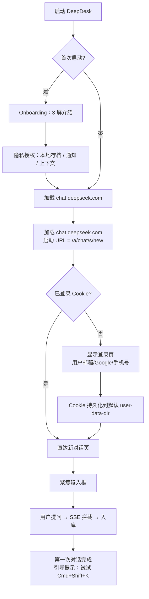
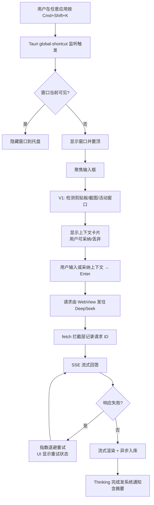
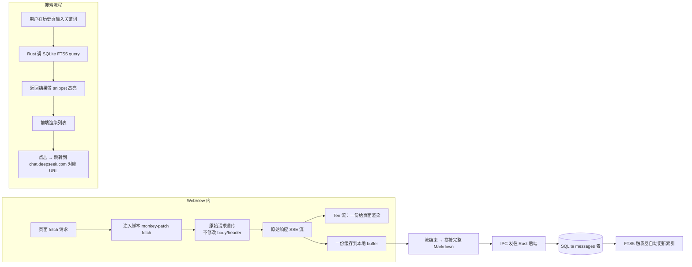

# 产品需求文档（PRD）

> 项目代号：DeepDesk（暂定）
> 文档版本：v0.1（初稿）
> 撰写时间：2026 年 3 月
> 文档状态：评审中

## 摘要（一页速览）

**产品定位**：一款 DeepSeek 网页版的非官方桌面增强外壳——为 DeepSeek 用户量身定制，把官方网页版当前缺少、浏览器又做不到的能力用桌面壳本地能力补上去；当 DeepSeek 后续上线某个能力时，对应补丁可一键关闭、优雅退场。

**产品哲学**：**为 DeepSeek 量身定制 + 查漏补缺 + 优雅退场**——每个能力都问"这是 DeepSeek 用户特别需要的吗"；只补 DeepSeek 缺的，不重复 DeepSeek 已做好的；DeepSeek 上线对应官方能力后我方补丁能一键关闭，不绑架用户。

**技术路线**：Tauri 2.x + React + TypeScript，原生 WebView 直接加载 `chat.deepseek.com`，通过 `initialization_script` 注入 CSS/JS，所有增强能力构建在"WebView 之上的原生层"，不抓 DOM 业务数据、不代理协议、不绕 PoW、不修改 DeepSeek 自己的请求。

**目标用户**：每天在 chat.deepseek.com 停留 1 小时以上的中文/英文重度用户——开发者、研究者、写作者、学生。

**版本规划**：

| 版本 | 主线 | 关键能力 |
|------|------|---------|
| MVP（v0.1，3.5 个月 / 13 周） | 桌面化基线 + 护城河三件套 | 全局快捷键 / 托盘 / 沉浸模式 / 对话导出 / 本地存档 / 失败重试 / Thinking 链折叠 / 主题字体 / **Mermaid 渲染** / **Prompt 模板库 + Slash + 自定义指令** / **截图 → OCR/视觉提问**（共 11 项 M-01 ~ M-11） |
| V0.2（+1 个月） | 失败兜底 + 二脑工作流 + DeepSeek 关怀 | 输入草稿 / 长回答接续 / 流式缓存 / HTML 预览 / **对话二脑（标签+嵌套文件夹+智能分类）** / Whisper STT / TTS / 对话回收站 / **DeepSeek 服务状态浮窗** / **官方公告订阅** / **代码块→VS Code 一条龙** / **URL→Readability** / **使用统计仪表盘** / **分享图卡**（共 22 项 F-01 ~ F-22） |
| V1（v0.5，+3 个月） | 差异化护城河 + 二脑 + IDE 联动 + 隐私护栏 | Thinking 伴侣进阶 / 对话知识库 / 智能上下文桥 / **消息片段卡** / **跨对话 @ 引用** / **Workspace 工作区** / **IDE 上下文桥（VS Code/JetBrains）** / **PDF 章节分块** / **改稿 Inline Diff** / 自动 TODO 抽取 / 找类似对话（语义） / 一键发笔记应用 / **本地嵌入式语义搜索** / **数据加密 SQLCipher** / **隐私脱敏过滤器** / 对话日历热力图 / 配额仪表盘 / Git Commit 助手 / 拖拽即时翻译总结（共 19 项 V1-01 ~ V1-19） |
| V2（v1.0，+6 个月） | 生态扩展 | 插件系统 / 本地代码沙箱 / Spotlight 集成 / Obsidian-Notion 同步 / 浏览器扩展配套 / 保险柜模式 / 文献管理 / 代码 Review 套件 |

**合规底线**：MIT 开源、免费、独立品牌、显著标注 "Unofficial / Not affiliated with DeepSeek"，不抓 DOM 业务数据、不代理协议、不内置账号、不商业化收费；每个补丁均设独立开关，自动检测官方功能上线后建议关闭。

**6 个月 OKR**：GitHub 3,000+ Star、月活 10,000+、核心功能（导出 / 搜索 / 快捷键 / Mermaid / Prompt 库 / 截图 OCR）使用率达标，DeepSeek 官方上线对应能力时一键关闭率 ≥ 95%。

---

## 一、产品定位与愿景

### 1.1 一句话产品定位

> **"为 DeepSeek 量身定制的桌面外壳——查漏补缺，优雅退场。补 DeepSeek 网页版缺失的，不重复 DeepSeek 已做好的。"**

记忆点："DeepSeek 留给网页，桌面留给我们；DeepSeek 上线后，我们体面让位。"

### 1.2 产品名候选

避免商标问题、避免直接使用 "DeepSeek" 作为名称主体，但保留语义关联与桌面/工具感。

| 候选 | 含义 | 调性 | 商标风险 |
|------|------|------|---------|
| **DeepDesk**（推荐） | Deep + Desktop，"深度思考的工作台" | 极简、与 DeepSeek 押头韵但不重名 | 低 |
| **Seekly** | Seek + ly，"寻找的姿态" | 轻盈、动词化 | 低 |
| **Inkstone**（砚台） | 中文文化感，思考与书写的载体 | 中文用户友好、有质感 | 低 |
| **ThinkPad·**（弃） | 与联想商标冲突 | — | 高（淘汰） |
| **Reverie** | "深思、遐想" | 偏文艺，国际感强 | 低 |
| **Ponder** | "深思" | 简洁、英文友好 | 中（同名应用偏多） |

**首选 `DeepDesk`**：发音与 DeepSeek 押头韵，"Desk = 桌面/工作台"语义直白，全球域名 `deepdesk.app` 可注册，GitHub 组织名可用，与 DeepSeek 商标足够区分。

> 最终命名需法务核查 + 域名/包名/GitHub 组织名联动确认，本文档以下统一以 **DeepDesk** 指代产品。

### 1.3 目标用户画像

#### 用户故事 A：开发者「林川」（中文，28 岁，全栈工程师）

- **场景**：每天在 VS Code 与 chat.deepseek.com 之间切换 50+ 次，遇到报错复制粘贴到网页问 DeepSeek。
- **痛点**：浏览器标签淹没；想"问过的代码"找不到；服务器繁忙时手动重试。
- **期待**：`Cmd+Shift+K` 唤起浮窗 → 粘贴 → 回车 → 答案直接复制回 IDE；本地全文搜历史。

#### 用户故事 B：研究生「Maya」（英文，24 岁，论文写作）

- **场景**：用 DeepSeek Thinking 模式做文献综述，思考链经常长达 2 分钟。
- **痛点**：思考链折叠粗糙；想单独保存推理过程；同一问题想用 Thinking 与非 Thinking 对比。
- **期待**：思考链优雅折叠、可单独导出、回答完成桌面通知；对话以 Markdown 入 Obsidian。

#### 用户故事 C：内容创作者「老周」（中文，42 岁，公众号作者）

- **场景**：日常用 DeepSeek 改稿、起标题、做选题。
- **痛点**：账号工作号/个人号切换麻烦；网页历史一长就刷不动；浏览器干扰多。
- **期待**：思考链优雅折叠、可单独导出；沉浸式专注；常用 Prompt 一键调用；导出成 Markdown 备份。

### 1.4 价值主张对比

| 维度 | 浏览器 | API 客户端（NextChat/LobeChat/Cherry） | 已有套壳竞品（doxdk 等） | **DeepDesk** |
|------|--------|----------------------------------------|------------------------|--------------|
| 成本 | 免费 | 需自购 API Key 付费 | 免费 | **免费** |
| 模型版本 | 永远最新 | 滞后于网页版功能 | 永远最新 | **永远最新** |
| 联网搜索 / Thinking / 文件上传 | ✅ 完整 | ⚠️ 需手动接入，部分缺失 | ✅ 完整 | **✅ 完整** |
| 桌面体验（托盘/快捷键/通知） | ❌ | ✅ | 部分 | **✅ 完整** |
| 对话导出 | 需扩展脚本 | ✅ | 多数无 | **✅ 一键多格式** |
| 本地全文搜索 | ❌ | ✅ | ❌ | **✅** |
| 失败自动重试 | ❌ | 部分 | ❌ | **✅** |
| 多账号隔离 | 多浏览器配置 | ✅ | ❌ | 后置（V1+） |
| Thinking 链工具化（折叠/对比/导出） | ❌ | ❌ | ❌ | **✅ 独家** |
| **Mermaid / 流程图渲染** | ❌（用户脚本补） | 部分 | ❌ | **✅ MVP 内置** |
| **Prompt 模板库 + Slash 命令 + 自定义指令** | ❌（用户脚本补） | ✅ | ❌ | **✅ MVP 内置** |
| **截图 → 本地 OCR / 直发图片提问** | ❌ | 部分 | ❌ | **✅ MVP 内置（含中英文模型）** |
| **HTML 预览 / 工件抽屉** | ❌ | ❌ | ❌ | **✅ V0.2 / V1** |
| **失败兜底套件**（重试 / 接续 / 草稿 / 流缓存） | ❌ | 部分 | ❌ | **✅ MVP + V0.2 完整** |
| **被审查内容保留（"对话回收站"）** | ❌ | ❌ | ⚠️ 用户脚本 | **✅ V1 默认关闭，明示风险** |
| 安装包 / 启动速度 | — | Electron 60-90MB / 280ms | Electron 同上 | **Tauri ~50MB（含 OCR 模型） / ~150ms** |
| 合规风险 | 无 | 无 | 部分有抓 DOM | **遵守底线 + 优雅退场** |

**核心定位**：在"网页路线"赛道做完整且差异化的桌面体验，不与 API 路线（Lobe/Cherry）竞争；与所有套壳竞品的根本区别是**为 DeepSeek 量身打造的查漏补缺哲学，而非通用桌面化套壳**。

---

### 1.5 产品哲学：三个原则

DeepDesk 不追求成为"功能最多的客户端"，而追求成为**"DeepSeek 网页用户的最佳补丁层"**。三条原则贯穿所有功能决策：

#### 原则一 · 量身定制（Tailored）

每决定加一个功能，先问一句话：**"这是 DeepSeek 用户特别需要的吗？还是任何 AI 客户端都适合？"**

只有前者才进入路线图。我们不做"通用型 AI 桌面助手"——那是 Cherry Studio / NextChat / Raycast AI 的赛道。我们做的是 DeepSeek 用户特别需要的：思考链工具化（DeepSeek 独有的 reasoning_content）、长思考长回答的兜底（DeepSeek 推理模式的高频痛点）、Mermaid 渲染（DeepSeek 网页久未原生支持）、自定义指令（DeepSeek 网页前端从不暴露 system prompt）。

#### 原则二 · 查漏补缺（Patch the Gap, Not the Whole）

DeepSeek 已经做好的（模型质量、联网搜索、文件上传、Thinking 模式本身），我们一行代码不写，原样透传给原始 WebView。

DeepSeek 还没做的（Mermaid、Prompt 库、本地搜索、对话回收站、桌面集成），我们补上，但只补到"够用"为止，不堆叠不必要的精雕细琢。

我们绝不做"重新发明轮子"：不内置自家模型、不做 API 路由、不做"DeepSeek 替代品"——那是另一个赛道，且与 DeepSeek 哲学相悖。

#### 原则三 · 优雅退场（Graceful Sunset）

每一个补丁都假设有一天 DeepSeek 会自己做。当那一天到来，我们的补丁要：

1. **可独立关闭**——每个增强项都有独立开关，用户一勾即停
2. **可被检测替代**——运行时检测 DeepSeek 网页是否已原生提供该能力（如 DOM 中出现官方 Mermaid 节点、或 API 响应中出现新字段），自动弹出"DeepSeek 已上线该功能，建议关闭本地补丁"提示
3. **数据可迁出**——所有本地数据（Prompt 库、对话存档、回收站、思考集）都能一键导出为通用格式（Markdown / JSON），不绑架用户
4. **不阻塞官方使用**——任何补丁失效或关闭，DeepDesk 都自动回退到原始 WebView 体验，绝不"补丁坏了 DeepSeek 也用不了"

每个功能（特别是新增的 11 项）都必须在 PRD 中明确写出**「退场设计」**段落——这是 DeepDesk 与所有套壳产品的根本区别：我们对自己的"暂时性"完全坦诚。

---

## 二、功能清单（按"三层增强体系"组织）

DeepDesk 的功能不再按"MVP / V1 / V2"线性堆砌，而是按**「三层增强体系」**组织——这能让读者一眼看出每个功能"为什么属于 DeepDesk 而不是 DeepSeek"，以及"DeepSeek 上线后会不会让它过时"。每一层内部再标注版本（MVP / V0.2 / V1 / V2）。

> **三层定义速览**
>
> - **Layer 1 · 系统集成层（Desktop-Only）**：浏览器永远做不到的桌面专属能力——全局快捷键、托盘、浮窗、划词、截图、右键菜单。**长线价值**：DeepSeek 即使做官方桌面 App，也依然需要 OS 级集成；这层是 DeepDesk 唯一不可替代的护城河。
> - **Layer 2 · 缺失功能补丁层（Patch the Gap）**：DeepSeek 网页版没有但用户呼声大的功能。子分两类：
>     - **2.A 长线价值**：DeepSeek 历来不重视前端，长期不会做完整（Mermaid 内联渲染、本地搜索、对话标签、导出、TTS/STT、本地文件库、Prompt 库）。
>     - **2.B 短窗口补丁**：DeepSeek 在 12 个月内可能补齐的能力（自定义指令、本地 OCR、对话回收站）。**这一类必须有明确退场设计**——补丁存在的意义是"在官方追上之前为用户提供过渡方案"。
> - **Layer 3 · 已有功能体验增强层（Polish the Existing）**：DeepSeek 已有但做得不够好的体验（Thinking 折叠、代码块体验、表格、KaTeX、引用源呈现、长对话渲染优化）。**价值**：纯前端注入，对官方既有体验做精雕细琢，零侵入。

每个功能都附**六段式**说明：① 功能描述 ② 用户故事 ③ 关键交互流程 ④ 验收标准 ⑤ 风险/注意事项 ⑥ **退场设计**（DeepSeek 官方上线对应能力时本功能如何关闭/迁移；这一段在 PRD 中是新增项）。

> 工程实现约束：所有功能必须在不修改 DeepSeek 网页业务逻辑的前提下，仅通过桌面层 + 可逆的 CSS/JS 注入 + 拦截层（仅缓存自身请求结果）实现；任何补丁失效都自动降级到原始 WebView，绝不阻塞 DeepSeek 本身的使用。

---

## 2.1 MVP 功能详述（按层标记）

> 每个功能标题后括号内为所属层。**Layer 1 系统集成（L1）**：浏览器永远做不到的桌面专属能力，DeepDesk 最稳的护城河。**Layer 2.A 长线补丁（L2.A）**：DeepSeek 长期不会做的能力，稳态产品价值。**Layer 2.B 短窗口补丁（L2.B）**：DeepSeek 12 个月内可能补齐的能力，每一项都有明确退场设计。**Layer 3 精修已有 UI（L3）**：DeepSeek 已有但做得不够好的体验，纯前端注入精雕细琢。

---

### 2.1.1 MVP 阶段（v0.1，13 周首发）

> **MVP 共 11 项功能（M-01 ~ M-11）**，覆盖三层增强体系。每项标题后用 `[L1]/[L2.A]/[L2.B]/[L3]` 标记其归属层，便于读者识别每个功能"为什么属于 DeepDesk 而不是 DeepSeek"。
>
> | 项 | 名称 | 层 |
> |----|------|-----|
> | M-01 | 全局快捷键唤起 | L1 系统集成 |
> | M-02 | 系统托盘常驻 | L1 系统集成 |
> | M-03 | 沉浸式专注模式 | L3 精修已有 UI |
> | M-04 | 对话导出 Markdown / PDF | L2.A 长线补丁 |
> | M-05 | 本地对话存档 + 全文搜索 | L2.A 长线补丁 |
> | M-06 | 失败自动重试 + 断网恢复 | L2.A 长线补丁 |
> | M-07 | Thinking 链折叠 + 单独导出 | L3 精修已有 UI |
> | M-08 | 启动直达新对话 + 主题/字体 | L3 精修已有 UI |
> | M-09 | Mermaid / PlantUML 实时渲染 | L2.A 长线补丁 |
> | M-10 | Prompt 库 + Slash 命令 + 自定义指令 | L2.B 短窗口补丁 |
> | M-11 | 截图 → OCR / 视觉提问 | L1 + L2.B 混合 |

---

#### M-01 全局快捷键唤起 `[L1]`

**功能描述**
在系统任意应用中按下用户配置的全局快捷键（默认 `Cmd/Ctrl+Shift+K`），主窗口立即从托盘弹出并聚焦输入框；再次按下则隐藏。支持单独为"新建对话"配置快捷键（默认 `Cmd/Ctrl+Shift+N`）。

**用户故事**
作为开发者，我希望在 IDE 中遇到问题时按一个快捷键直接弹出 DeepSeek 输入框，以便不打断当前心流去切换浏览器和标签。

**关键交互流程**
1. 用户在任意应用中按下全局快捷键
2. 应用窗口从托盘/最小化状态恢复并置顶
3. 自动聚焦到输入框，光标可立即输入
4. 输入完成回车发送，答案在窗口内呈现
5. 再次按下快捷键则隐藏窗口（保留对话上下文）

**验收标准**
- [ ] 默认 `Cmd/Ctrl+Shift+K` 全平台可用，可在设置中改键且热更新（无需重启）
- [ ] 唤起耗时 ≤ 200ms（窗口可见 → 输入框聚焦）
- [ ] 与系统中已占用快捷键冲突时给出明确错误并允许重新设置
- [ ] 多显示器场景下窗口出现在用户当前活动屏幕
- [ ] 配置持久化（重启后保留），快捷键解绑后立即生效

**风险/注意事项**
- macOS 需引导用户授权"辅助功能"权限
- Linux 不同窗口管理器对全局快捷键支持差异大（X11 OK，Wayland 受限）
- 与 Raycast、Alfred 等热键管理工具冲突时需有诊断提示

**退场设计**
属 Layer 1 系统集成，浏览器永远做不到，DeepSeek 即使推官方桌面 App 也不会让此功能过时。无需退场，长期保留。

---

#### M-02 系统托盘常驻 `[L1]`

**功能描述**
应用启动后在系统托盘/状态栏常驻一个图标。点击关闭按钮（窗口右上角）默认行为改为最小化到托盘而非退出。托盘菜单提供：显示/隐藏主窗口、新建对话、最近 5 个对话、设置、关于、退出。

**用户故事**
作为重度用户，我希望应用始终在托盘随时可调出，而不是每次都要从启动器找应用图标，以便降低使用门槛。

**关键交互流程**
1. 应用启动 → 托盘图标出现
2. 用户点击窗口"关闭"按钮 → 窗口隐藏到托盘（首次会弹气泡提示"已最小化到托盘"，可选"不再提示"）
3. 单击托盘图标 → 切换主窗口显示/隐藏
4. 右键托盘图标 → 弹出菜单
5. 通过菜单"退出"才真正结束进程

**验收标准**
- [ ] Windows / macOS / Linux 三平台托盘图标可见且操作一致
- [ ] 关闭按钮行为可在设置中改为"直接退出"
- [ ] 托盘菜单中"最近对话"动态更新（最多 5 条），点击直达对话
- [ ] 单实例锁：第二次启动直接唤起已有窗口，不重复运行
- [ ] 系统重启后若设置了"开机自启"则自动以托盘隐藏方式启动

**风险/注意事项**
- macOS 需提供 Template Image（黑白），适配深色菜单栏
- Linux 部分桌面环境（GNOME 默认）无系统托盘，需引导用户安装 AppIndicator 扩展或降级为窗口模式

**退场设计**
属 Layer 1 系统集成，长期保留。无需退场。

---

#### M-03 沉浸式专注模式 `[L3]`

**功能描述**
通过快捷键（默认 `F11`）或菜单切换"沉浸模式"。开启后通过 CSS 注入隐藏 chat.deepseek.com 的侧边栏、顶部导航、营销 banner、Footer 等非对话核心元素，对话区铺满窗口；窗口可选"无边框"与"始终置顶"。

**用户故事**
作为写作者，我希望进入沉浸模式后视觉只剩"我的话 + AI 的话"，以便在长对话中保持专注、减少干扰。

**关键交互流程**
1. 用户按 `F11` 或点击菜单"沉浸模式"
2. 应用注入预设 CSS 隐藏侧栏、顶栏、底栏
3. 窗口可选切换无边框 / 始终置顶
4. 再次按 `F11` 退出，CSS 移除，恢复原貌
5. 模式状态持久化，下次启动恢复上次状态

**验收标准**
- [ ] 切换耗时 ≤ 150ms，无明显闪屏
- [ ] CSS 选择器版本化管理，DeepSeek 页面改版后只需更新 CSS 文件即可恢复
- [ ] 退出沉浸模式后页面状态完全还原
- [ ] 设置中可选择"轻度沉浸"（仅隐藏顶栏）/"深度沉浸"（仅留对话区）
- [ ] 提供"自定义 CSS"高级选项，技术用户可自行编辑（与 Pake/Arc Boosts 一致）

**风险/注意事项**
- DeepSeek 网页改版会导致 CSS 选择器失效，需在 GitHub 维护"沉浸模式 CSS"独立仓库或文件，社区 PR 可快速修复
- CSS 注入须避免影响输入框、文件上传、模型切换等核心交互
- 不修改任何业务行为，仅视觉层调整，以满足合规底线

**退场设计**
DeepSeek 上线官方"全屏专注模式"时（参考 ChatGPT），用户可二选一；沉浸度与个性化通常是 DeepDesk 优势，无需主动关闭。

---

#### M-04 对话导出 Markdown / PDF `[L2.A]`

**功能描述**
用户在任意一条对话视图下，可一键将完整对话（含 Thinking 链可选）导出为 Markdown 或 PDF。Markdown 内容来自拦截 SSE 流时缓存的 DeepSeek 原始 Markdown 文本，无需 DOM 反转换。PDF 通过 WebView 原生 print API 生成。

**用户故事**
作为研究生，我希望把 DeepSeek 给的文献综述完整存成 Markdown 进 Obsidian，以便日后引用，而不是网页"复制粘贴"格式全乱。

**关键交互流程**
1. 用户在对话视图点击工具栏"导出"按钮（或右键菜单）
2. 弹出格式选择：Markdown / PDF
3. 弹出选项：是否包含 Thinking 链、是否包含元信息（模型、时间）
4. 选择保存路径并确认
5. 桌面通知"导出成功"，可点击直接打开文件

**验收标准**
- [ ] 导出的 Markdown 在 Typora / Obsidian / VS Code Preview 中渲染正确（代码块、公式、表格、Mermaid）
- [ ] PDF 保留语法高亮、字体一致性、分页合理
- [ ] 一次会话内多轮对话按时间顺序拼接，每轮含角色（User / DeepSeek）与时间戳
- [ ] Thinking 链可选导出且在 Markdown 中以 `<details>` 折叠块呈现
- [ ] 当 SSE 流尚未读到（历史对话首次打开）时回退到 DOM 序列化方案，并标注"内容来自 DOM 解析，可能略有差异"

**风险/注意事项**
- SSE 拦截需谨慎：仅缓存响应文本到本地，不修改请求、不重发，不构成"代理"或"爬虫"
- 历史会话的导出无法从 SSE 拦截获取，需设计 DOM 兜底方案；DOM 方案要随网页改版可维护
- 大文件导出（万字以上）需走流式写入，避免阻塞主进程

**退场设计**
DeepSeek 若上线官方导出（仍只是 Markdown/PDF 基础格式），DeepDesk 仍保留"图卡分享"、"Obsidian 双链导出"等差异化版式；用户可二选一。**Layer 2.A 长线补丁，无需退场。**

---

#### M-05 本地对话存档 + 全文搜索 `[L2.A]`

**功能描述**
所有通过本应用进行的对话由 SSE 拦截层异步写入本地 SQLite 数据库（`messages` 表 + FTS5 索引）。提供"对话历史"页面：按时间/对话/模型筛选，支持全文搜索关键词高亮、跳转到原对话页面。

**用户故事**
作为开发者，我希望两个月前问过的"如何在 SQLite 里做向量检索"能一搜就出来，以便不用重复提问浪费时间。

**关键交互流程**
1. 用户每次发送消息 → SSE 流被拦截 → 异步入库（不阻塞 UI）
2. 用户打开"历史"页（侧边栏或 `Cmd/Ctrl+H`）
3. 输入关键词 → FTS5 实时返回结果，匹配片段高亮
4. 点击结果项 → 跳转到 chat.deepseek.com 对应对话 URL
5. 也可右键单条消息 → "复制为 Markdown" / "导出此回答"

**验收标准**
- [ ] 入库延迟 ≤ 500ms，不影响打字与回答渲染
- [ ] 10 万条消息全文搜索响应时间 ≤ 200ms
- [ ] 搜索支持中英文（FTS5 + jieba/icu 分词）
- [ ] 数据库文件位于用户数据目录，可手动备份/导出/导入
- [ ] 提供"清空本地数据"入口与确认弹窗
- [ ] 数据库文件加密可选（设置中开启 SQLCipher，性能影响可接受）

**风险/注意事项**
- 必须明确告知用户"对话内容会本地存档"，并在首次启动 onboarding 中获取知情同意
- 数据库 schema 版本化管理，支持自动迁移
- 入库逻辑必须容错：拦截失败不能影响网页正常发送/接收

**退场设计**
DeepSeek 若上线"跨对话搜索"（基础列表搜索），用户仍偏好本地搜索（速度、隐私、跨账号、永不丢失）。**Layer 2.A 长线补丁，无需退场。**

---

#### M-06 失败自动重试 + 断网恢复 `[L2.A]`

**功能描述**
通过 fetch 拦截监控 DeepSeek API 请求。当返回 "服务器繁忙"、5xx 或网络错误时，自动按指数退避（1s → 2s → 4s → 8s → 16s）重试最多 5 次，并在 UI 上显示当前状态（"第 2 次重试中…"）。`navigator.onLine` 监听到断网时，将待发送请求放入队列，恢复连接后自动重试。

**用户故事**
作为用户，我希望"服务器繁忙"时不用手动点重试，以便专注思考问题本身而不是和服务器抗争。

**关键交互流程**
1. 用户发送消息 → fetch 被注入脚本拦截记录
2. 收到失败响应（503 / "Server Busy" 文本 / 超时）→ 拦截层不传递给页面，自动重试
3. UI 顶部显示状态条："服务器繁忙，第 2/5 次重试…"
4. 重试成功 → 状态条消失，回答正常流式呈现
5. 5 次仍失败 → 弹通知 "重试失败，可手动重发"

**验收标准**
- [ ] 重试期间不重复入库、不重复触发"思考中"动画
- [ ] 断网恢复后队列请求按原顺序重发
- [ ] 用户可在设置中关闭自动重试或调整最大次数
- [ ] 重试日志记录到本地（用户可在"诊断"页查看），便于排查
- [ ] 不绕过任何风控机制（不修改请求体、不替换 token、不删 PoW header）

**风险/注意事项**
- 严禁修改请求内容/header，仅在响应失败时原样重发
- 重试期间用户主动关闭页面或刷新需立即取消队列
- 与 DeepSeek 自身的限流冲突时，遵守服务端 `Retry-After`

**退场设计**
DeepSeek 若提升服务稳定性、不再有"服务器繁忙"，重试模块可降级为"网络层重连"；输入草稿持久化、断网恢复仍保留（这些是客户端职责）。**Layer 2.A 长线补丁，部分能力随官方稳定性提升而降级，但不消失。**

---

#### M-07 Thinking 链优雅折叠 + 单独导出 `[L3]`

**功能描述**
针对 DeepSeek Thinking 模式的"思考链（reasoning content）"做专属增强：通过注入 CSS 把网页原生的思考块改造成可平滑折叠/展开的卡片，默认折叠，点击展开；卡片右上角提供"复制思考链"和"单独导出思考链为 Markdown"两个操作。SSE 拦截层从流中分离 `reasoning_content` 与 `content` 两段，分别落盘，使后续搜索、导出、对比都能精确指向其中一段。这是 DeepDesk 区别于通用套壳工具的第一道护城河。

**用户故事**
作为研究生 / 工程师，我希望长达 1-2 分钟的思考链能优雅折叠不挤压视野，又能在我需要复盘"为什么 AI 这么想"时单独保存或导出，以便把推理过程作为学习材料反复研究。

**关键交互流程**
1. 用户开启 DeepSeek 网页的"Thinking 模式"提问 → 注入脚本识别 SSE 流中的 reasoning 段落
2. 思考链生成中：注入卡片显示"思考中…"+ 已用秒数 + 可暂停的折叠按钮（默认展开预览前 3 行）
3. 思考链结束 → 卡片自动折叠，仅显示"思考用时 84s · 1,232 tokens · 点击展开"
4. 鼠标悬停 → 显示"复制 / 导出 / 收藏"三按钮
5. 导出按钮 → 选择"仅思考链"或"思考链 + 答案"，输出 Markdown 文件
6. 设置页可调整默认行为：默认折叠 / 默认展开 / 自动滚动跟随

**验收标准**
- [ ] SSE 拦截能正确分离 `reasoning_content` 与 `content`，分别入库
- [ ] 折叠/展开动画 60fps 无卡顿，长思考链（>5K 字符）展开 ≤ 200ms
- [ ] 思考链摘要文案准确（用时、token 数与网页一致）
- [ ] "仅思考链"导出 Markdown 文件结构清晰，含元信息（模型、时间、token）
- [ ] DeepSeek 网页改版导致 reasoning 字段位置变化时，注入脚本进入降级模式（不破坏原页面，仅放弃增强卡片）

**风险/注意事项**
- DeepSeek SSE 协议如果调整字段名（reasoning_content → thinking 等），注入脚本必须能优雅失败而非崩溃整个对话区
- 折叠 UI 不得遮挡或破坏 DeepSeek 原生的复制、点赞、再生成等按钮
- 导出文件命名包含可识别的对话标题前缀，方便用户归档

**退场设计**
DeepSeek 若优化原生 Thinking 折叠 UI（更紧凑、可折叠），仍可保留我方"单独导出 + 思考链收藏"差异化；用户可在设置二选一。**Layer 3 精修，长期保留。**

---

#### M-08 启动直达新对话页 + 主题/字体定制 `[L3]`

**功能描述**
启动时默认直接打开 `chat.deepseek.com/a/chat/s/new`（或最近会话页，由用户配置），跳过任何首页/营销页。设置中提供主题（跟随系统/亮色/暗色）、字体族（系统/思源/JetBrains Mono 等内置 5 种）、字号（90%/100%/110%/125%）调节，通过 CSS 注入实时生效。

**用户故事**
作为用户，我希望打开应用就能直接开始问问题，并且字体大一些不刺眼，以便长时间使用更舒适。

**关键交互流程**
1. 应用启动 → WebView 加载用户配置的"启动 URL"
2. 默认值为新对话页，可在设置改为"上次对话"或自定义
3. 首次进入设置 → 主题/字体/字号 → 实时预览
4. 修改字体即时通过 CSS 注入生效
5. 退出后下次启动保留全部设置

**验收标准**
- [ ] 启动到可输入耗时 ≤ 1.5s（不计首次加载 DeepSeek 资源时间）
- [ ] 主题切换无闪屏（注入 CSS 在页面渲染前生效）
- [ ] 字体在代码块、公式、对话主体均生效
- [ ] 设置项变更即时生效，不需重启
- [ ] 提供"重置外观"按钮恢复默认

**风险/注意事项**
- 主题切换若与 DeepSeek 自身 dark/light 切换不同步会出现闪烁，需要监听并联动
- 字体注入不得影响 KaTeX/代码高亮的等宽字体需求
- 用户自定义 CSS（高级）必须沙箱化，避免破坏页面或被恶意扩展利用

**退场设计**
此功能是基础桌面化体验的一部分，DeepSeek 上线官方桌面 App 也不会冲突；但若官方未来支持自定义启动页或主题，本功能仍可独立运行（用户偏好两套并存）。

---

#### M-09 Mermaid / PlantUML 实时渲染 `[L2.A]`

**功能描述**
通过注入脚本检测 chat.deepseek.com 输出中的 ` ```mermaid ` / ` ```plantuml ` / ` ```graphviz ` 代码块，自动用 Mermaid.js 在原代码块下方渲染为 SVG 图。失败时降级为原代码块 + 错误徽标，绝不阻塞对话。设置中可切换"自动渲染"与"按钮触发"两种模式。

**用户故事**
作为开发者「林川」，我让 DeepSeek 帮我画系统架构图，希望网页里直接看到流程图而不是一堆 mermaid 源码——就像在 ChatGPT 和 Claude 里那样。

**关键交互流程**
1. DeepSeek 输出含 mermaid 代码块 → 注入脚本 MutationObserver 检测到新代码块
2. 在原代码块下方插入 SVG 容器，Mermaid.js 渲染
3. 渲染失败 → 显示"渲染失败 (语法错误)"badge，原代码块仍可见
4. 工具栏新增"切换源码/图"按钮 → 点击在 SVG 与代码间切换
5. SVG 右键菜单："复制为 PNG"、"导出为 SVG 文件"、"放大查看"
6. 设置可关闭，或切换到"按钮触发"（避免大量代码块自动渲染卡顿）

**验收标准**
- [ ] Mermaid 7 类图（流程/时序/类/状态/甘特/ER/思维导图）渲染正确
- [ ] PlantUML 简单图通过本地 plantuml.jar 或公共 kroki.io 渲染（用户可选）
- [ ] 单图渲染耗时 ≤ 300ms（典型流程图）
- [ ] 渲染失败不影响 DeepSeek 原页面，错误信息可见
- [ ] PNG/SVG 导出功能可用，导出图与显示图一致
- [ ] 提供"渲染开关"全局设置

**风险/注意事项**
- Mermaid.js 体积约 250KB gzip，打包入注入脚本，不依赖 CDN
- DeepSeek 网页改版导致 markdown 代码块 DOM 结构变化时，CSS 选择器需有 fallback
- 注入的 SVG 容器必须使用 Shadow DOM 隔离，避免污染 DeepSeek 自身样式

**退场设计**
DeepSeek 上线 Mermaid 内联渲染时（参考 ChatGPT 已支持），注入脚本启动时探测原页 `<svg class="mermaid">` 是否已存在，存在则跳过我方渲染并在设置面板显示绿色提示"DeepSeek 已支持 Mermaid，可关闭 DeepDesk 此功能"。用户也可继续保留我方实现（更多自定义样式与导出格式）。

---

#### M-10 Prompt 库 + Slash 命令 + 自定义指令 `[L2.B]`

**功能描述**
三合一的"提问辅助"系统：
1. **Prompt 模板库**：本地存储常用提问模板，支持分类、变量（`{{selection}}` `{{clipboard}}` `{{datetime}}` `{{file}}`）。
2. **Slash 命令**：在输入框输入 `/` 弹出模板选择器，键盘选择后插入；用户可对常用模板设置专属快捷键。
3. **自定义指令**（Custom Instructions）：用户配置一段全局偏好文本（如"永远用中文回答""默认用 markdown 输出"），新对话首条消息发送前自动 prepend 到输入框。**等价于用户自己在前面敲了一段——完全合规，零侵入协议层**。

**用户故事**
作为内容创作者「老周」，我希望"改稿+起标题+做选题"三个常用 Prompt 一键调用，并且每次新对话都自动告知 DeepSeek 我的写作风格偏好——而不是每次手敲。

**关键交互流程**
1. 设置 → Prompt 库 → 新建/编辑模板，支持变量与分类
2. 用户在 chat.deepseek.com 输入框输入 `/` → 注入脚本捕获并弹出模板选择器（Shadow DOM 隔离）
3. 上下键选择 / 输入关键字过滤 → 回车插入模板
4. 含变量的模板自动替换（剪贴板内容、当前选中文本、当前日期等）
5. 自定义指令开关 → 写入"全局偏好" → 每次开新对话前自动插入到输入框头部，用户可见、可手动删除
6. 角色卡片库：内置开发者/作家/翻译/教师 4 张，用户可自建并设置图标、颜色、关联 Prompt 集

**验收标准**
- [ ] Prompt 模板创建/编辑/删除/排序流畅
- [ ] Slash 弹出后键盘操作完整，与 DeepSeek 自身 IME 输入互不干扰
- [ ] 变量替换正确（特别是 `{{selection}}` 跨应用 OS 选择文本）
- [ ] 自定义指令以可见文本形式注入输入框（不修改任何请求头或 system 字段）
- [ ] 角色卡切换时仅影响后续新对话，不污染历史
- [ ] 用户可一键禁用整个 M-10 系统（在 DeepSeek 上线 Custom Instructions 时）

**风险/注意事项**
- Slash 命令必须在 keydown capture 阶段拦截，避免影响 DeepSeek 自身的输入法行为
- 自定义指令文本头部需要醒目区分（如以"---"或灰色 placeholder 渲染），防止用户误以为已发送
- 角色卡 system_prompt 不能伪装成"DeepSeek 系统消息"，对外只是用户自己输入的前缀文本

**退场设计**
DeepSeek 上线 Custom Instructions / GPTs 等价能力时：
- 注入脚本探测原页是否新增"自定义指令"设置 UI
- 设置面板红色高亮提示"DeepSeek 已支持原生 Custom Instructions，建议关闭并迁移"
- 提供"导出我的指令到剪贴板"一键按钮，便于用户粘贴到官方设置
- 不强制关闭——本地 Prompt 库 / Slash 命令的"键盘流"体验仍胜于网页版

---

#### M-11 截图 → OCR / 视觉提问 `[L1 + L2.B]`

**功能描述**
全局快捷键（默认 `Cmd/Ctrl+Shift+Q`）触发系统级区域截图。截图后弹出小窗，提供两个操作：
1. **「识别为文字」**：本地 Tesseract OCR（中英文打包入安装包，约 30-50MB）→ 文字写入 DeepSeek 输入框，用户可继续编辑
2. **「作为图片提问」**：图片注入到 chat.deepseek.com 文件上传区（通过 DataTransfer API 模拟用户拖入），用户授权后发送

**用户故事**
作为研究生「Maya」，我读 PDF 论文遇到不懂的英文段落或公式，按 `Cmd+Shift+Q` 选区 → 选"识别为文字" → DeepSeek 输入框已有原文 + 自定义指令"请翻译并解释" → 直接回车提问。整个流程不离开 DeepDesk。

**关键交互流程**
1. 用户按 `Cmd+Shift+Q` → Tauri 调用系统截图 API（macOS screencapture / Windows Snipping Tool / Linux scrot+grim）
2. 截图完成 → 小窗预览 + 两个按钮 + "重新截"
3. 选"识别为文字" → 本地 Tesseract 识别（典型 < 2s）→ 文字插入输入框头部
4. 选"作为图片提问" → 图片转 File 对象 → 通过 DataTransfer 触发 DeepSeek 文件上传 input 的 change 事件
5. 失败兜底：OCR 失败 → 提示"识别失败，是否作为图片上传？"；图片上传失败 → 提示"DeepSeek 配额可能用完，可否选择 OCR 模式"
6. 设置：Tesseract 语言包按需下载（中简、英已默认；繁中、日韩、其他按需）

**验收标准**
- [ ] 跨平台截图流畅（macOS、Windows、主流 Linux 桌面）
- [ ] 中文清晰打印体 OCR 准确率 ≥ 90%、英文 ≥ 95%
- [ ] 单图 OCR 耗时 ≤ 2s（A4 半屏，中文）
- [ ] 图片上传到 DeepSeek 输入区成功率 ≥ 95%（依赖 DOM 选择器稳定性，需有 fallback）
- [ ] 全流程无网络依赖（OCR 完全本地）
- [ ] 截图小窗可被快捷键 `Esc` 取消

**风险/注意事项**
- macOS 需用户授权"屏幕录制"权限；首次启动需引导授权
- DOM 注入文件上传是脆弱点（DeepSeek 改版可能改输入控件）→ 提供"复制图片"兜底方案
- Tesseract 模型默认仅中简+英，包体已 ≥ 30MB；繁中/日韩按需下载
- OCR 隐私：所有识别完全本地、不上传任何数据，需在隐私声明明确

**退场设计**
- DeepSeek 网页若上线"截图直接粘贴 → 视觉问答"快捷键，本功能的"作为图片提问"路径可关闭；但"识别为文字"由于完全本地，仍有"零配额、零网络"独有价值
- DeepSeek 视觉问答配额若放开为不限量，本地 OCR 价值降低；可在设置中显式标注"本地 OCR 推荐用于：① 离线场景 ② 节省视觉问答配额 ③ 长文档高速识别"

---

## 2.2 V0.2（v0.2，MVP 后 4-6 周）

> V0.2 聚焦"**失败兜底套件**"和**系统集成第二梯队**。这些不是 MVP 必须，但是 MVP 用户首批反馈中最容易出现的"还差一口气"的功能。

| 项 | 名称 | 层 | 一句话价值 |
|----|------|-----|----------|
| F-01 | 输入草稿持久化 | L2.A | 断网/崩溃/误关都不丢用户已输入内容（极高频） |
| F-02 | 长回答自动接续 | L2.A | 检测"继续生成"按钮自动点击（最多 3 次后停下） |
| F-03 | 流式响应本地缓存 | L2.A | SSE 拦截同步落盘，页面刷新可恢复 |
| F-04 | 划词快速提问 | L1 | 任意应用选中文本 + Cmd+Shift+D → 自动构造提问发送 |
| F-05 | 系统右键菜单 | L1 | macOS Services / Win Explorer / Linux .desktop 注册"用 DeepSeek 解释"（V1 有，V0.2 提前部分） |
| F-06 | 剪贴板感知（默认关闭） | L1 | 唤起浮窗时自动检测剪贴板，可一键采纳 |
| F-07 | HTML 预览面板 | L2.A | 代码块语言为 html → "预览"按钮 → 弹出沙箱 webview srcdoc |
| F-08 | **对话二脑**（标签 + 嵌套文件夹 + 颜色 + 智能分类 + 收藏 + 置顶） | L2.A | 元数据独立表；多维标签 + 3 层嵌套文件夹 + 颜色编码 + 客户端规则建议标签 |
| F-09 | 系统通知（回答完成） | L1 | 长回答生成完毕推送通知，可点击通知唤起 |
| F-10 | 桌面 TTS 朗读 | L2.A | 系统原生 TTS API 朗读 AI 回答 |
| F-11 | 本地 Whisper STT | L2.A | whisper.cpp 按需下载模型 → 麦克风按钮 → 本地识别填入输入框 |
| F-12 | DeepSeek 服务状态浮窗 | L1 | 托盘图标显示 DeepSeek 服务实时状态（5 分钟轮询 status.deepseek.com，离线时降级为本地请求成功率统计） |
| F-13 | DeepSeek 官方公告订阅 | L2.A | 拉取 DeepSeek 官方 release notes / blog / api-docs/news，未读时托盘红点 |
| F-14 | 模型版本 Changelog | L2.B | 检测到 DeepSeek 切换默认模型（如 V4-Pro→V4.1）时弹通知 + 摘要要点 |
| F-15 | 自动对话标题（AI Auto-Title） | L2.B | 第一轮对话完成后用一次轻量请求让 DeepSeek 总结 2-8 字标题覆盖"新对话" |
| F-16 | 代码块 → VS Code 一条龙 | L1 | 代码块右上角加按钮"在 VS Code 打开 / 另存为 / 复制并 git commit" |
| F-17 | 表格直转 Excel | L1 | markdown 表格右上角"打开为 Excel"按钮，导出 .xlsx 自动调用系统应用打开 |
| F-18 | URL → Readability 抽取 | L2.A | 粘贴 URL 时浮出"是否抓取该网页正文作为上下文"提示，本地用 Readability.js 抽取 |
| F-19 | 截图历史栏 | L1 | M-11 截图历史悬浮小栏（最近 20 张），可拖入输入框 |
| F-20 | 多文件批量上传管道 | L2.A | 拖入 10+ 文件时自动队列化、并发数 3、失败重试、批量进度条 |
| F-21 | 使用统计仪表盘 | L2.A | 本地仪表盘：本周/本月对话数、热门话题、token 节省估算、年度复盘图卡 |
| F-22 | 分享图卡 | L2.A | 选中片段一键生成可分享图卡（多模板、暗/亮、含 Unofficial 水印），社交媒体格式 |

> V0.2 共 22 项功能（F-01 ~ F-22）。下文按"先 F-01 ~ F-07 简述（已在速览表中以一句话提要，详述放 V0.2 PRD 子文档），再 F-08 ~ F-22 完整六段式"的方式展开——后 15 项（含升级后的 F-08）的六段式详述紧随其后，作为本主文档的可直接交付源料。

---

#### F-08 对话二脑（标签 + 嵌套文件夹 + 颜色 + 智能分类 + 收藏 + 置顶） `[L2.A]`

**功能描述**
F-08 是 DeepDesk「二脑」哲学在对话维度上的完整体——把 DeepSeek 网页线性扁平的会话列表，升级为可标签、可嵌套、可着色、可智能识别的本地侧栏。能力包括：① 嵌套文件夹（最多 3 层，避免过度分类后无法浏览）；② 自定义颜色编码（每个文件夹/标签可设主色，侧栏一眼可辨）；③ 多标签系统（一个对话可同时挂多个标签，一对多关系）；④ 智能建议标签（基于对话内容关键词在客户端本地匹配规则库，如出现"useEffect / hook"自动建议 `#react`，规则库内置 + 用户自定义）；⑤ 批量操作（多选对话 → 批量加标签 / 移动 / 归档 / 删除元数据）；⑥ 置顶（最多 5 条，固定显示在侧栏顶部）；⑦ 收藏（独立的"⭐收藏"虚拟分类，跨文件夹聚合）；⑧ 归档（不显示在主列表但保留可搜索）。所有数据仅本地 SQLite 元数据表，对话本身仍存 DeepSeek 服务器，DeepDesk 只在侧栏渲染额外结构。

**用户故事**
作为开发者「林川」，我希望把"DeepDesk 重构""副业 SaaS""读源码笔记"三个项目分别建文件夹，每个文件夹下还能再分"调研/Bug/方案"子目录，并用蓝/红/绿三色标记，以便在 50 个进行中对话里 1 秒定位到当前要找的那个。
作为研究生「Maya」，我希望按"论文-A / 论文-B / 答辩准备"打标签，一个对话可同时属于"论文-A"+"实验失败"+"待复盘"三个维度，以便复盘时按维度切片。
作为内容创作者「老周」，我希望按"专栏-AI 周报"+"心情-高产 / 卡壳"双重维度组织对话，写不出来的时候打开"卡壳"标签看看上次怎么自救的，以便把对话历史变成创作辅助。

**关键交互流程**
1. 侧栏右键任意对话 → 弹出菜单"加标签 / 加入文件夹 / 设颜色 / 置顶 / 收藏 / 归档"，操作即时响应、无网络请求
2. 顶部标签管理入口 → 标签库页面：标签列表（含使用次数）、新建/重命名/合并标签、批量重新着色
3. 文件夹拖拽：把对话拖入文件夹；把子文件夹拖入父文件夹（达到 3 层时拒绝并气泡提示"嵌套已达上限"）
4. 智能建议：进入对话详情后，DeepDesk 后台基于本轮 + 历史消息关键词在本地规则库匹配 → 侧边浮出"建议标签：#react #hooks（基于本对话关键词）"，用户一键采纳或忽略
5. 批量模式：长按 / Shift 多选 → 顶部出现批量操作条 → 批量加标签 / 移动 / 归档 / 导出
6. 置顶/收藏聚合：侧栏顶部固定区显示"📌 置顶"+"⭐ 收藏"两组虚拟集合，跨文件夹聚合显示

**验收标准**
- [ ] 标签/文件夹/颜色/置顶/收藏/归档操作秒级响应，不阻塞对话区渲染
- [ ] 嵌套文件夹深度 ≤ 3 层强制约束，超过给出气泡提示且不生效
- [ ] 一个对话可同时挂 ≤ 20 个标签，超过给出软提示但不强制阻断
- [ ] 智能建议标签命中率 ≥ 50%（用户对前 100 个建议的"采纳率"统计），且建议永远不自动应用，需用户确认
- [ ] 元数据表 schema 版本化迁移，未来字段扩展不破坏老数据
- [ ] 一键导出"标签 + 文件夹结构 + 对话引用"为 JSON / Markdown，便于迁移
- [ ] 与 M-05 全文搜索联动：搜索结果可按标签/文件夹/颜色二次筛选

**风险/注意事项**
- 元数据库与 DeepSeek 对话 ID 解耦：若 DeepSeek 后台删除某对话，DeepDesk 应保留元数据并标记"对话已不可达"，避免用户的标签结构因服务端清理而崩塌
- 智能建议规则库需可热更新（独立 JSON 文件 + 用户自定义文件合并），避免每次新增规则都要发版
- 颜色无障碍：色觉障碍用户必须能通过图标/文字辨识，不能纯靠颜色（颜色 + 文字 + 图标三层冗余）
- 大量标签场景下侧栏渲染性能：≥ 200 个标签时切虚拟列表，避免一次性 DOM 挂载
- 智能建议涉及对话内容扫描，必须完全本地，不发任何网络请求

**退场设计**
- DeepSeek 上线官方"文件夹 / Project / 标签"基础能力时：注入脚本探测官方侧栏新增 folder/tag UI → 设置面板提示"DeepSeek 已上线基础分类，可选择关闭 DeepDesk 侧栏注入"，用户可二选一
- 即使官方上线，DeepDesk 仍有差异化保留：① 颜色编码（官方版本通常无）；② 嵌套深度 3 层（官方多为单层）；③ 智能建议（官方需要后端跑模型，本地规则库零延迟）；④ 跨账号合并视图（V2 多账号能力）
- 数据迁出：一键导出标签结构 + 对话映射为标准 JSON，便于用户在官方功能内手动重建或交给第三方迁移工具

---

#### F-12 DeepSeek 服务状态浮窗 `[L1]`

**功能描述**
托盘图标实时显示 DeepSeek 服务可用性。客户端启动后每 5 分钟拉取 `status.deepseek.com` 公开状态页（解析公告 / 历史事件时间线），按"全绿 / 部分降级 / 完全宕机"三档分别给托盘图标贴上🟢🟡🔴角标；点击托盘图标弹出"今日状态"卡片，列出当日所有事件、影响范围、官方更新时间戳。状态页本身访问失败时降级为客户端可观测的"近 30 分钟请求成功率统计"——基于 fetch 拦截层记录的本地数据计算，不发任何额外探测请求。设置中可关闭浮窗、改变轮询频率、或切换镜像源。

**用户故事**
作为开发者「林川」，我希望在写代码时一眼瞥到托盘就知道"现在 DeepSeek 是不是又繁忙了"，以便决定继续问问题还是先去 ChatGPT 临时顶一下。
作为研究生「Maya」，我希望长 Thinking 卡住时能立即区分"是我网络问题"还是"是 DeepSeek 在故障"，以便不再徒劳地重试浪费时间。

**关键交互流程**
1. 应用启动 → 后台 worker 立即首次拉取 status.deepseek.com，结果写入内存 + 托盘图标贴角标
2. 之后每 5 分钟轮询一次；网络可用但状态页 4xx/5xx 时降级到本地成功率模式，托盘角标变灰并提示"无法连接官方状态页"
3. 用户点击托盘图标 → 弹出"今日状态"小窗：当前等级 / 最近 1 次事件摘要 / "查看详情"链接（外部浏览器打开 status.deepseek.com）
4. 检测到状态等级变化（绿→黄、黄→红）→ 桌面通知一次（30 分钟内不重复弹），点击通知唤起小窗
5. 设置 → 通用 → "服务状态浮窗"开关 + 轮询频率（1/5/15 分钟）+ 镜像源（默认 status.deepseek.com，可填备用 URL）

**验收标准**
- [ ] 启动 5 秒内首次拉取完成，失败时降级流程顺畅
- [ ] 角标颜色与无障碍要求兼容（除颜色外有🟢🟡🔴 emoji 兜底）
- [ ] 5 分钟轮询带去抖：用户操作（点击、设置变更）不影响计时
- [ ] 本地成功率统计窗口仅记录"自家发起的"请求，且滚动窗口 ≤ 30 分钟
- [ ] 关闭功能后托盘图标完全恢复原色，无残留计时器（leak 检测）

**风险/注意事项**
- status.deepseek.com 是公开页面，但应保持轮询频率克制（5 分钟），避免被官方视作过度抓取
- 本地成功率统计仅基于用户自身请求结果，不发任何探测包；不可能成为"压力探测器"
- 解析状态页 HTML 结构脆弱——状态页改版需 fallback 到"页面可达即认为绿"，避免误报
- 在中国大陆访问 status.deepseek.com 偶发慢/不可达，需有超时（≤ 5s）+ 降级策略

**退场设计**
- DeepSeek 若把官方状态展示嵌入 chat.deepseek.com 顶部 banner（注入脚本探测顶部出现 status banner DOM 节点），桌面层托盘可降级为"仅故障通知"，不再贴日常角标，避免双重显示干扰
- DeepSeek 若提供官方桌面 App 内置状态指示，DeepDesk 提示用户"已有官方等价能力，建议关闭"
- 即便完全退场，本地成功率统计模块仍可保留作为"网络诊断"工具的一部分

---

#### F-13 DeepSeek 官方公告订阅 `[L2.A]`

**功能描述**
客户端在启动 + 每 4 小时定时拉取 DeepSeek 官方信息源——`api-docs.deepseek.com/news`（公开 release notes）+ DeepSeek 官方博客 RSS（如有）+ GitHub `deepseek-ai/*` 仓库的 release feed，合并去重后形成"公告时间线"。新公告未读时托盘图标右上角红点提醒；用户点击侧栏"📢 DeepSeek 公告"入口进入完整列表（最多保留近 90 天）。每条公告显示标题、首段摘要、原文链接、发布时间，可标记已读 / 收藏 / 屏蔽。这一项不是"做新闻聚合 App"，而是"让 DeepDesk 和 DeepSeek 站在一起"的产品定位强化——官方上新功能 / 模型变更，DeepDesk 用户第一时间知道。

**用户故事**
作为研究生「Maya」，我希望 DeepSeek 上线 V4.5 的当天就能在 DeepDesk 内看到 changelog，而不是几天后从 V2EX 偶然看到才知道，以便第一时间评估新模型对论文的帮助。
作为开发者「林川」，我希望 DeepSeek API 有破坏性变更时桌面客户端主动告知，以便尽快回头检查我那些用 API 的小工具会不会挂掉。

**关键交互流程**
1. 启动后 10 秒内静默拉取所有数据源（带 If-Modified-Since），更新本地缓存表
2. 检测到有新条目 → 托盘红点 + 当前主窗口侧栏"📢"图标显示未读数
3. 用户点击侧栏入口 → 进入公告列表页：按时间倒序、可按数据源筛选、未读高亮
4. 点击单条公告 → 内嵌 readability 视图（不离开 DeepDesk）+ "在浏览器打开"按钮
5. 设置 → "公告订阅"开关 + 数据源勾选（默认全开）+ 拉取频率 + 镜像源

**验收标准**
- [ ] 启动后 10 秒内完成首次拉取，不阻塞 UI
- [ ] 公告内容渲染支持 Markdown（DeepSeek release notes 多为 Markdown 格式）
- [ ] 离线状态下打开侧栏入口仍可看缓存内容，标注"离线模式"
- [ ] 屏蔽某条公告后该 ID 永不再次提醒（即便用户清空已读状态）
- [ ] 数据源全部失败时降级为"无法连接"提示而非空白页

**风险/注意事项**
- RSS / API 响应格式可能变化，解析需 schema 校验 + 失败兜底（保留原始字符串）
- 仅拉取公开元信息，不拉取需要登录态的页面（不接触 chat.deepseek.com 自身的鉴权请求）
- 国内访问 api-docs.deepseek.com 应有超时 + 镜像源切换
- 公告内嵌 readability 视图可能含外链/脚本，需用 `<iframe sandbox>` 隔离

**退场设计**
- DeepSeek 若把公告嵌入 chat.deepseek.com 主页（注入脚本探测主页新 banner / 公告 widget DOM），DeepDesk 公告侧栏可保留但去掉红点提醒（避免双重打扰）
- 数据可迁出：用户的"收藏公告"/"已屏蔽列表"可一键导出 JSON
- 即便 DeepSeek 上线官方推送，本地公告时间线仍保留"按数据源聚合 + 离线可读"的差异化价值

---

#### F-14 模型版本 Changelog `[L2.B]`

**功能描述**
SSE 拦截层在每次响应流的元信息中提取 `model` 字段，与本地"上次见过的默认模型"做对比。一旦默认模型从 V4-Pro 切到 V4.1（或类似情形），DeepDesk 立即触发：① 桌面通知"DeepSeek 默认模型已切换：V4-Pro → V4.1"，含简短摘要；② 自动从 `api-docs.deepseek.com/news` 拉取最新一篇 release note，提取要点（前 3 个 bullet）以行内卡片形式展示在通知详情中；③ 在主窗口顶部出现一条 dismissable banner，链接到完整 changelog；④ 元数据写入 SQLite，便于事后检索"哪天起我开始用 V4.1"。本功能仅观察、不主动切换模型。

**用户故事**
作为开发者「林川」，我希望 DeepSeek 默认模型悄悄换代时桌面端能像 macOS"系统更新就绪"一样优雅地告诉我，以便我快速对照新模型表现是否变了。
作为研究生「Maya」，我希望知道一份 6 个月前的对话当时用的是哪个模型，以便复现实验或做模型间对比时有准确版本号。

**关键交互流程**
1. SSE 拦截层每次解析响应 → 提取 `model` 字段 → 与上次写入的"latest seen"对比
2. 检测到差异 → 异步拉取 changelog → 桌面通知 + 顶部 banner（同一版本切换 30 天内只提醒一次）
3. 用户点通知 / banner → 弹出"模型 Changelog"小窗：版本号、上线时间、要点列表、外链
4. 历史对话页 → 每条对话旁显示当时使用的模型版本（基于元数据），可按版本筛选
5. 设置 → "模型切换通知"开关、"自动拉取 changelog"开关

**验收标准**
- [ ] 模型字段缺失（响应未包含 model 字段）时静默退化，不弹假通知
- [ ] 同一切换 30 天内最多触发一次通知
- [ ] Changelog 拉取失败 → 通知简化为"模型已变更，详情请见官方公告"，不留空内容
- [ ] 元数据迁移：老对话无 model 字段时显示"未知"而非崩溃
- [ ] 用户关闭后未来 90 天内不再触发任何通知

**风险/注意事项**
- DeepSeek SSE 字段名变更（model → engine 等）会导致功能失效——拦截层应有 schema 容错
- Changelog 拉取依赖 F-13 数据源链路，避免重复拉取浪费带宽
- 不要把"模型切换"包装为耸动通知，文案保持中性事实（避免被解读为引导用户对比/吐槽官方）
- 通知内容可能含外链，遵循统一的安全打开策略（仅外部浏览器）

**退场设计**
- DeepSeek 若在 chat.deepseek.com 内置"模型变更通知"（顶部 banner / 设置项 changelog tab）→ 注入脚本探测到后，DeepDesk 通知降级为"仅写入元数据"模式，不再弹通知和 banner
- 元数据保留：即便通知能力关闭，对话与模型版本的映射元数据仍持续记录，作为知识库筛选维度
- 数据迁出：本地"模型时间线"可导出为 CSV / JSON

---

#### F-15 自动对话标题（AI Auto-Title） `[L2.B]`

**功能描述**
默认情况下 DeepSeek 把新对话命名为"新对话"或截取首句作为标题，长对话堆积后侧栏一片"新对话""新对话""新对话"，几乎不可用。F-15 在用户的第一轮提问 + 回答完成后（监听 SSE 流结束事件 + 至少有 1 轮完整 user→assistant），由 DeepDesk 后台用 DeepSeek 自身的轻量端点（同一鉴权态）发一条**用户身份**的轻量请求："用 2-8 个汉字概括下面这段对话主题，只回答标题本身"，把首段对话内容作为输入。结果通过 DeepSeek 的"重命名对话"接口写回（与用户手动重命名等价）；若该接口不可用则仅在本地侧栏覆盖渲染显示。本功能默认开启，可一键关闭，每次额外消耗 1 次极短请求。

**用户故事**
作为内容创作者「老周」，我希望侧栏不再是 50 个"新对话"，而是"公众号选题：AI 周报""旧文重写：哲学随笔"等一目了然的标题，以便快速回到要找的对话。
作为研究生「Maya」，我希望对话标题能成为本地搜索的强信号（一搜"实验设计"就出来），以便配合 M-05 全文搜索更高效定位。

**关键交互流程**
1. SSE 拦截层监听到一轮 user→assistant 完整结束 + 当前对话标题为默认占位（"新对话"/截取首句）→ 触发 F-15 后台任务
2. 后台用同鉴权态发 1 条短请求，prompt 仅含首条提问 + 首条回答的前 N 字符（≤ 800 字），让模型返回 ≤ 8 字标题
3. 收到标题后调用 DeepSeek 的"重命名对话"接口（若有）写回；若无则在 DeepDesk 侧栏本地覆盖渲染显示，原服务端标题保留
4. 设置 → "自动标题"开关 + 触发条件（默认"首轮完成后"，可改为"3 轮后"）+ 模型选择（默认与对话同模型，可固定走最便宜模型省额度）
5. 用户随时可手动改标题，手动修改后该对话不再被自动覆盖

**验收标准**
- [ ] 自动标题在 ≤ 3 秒内出现，否则保留原占位标题不阻塞用户
- [ ] 失败 / 超时 / 拒绝时静默退化为原标题，不弹错误
- [ ] 用户手动修改过的标题永不被自动覆盖（手动标记位）
- [ ] 设置中可看到"今日自动标题已消耗 N 次轻量请求"统计，让用户对配额负担有数
- [ ] 全功能可一键关闭后立即停止任何额外请求

**风险/注意事项**
- 额外消耗 DeepSeek 配额，必须在设置中明示"每次新对话会额外消耗 1 次轻量请求用于自动命名"，提供开关
- 标题质量参差：模型偶尔会回过长 / 乱码 / 含引号的标题，需做后处理（裁剪长度 / 去除符号 / 兜底"未命名"）
- 私密内容自动总结可能在标题中暴露关键词，对隐私敏感用户提供"仅本地标题，不写回服务端"模式
- 调用 DeepSeek 的重命名接口属于"模拟用户操作"，需确保等价于用户手动重命名（不构造非法字段）

**退场设计**
- DeepSeek 若上线官方"AI 自动命名"——注入脚本探测到默认标题不再是"新对话"而是有意义文本时，DeepDesk 自动停用本功能并提示"DeepSeek 已支持自动命名，DeepDesk 已退场"
- 用户的"手动修改过的标题"作为元数据保留，便于即便服务端被自动重命名功能覆盖时仍有本地参考
- 数据迁出：本地标题映射可导出 JSON

---

#### F-16 代码块 → VS Code 一条龙 `[L1]`

**功能描述**
注入脚本在 chat.deepseek.com 渲染的代码块右上角工具栏（紧邻官方"复制"按钮）添加 3 个 DeepDesk 专属按钮：① "在 VS Code 打开"——把代码块写入 OS 临时目录的 `dd-snippet-{lang}-{timestamp}.{ext}` 文件，调用 `code <file>` CLI 打开（fallback 到 `cursor`、`code-insiders`、`subl`、`vim` 顺序探测）；② "另存为..."——弹出系统保存对话框，记住上次目录；③ "复制并 git commit"——把代码写入临时分支 + 自动 `git add . && git commit -m "<AI prompt 摘要>"`（仅在用户主动指定的目录下生效，需 onboarding 授权）。所有按钮都有键盘快捷键（光标位于代码块时 Cmd/Ctrl+E 打开 VS Code）。

**用户故事**
作为开发者「林川」，我希望 DeepSeek 给我一段 100 行的 Python 代码后，按一个键就跳进 VS Code 里继续改，而不是手动复制 → 切窗口 → 新建文件 → 粘贴 → 保存。
作为开发者，我希望偶发性的"DeepSeek 改了我半个文件"的实验性提交能直接 git commit 留档，以便事后用 git diff 复盘 AI 改动。

**关键交互流程**
1. 注入脚本检测到代码块渲染完成（基于 MutationObserver） → 在工具栏挂载 3 个 DeepDesk 按钮（带专属图标 + tooltip + Shadow DOM 隔离）
2. 用户点击"在 VS Code 打开" → 写临时文件 → 调用 OS shell `code <path>`（macOS / Windows / Linux 各自适配） → 失败时 fallback 到下一个 IDE
3. "另存为" → 走 Tauri Save Dialog，根据代码语言自动选扩展名 → 记住上次保存目录
4. "git commit" → 仅当用户在设置中授权过"git 集成目录"才显示；点击后弹小窗确认提交信息，可编辑
5. 设置 → "代码块工具" → 启用按钮 / IDE 偏好顺序 / git 授权目录列表

**验收标准**
- [ ] 三个按钮在所有支持的代码语言（≥ 30 种）正确出现，与"复制"按钮风格一致
- [ ] VS Code 调用成功率 ≥ 95%（前提是用户已安装 `code` CLI）
- [ ] 文件名生成：含语言后缀 + 时间戳，避免覆盖
- [ ] git commit 必须在用户授权过的目录范围内才生效，否则阻止并提示
- [ ] 与 M-09 Mermaid 渲染共存（不冲突）

**风险/注意事项**
- IDE 探测顺序需可配置：开发者可能用 Cursor / Vim / RustRover 等小众工具
- "git commit"是一个有副作用的操作——必须默认关闭 + 显式授权 + 二次确认
- 临时文件生命周期：可保留 7 天，每次启动清理超过 7 天的 dd-snippet-* 残留
- DOM 选择器依赖：DeepSeek 改版代码块结构会导致按钮挂载失败 → 提供"复制按钮 fallback 模式"

**退场设计**
- DeepSeek 若在代码块工具栏上线官方"在 VS Code 打开"按钮（探测官方按钮特征） → DeepDesk 主动让位，仅保留 git commit 这种官方不会做的能力
- "git commit"是 DeepDesk 独有，DeepSeek 不可能做（OS 层操作），永久保留
- 数据迁出：临时文件均在 OS 标准临时目录，用户可随时清理；按钮配置可导出 JSON

---

#### F-17 表格直转 Excel `[L1]`

**功能描述**
注入脚本检测到 markdown 表格渲染（含简单的 `| header |` 与 GFM 表格）→ 在表格容器右上角悬浮一个 DeepDesk 工具条（默认隐藏，鼠标悬停时出现），含三个按钮：① "打开为 Excel"——用 SheetJS（xlsx.js）把表格转 .xlsx 文件保存到临时目录，调用系统默认应用打开（macOS open、Windows start、Linux xdg-open）；② "导出 .csv"——保存为 UTF-8 with BOM 的 CSV 便于 Excel 直接打开中文；③ "复制 TSV"——复制为制表符分隔便于直接粘到飞书 / Notion / Google Sheets。三个按钮都不影响 DeepSeek 自身的复制按钮。

**用户故事**
作为研究生「Maya」，我让 DeepSeek 整理了一张 50 行的实验数据对比表，希望一键就能在 Excel 里继续改，而不是手动复制粘贴然后还要手动加表头分隔符。
作为内容创作者「老周」，我经常让 DeepSeek 出"选题 / 受众 / 难度"评分表，希望能直接粘到飞书多维表里给团队评审。

**关键交互流程**
1. 注入脚本 MutationObserver 监听到新 `<table>` 节点 → 在容器右上角挂载工具条（Shadow DOM）
2. 用户点"打开为 Excel" → SheetJS 把 DOM table 转 workbook → Tauri 写入临时目录 → 调用系统打开命令
3. "导出 .csv" → 走系统 Save Dialog
4. "复制 TSV" → navigator.clipboard 写入制表符分隔文本 → toast 提示"已复制"
5. 设置 → "表格工具" → 启用 / 默认动作 / 临时目录路径

**验收标准**
- [ ] markdown 标准表格 100% 正确转换；含合并单元格 / 嵌套等复杂表格降级保留原文本
- [ ] 中文字符在 Excel 打开后不乱码（UTF-8 BOM）
- [ ] .xlsx 写入耗时 ≤ 200ms（≤ 500 行表格）
- [ ] 临时文件命名含来源对话 ID 与时间戳，避免冲突
- [ ] 与 F-16 共存（同一容器多按钮不打架）

**风险/注意事项**
- SheetJS（xlsx.js）打包体积约 800KB，按需 lazy load，不进首包
- 用户系统未安装 Excel / Numbers / WPS 时"打开"会失败 → fallback 到 Save Dialog
- Linux 系统 xdg-open 行为不一致，需有兜底提示
- 表格里含富文本（链接、加粗）时只导出文本不丢内容，但样式不保证

**退场设计**
- DeepSeek 若在表格上线官方"导出 CSV / 复制 TSV"（极不可能但保留预案）→ 注入脚本探测到官方按钮后隐藏 DeepDesk 工具条，避免重复
- "打开为 Excel"是 OS 级集成（调起本机应用），浏览器永远做不到 → 长期保留
- 数据迁出：临时文件保留 7 天后自动清理，用户可在设置中改保留时长

---

#### F-18 URL → Readability 抽取 `[L2.A]`

**功能描述**
注入脚本监听用户在 chat.deepseek.com 输入框的 paste 事件 + 输入内容变化。当检测到粘贴/输入的整段文本是一个独立 URL（含简单启发：单行 + 以 http(s) 开头 + 无其他文字）→ 输入框上方浮出一条克制的提示卡片："识别到 URL，是否抓取该网页正文作为上下文？"，附三个按钮：① "抓取并替换"——本地用 Mozilla Readability.js（在桌面层独立 fetch，绕过 chat.deepseek.com 上下文）抽取正文 → 替换原 URL 为"## 来源：<原 URL>\n<抽取的正文>"格式；② "抓取并保留 URL"——附在 URL 之后；③ "忽略"。整个流程完全在桌面层进行，不动 DeepSeek 自身请求。

**用户故事**
作为研究生「Maya」，我读到一篇网页论文摘要想问 DeepSeek 解读，希望粘贴 URL 就能让 DeepDesk 自动把正文喂给 AI，而不是手动打开网页 → 复制全文 → 粘贴。
作为开发者「林川」，我看到 GitHub Issue 想问 DeepSeek 怎么 workaround，希望粘贴链接就能自动把 issue 正文 + 评论作为上下文。

**关键交互流程**
1. 注入脚本检测 paste / input 事件，URL 启发式匹配通过 → 输入框上方浮出提示卡（Shadow DOM 隔离）
2. 用户点"抓取并替换" → Tauri 后端 fetch URL（按用户配置的 UA + 5s 超时）→ 用 Readability 解析 → 把正文塞回输入框
3. 失败时（403 / robots / 解析为空）→ 卡片显示"抓取失败：原因"，并保留原始 URL
4. 设置 → "URL 抓取" → 启用 / 自动 vs 手动 / 默认动作 / robots.txt 是否尊重 / UA 字符串
5. 抓取域名白/黑名单：用户可设"任何 *.zhihu.com 自动抓取"或"特定域名永不询问"

**验收标准**
- [ ] URL 启发式准确率：常见 URL 100% 触发；含中文文字的"半 URL"段落不误触发
- [ ] Readability 抽取耗时 ≤ 3s（典型博客 / 新闻文章），超时 fallback 到 fetch 原始 HTML 截取
- [ ] 抽取后的正文长度 ≤ 30K 字符时直接塞入；超过时给"截取前 30K"或"按章节选择"二次选择
- [ ] 不发送 DeepSeek 任何请求体之外的内容（抓取的正文走桌面层独立 fetch，不经过 chat.deepseek.com）
- [ ] robots.txt 标识"禁止抓取"时默认拒绝并提示

**风险/注意事项**
- 合规：明确告知用户"抓取仅在用户主动粘贴 URL 时触发，且仅用于自己提问的上下文，不上传第三方"
- 反爬虫：使用浏览器 UA + 不带任何 cookies + 单次抓取，不构成"爬虫行为"
- HTML 解析失败 / SPA 站点（无 SSR） → fallback 提示"该网页可能为单页应用，建议手动复制"
- 大网页可能含恶意脚本，Readability 提取后必须 strip 所有 `<script>` / `<style>` / `<iframe>`，仅保留纯文本 + 基础 markdown

**退场设计**
- DeepSeek 若上线"输入 URL 自动抓取"（参考 ChatGPT 浏览功能）→ 注入脚本探测官方提示出现 → DeepDesk 提示卡片让位
- 即便官方上线，DeepDesk "纯本地抓取 + robots 严守"仍是隐私敏感用户的差异化选择
- 数据迁出：抓取历史可导出 JSON，含 URL + 时间 + 是否抓取成功

---

#### F-19 截图历史栏 `[L1]`

**功能描述**
M-11（截图 → OCR / 视觉提问）每次截图都把图片入本地 `screenshots/` 目录，保留最近 20 张（FIFO 自动清理）。在主窗口右下角悬浮一个折叠小栏（默认隐藏，鼠标移到右边缘 4px 内浮出，或按 `Cmd/Ctrl+Shift+H` 切换显示）→ 展开后是一列横向缩略图，按时间倒序。每张缩略图可：① 拖拽到 chat.deepseek.com 输入框/文件上传区直接当图片提问；② 拖到 DeepDesk 输入框作为视觉上下文；③ 右键→"识别为文字"再次走本地 OCR；④ "复制原图到剪贴板"；⑤ "在系统看图器中打开"；⑥ "删除"。

**用户故事**
作为研究生「Maya」，我连续截 3 张论文段落想分别问，希望小栏一直在那里，而不是每次都重新按快捷键截图，以便把"截图—问答"做成连续工作流。
作为开发者「林川」，我截了一张报错图问 DeepSeek 后想再问"那我把这块代码也截给你看看"，希望随手能找回上一张图，以便保持上下文连贯。

**关键交互流程**
1. M-11 每次截图完成 → 写入 `screenshots/` + 元数据库 → F-19 小栏自动追加缩略图
2. 用户鼠标靠近右边缘 / 按 `Cmd/Ctrl+Shift+H` → 小栏滑出展开（≤ 200ms 动画）
3. 拖拽缩略图到 chat 输入框 → 触发 DataTransfer 模拟用户文件上传（同 M-11 路径）
4. 右键缩略图 → 弹出菜单（识别为文字 / 复制 / 打开 / 删除）
5. 设置 → "截图历史" → 保留张数（默认 20，最大 100）/ 自动清理周期（默认永不，仅 FIFO）/ 启用 / 隐藏热键

**验收标准**
- [ ] 缩略图加载流畅，20 张同时渲染不卡顿（lazy load + thumbnail 缓存）
- [ ] 拖拽到 chat.deepseek.com 输入框成功率 ≥ 95%（依赖 DOM 选择器，需 fallback 到"复制图片"提示）
- [ ] FIFO 清理：达到上限时自动删除最旧的缩略图与原图文件
- [ ] 元数据记录：每张图含截图时间、来源屏幕、OCR 已识别文本（缓存供再次使用）
- [ ] 关闭后小栏完全消失，不留 DOM 残留

**风险/注意事项**
- 截图含敏感信息：必须有"一键清空所有截图"按钮 + onboarding 中明示"截图保留在本地，不上传"
- 磁盘占用：20 张未压缩高分屏截图可能占 200MB，需提示并提供 jpg 压缩选项
- DOM 注入文件上传与 M-11 共用脆弱点 → 升级 fallback 到剪贴板复制
- 拖拽 API 跨平台行为：macOS / Windows / Linux 各自需要测试

**退场设计**
- DeepSeek 若上线官方"最近截图"快捷栏（极不可能） → 注入脚本探测后隐藏 DeepDesk 小栏
- 与 M-11 强绑定，M-11 退场时本功能也降级；M-11 长期保留 OCR 价值，本功能因此长期保留
- 数据迁出：所有截图原图在标准目录，用户可随时打包；元数据可导出 JSON

---

#### F-20 多文件批量上传管道 `[L2.A]`

**功能描述**
DeepSeek 网页版当前一次只允许串行上传单个文件，遇到"我有 12 个 PDF 想喂给你"的场景需用户来回拖 12 次，且任意一次失败都要重头。F-20 在 chat.deepseek.com 输入框拖拽监听层增设 DeepDesk 拦截：检测到一次拖入 ≥ 2 个文件 → 拦截原 DOM 上传逻辑 → 弹出"批量上传"小窗，自动队列化文件、并发数 3、单文件失败自动重试 2 次、所有文件完成后再发送统一提问。窗口实时显示每个文件状态（排队 / 上传中 / 成功 / 失败重试中 / 失败需手动）+ 总进度条。用户可中途暂停、移除某个文件、或保留已上传文件继续问答。

**用户故事**
作为研究生「Maya」，我有一篇论文的 6 个 PDF 附录想一次性给 DeepSeek 看，希望能拖一下就行，而不是一个一个上传 + 等 + 重传。
作为内容创作者「老周」，我想让 DeepSeek 帮我对比 10 篇竞品公众号文章的选题角度，希望批量塞给它而不是分 10 次提问。

**关键交互流程**
1. 用户拖拽多文件到输入框 → DeepDesk 拦截 dragover/drop 事件 → 弹批量小窗
2. 小窗显示文件列表（缩略图 / 文件名 / 大小 / 状态），用户可移除任一项 → 点"开始上传"
3. 后台并发 3 个上传槽位（避免 DeepSeek 限流），每个槽位串行调用官方上传 API（同用户手动上传）
4. 单文件失败 → 自动等 2s 重试 1 次 → 仍失败标记并跳过，继续下一个
5. 全部完成 → 小窗变为"完成"态，输入框自动激活光标，用户可继续敲问题再发送

**验收标准**
- [ ] 同时拖入 20 个文件不卡顿，列表渲染流畅
- [ ] 并发数可在设置中改（1-5），默认 3，避免压垮 DeepSeek 单用户额度
- [ ] 失败重试不修改请求体（与 M-06 一致），仅原样重发
- [ ] 中途暂停后已上传文件保留在 DeepSeek 输入区状态中，不丢
- [ ] 总耗时相比串行上传节省 ≥ 40%（典型 10 文件场景）

**风险/注意事项**
- 上传 API 调用属于"模拟用户操作"，必须使用官方 endpoint + 用户当前鉴权态，不构造非法字段
- 大量并发可能触发 DeepSeek 限流（429），遇到时自动降并发到 1 + 退避
- 单文件超官方上限（如 ≥ 100MB）时不进入队列，弹提示让用户拆分
- 拦截输入框 drop 事件需谨慎，不能影响单文件场景的官方原生体验

**退场设计**
- DeepSeek 若官方支持多文件并发上传 → 注入脚本探测官方上传控件支持 multiple 属性后让位
- 即便官方支持，DeepDesk "失败重试 + 暂停恢复 + 进度可视化"仍是差异化保留
- 数据迁出：上传队列状态可导出（成功 / 失败 / 待传），用户可据此手动重传

---

#### F-21 使用统计仪表盘 `[L2.A]`

**功能描述**
基于 M-05 本地存档的全量对话与 SSE 拦截元数据，提供本地仪表盘页面（不上传任何数据）。包含：① 本周 / 本月对话数 + Thinking 次数 + 总文字量 + 估算 token 用量；② 热门话题（基于客户端规则库 + 简单词频聚类的话题标签 Top 10）；③ token 节省估算（基于"Thinking vs 直答"比例 + 拦截到的实际 token 字段）；④ 使用时段分布（柱状图）；⑤ 模型版本分布饼图；⑥ 年度复盘——年末（默认 12 月 25 日起触发，可改）自动生成"我和 DeepSeek 的 2026"图卡，含全年总对话数、最高产的一个月、最常问的领域、最长一次思考链等趣味数据，可分享（与 F-22 联动）。

**用户故事**
作为内容创作者「老周」，我希望年终能看到自己一年和 DeepSeek 的"伙伴关系"复盘图卡，并发到朋友圈，以便像 Spotify Wrapped 一样有仪式感。
作为研究生「Maya」，我希望知道我每周花在 DeepSeek 上的时间和 token，以便控制研究节奏不被 AI 牵着走。

**关键交互流程**
1. 侧栏新增"📊 使用统计"入口 → 进入仪表盘页
2. 顶部时间切换：本周 / 本月 / 今年 / 自定义区间
3. 各模块卡片化展示，悬停显示详情；图表支持点击下钻（如点"周二"看那天的对话列表）
4. 12 月 25 日起每次启动检测"年度复盘"是否已生成 → 未生成则自动后台生成图卡，主页弹一次"你的 2026 来了"
5. 图卡可"另存为 PNG / 生成分享链接"（链接为本地文件，不上传第三方）

**验收标准**
- [ ] 仪表盘渲染 ≤ 500ms（10 万条消息规模）
- [ ] 所有数据来自本地，不发任何遥测
- [ ] token 估算误差 ≤ 20%（基于 SSE 字段 + 字符数兜底）
- [ ] 年度复盘图卡分辨率 ≥ 1080x1920（社交媒体友好），含 Unofficial 水印
- [ ] 用户可一键关闭"年度复盘自动生成"

**风险/注意事项**
- "热门话题"聚类纯本地，不能用任何远程 NLP 服务
- 年度复盘可能触达隐私敏感用户，必须有"生成前预览 + 不生成"选项
- 图卡含用户对话主题摘要，必须有"是否包含主题词"勾选项，让保守用户能选纯统计数字版
- 数据计算放后台 worker，避免阻塞 UI

**退场设计**
- DeepSeek 若上线官方"使用统计"——这是云端服务可以做的，但通常云端版本难以做到"按本地全量对话维度"；即便上线 DeepDesk 仍保留"跨账号合并 / 离线可见 / 不上传"的差异化
- 数据迁出：所有统计可导出 CSV / JSON
- 关闭功能后立刻不再扫描数据库，但已生成图卡保留

---

#### F-22 分享图卡 `[L2.A]`

**功能描述**
用户在 chat.deepseek.com 任意对话中选中一段或多段消息（用户消息 + AI 回答均可），右键菜单 → "生成分享图卡"，DeepDesk 弹出图卡编辑器：左侧选模板（极简白 / 暗夜蓝 / 论文版 / 小红书风 / 微博长图），右侧实时预览。图卡含：选中的对话内容（自动美化排版）、可选元信息（日期、模型、对话标题）、底部水印"Powered by DeepSeek · Made with DeepDesk · Unofficial"。生成后可另存 PNG / 直接复制到剪贴板 / 调用系统分享 sheet（macOS / Windows）。模板由 HTML+CSS 渲染，可让社区贡献新模板。

**用户故事**
作为内容创作者「老周」，我让 DeepSeek 写了段精彩对答想发小红书，希望一键出 9:16 长图，而不是手动截图 + 拼图 + 加水印。
作为研究生「Maya」，我希望把和 DeepSeek 讨论某个学术问题的精华片段做成"论文版"图卡发到学术微博，以便有可分享的成果而非干巴巴的链接。

**关键交互流程**
1. 用户在对话中选中文本 → 右键 → "生成分享图卡"（DeepDesk 注入菜单项）
2. 弹出编辑器小窗：模板列表 + 实时预览 + 元信息开关 + 主题色
3. 用户选模板 → 右侧渲染（HTML+CSS 在 Shadow DOM 内）
4. 调整完成 → 点"生成 PNG"→ html-to-image 库渲染 → 弹保存对话框 / 复制到剪贴板 / 调用 OS 分享
5. 设置 → "图卡水印开关"（出于法务底线，水印不可关，至少保留 "Unofficial"）

**验收标准**
- [ ] 5 套模板均能正确渲染中英文混排、含代码块、含表格的内容
- [ ] 输出 PNG 分辨率 ≥ 2x（高分屏友好）
- [ ] "Unofficial" 水印不可被用户配置移除（避免冒充官方传播）
- [ ] 单次生成耗时 ≤ 1.5s（典型 500 字内容）
- [ ] 模板可外部 JSON / CSS 配置，不需要重新发版

**风险/注意事项**
- 水印是合规底线：避免用户拿图卡冒充 DeepSeek 官方账号发声
- 长图渲染：超过浏览器画布上限（通常 32K px 高度）时自动拆分多张
- HTML-to-image 渲染依赖 canvas，老 WebView 可能字体降级
- 模板风格：避免出现政治、宗教、敏感主题的视觉元素

**退场设计**
- 这是 DeepSeek 不会做的差异化能力（没有动机做"分享图卡"），长期保留
- 即便 DeepSeek 上线 share 链接，DeepDesk 图卡仍是"离线生成 + 自定义模板 + 多平台尺寸"的差异化
- 数据迁出：模板配置可导出 JSON 给社区分享

---

## 2.3 V1（v0.5，差异化护城河深化）

V1 的目标是从"通用桌面壳"跃迁为"为 DeepSeek 量身定制"，建立护城河。在 V1-01 ~ V1-03 三个核心差异化基础上，V1-04 ~ V1-19 进一步把"二脑"工作流、IDE 联动、隐私护栏、数据洞察四条主线落齐。

> V1 共 19 项功能（V1-01 ~ V1-19）。V1-01 ~ V1-03 在前文已展开六段式详述，下文先列 V1-04 ~ V1-19 速览表，再逐项展开。

| 项 | 名称 | 层 | 一句话价值 |
|----|------|-----|----------|
| V1-01 | 深度思考伴侣（进阶） | L3 | Thinking 链通知、对比、思考集 |
| V1-02 | 对话知识库 | L2.A | 标签 / 分类 / embedding 语义搜索 / 一键导出 Obsidian |
| V1-03 | 智能上下文桥 | L1 | 全局快捷键 + 自动感知剪贴板/截图/活动窗口 |
| V1-04 | 消息片段卡（Snippet Card） | L2.A | 收藏单条消息（甚至消息内某段）成独立卡片，进入"片段库"，跨对话引用 |
| V1-05 | 跨对话 @ 引用 | L2.A | 输入 `@` 触发选择器，引用历史对话/片段作为上下文 |
| V1-06 | Workspace 工作区 | L2.A | 工作区 = 一组对话 + 一组文件 + 一段系统指令 + 一个标签集 |
| V1-07 | IDE 上下文桥 | L1 | VS Code 扩展 + JetBrains 插件，从 IDE 一键发当前文件/选区到 DeepDesk |
| V1-08 | PDF 章节分块导入 | L2.A | 拖入 PDF 时本地解析章节，提示"按章节问"vs"全文问"省 token |
| V1-09 | 改稿模式（Inline Diff） | L2.A | 选中已有文字 + Cmd+Shift+R → AI 改写以 inline diff 形式呈现 |
| V1-10 | 自动 TODO + 代码片段抽取 | L2.A | 后台扫描历史，提取 TODO / 代码 / 链接到独立面板 |
| V1-11 | 找类似对话（语义相似度） | L2.A | 提问发出前用本地 embedding 找相似历史，提示"你之前可能问过类似的" |
| V1-12 | 一键发送到笔记应用 | L1 | 导出对话/片段到 Obsidian / Logseq / Notion / 飞书 / 语雀，按各自格式输出 |
| V1-13 | 本地嵌入式语义搜索 | L2.A | M-05 升级——支持本地 embedding 语义搜索（小型 ONNX ~100MB 按需下载） |
| V1-14 | 数据加密（SQLCipher） | L2.A | 可选启用，所有 SQLite 数据加密，密码用 OS Keychain 保存 |
| V1-15 | 隐私脱敏过滤器 | L2.A | 用户自定义敏感词/正则，发送前自动检测并提示替换占位符 |
| V1-16 | 对话日历热力图 | L2.A | GitHub 风格热力图显示每日使用密度，点击进入当天对话列表 |
| V1-17 | 配额仪表盘 | L2.A | 跟踪每日请求数、Thinking 比例，估算配额；接近限额时提醒 |
| V1-18 | Git Commit Message 助手 | L1 | 在 IDE 桥基础上专项做 git diff → DeepSeek 生成 commit message → 写入提交框 |
| V1-19 | 拖拽即时翻译/总结 | L1 | 任意应用拖文本/文件到 DeepDesk 浮窗 → 默认动作（翻译/总结/解释）一键执行 |

---

#### V1-01 深度思考伴侣（进阶）

**功能描述**
在 MVP M-07（Thinking 折叠 + 单独导出）的基础上叠加进阶能力：思考用时统计 + 桌面通知摘要、同问题"快速 vs Thinking"并排对比、独立"思考集"页面（收藏 + 标签 + 全文搜索）。本期把 Thinking 从"会用"升级为"可被深度复盘的素材库"。

**用户故事**
作为研究者，我希望长思考链的回答完成时桌面收到通知（含摘要），并能把有价值的思考链像收藏夹一样管理与回顾，以便把它们作为研究素材反复学习。

**关键交互流程**
1. Thinking 模式回答完成 → 系统通知（含用时 + 首句摘要 + 模型版本），点击通知 → 唤起对应对话定位到该回答
2. 工具栏"对比模式" → 同问题分别用 V4-Pro 直答 + V4 Thinking 跑两次，并排展示，可独立或同步滚动
3. 任一思考链点 ⭐ → 加入"思考集"
4. 思考集页面（独立侧边栏入口）→ 标签 / 全文搜索 / 批量导出 Markdown
5. 高级：在对话内引用思考集中已有的思考链（"@思考集"前缀触发选择器）

**验收标准**
- [ ] 桌面通知摘要 ≤ 60 字符，点击可精确定位到该回答
- [ ] 对比模式两栏支持独立 / 同步滚动切换
- [ ] 思考集支持按用时、模型、收藏时间排序
- [ ] 通知中显示摘要为可关闭项（隐私开关）
- [ ] 重启应用后思考集与收藏状态完整保留

**风险/注意事项**
- 通知摘要可能含敏感信息，需 onboarding 明示开关
- 对比模式发送两次请求，须明确告知用户消耗（向 DeepSeek 网页发起的请求量加倍）
- "@思考集"插入的内容必须明确标注来源，避免混淆 AI 自己的回答与历史引用

---

#### V1-02 对话知识库

**功能描述**
基于 MVP 的本地存档，叠加结构化能力：对话/单条消息可加标签、分类、收藏；自动从历史对话中提取代码片段、关键结论、TODO 项；提供本地 embedding 语义搜索（基于本地 ONNX 模型）；可一键导出为 Obsidian Vault 格式。

**用户故事**
作为开发者，我希望我的 DeepSeek 对话史不是"线性流水账"而是"我的二脑"，以便在做项目时随时调用过去的解法。

**关键交互流程**
1. 任意对话/消息 → 右键 → 加标签 / 加入收藏 / 加入分类
2. 后台定期任务（首次启动后增量执行）从历史中提取代码块入"代码片段库"
3. 用户在搜索框前缀 `?` → 切换到语义搜索（本地 embedding）
4. 知识库页：标签云、分类树、收藏列表、代码片段库、TODO 列表
5. "导出为 Obsidian" → 选择目录 → 按对话/标签生成 .md 文件 + 双链

**验收标准**
- [ ] 标签/分类操作秒级响应，多设备无云同步（V2 再做）
- [ ] 代码片段提取支持 30+ 主流语言识别
- [ ] 本地 embedding 模型 ≤ 200MB，搜索响应 ≤ 500ms
- [ ] Obsidian 导出后双链有效、Frontmatter 正确
- [ ] 提供"重建索引"功能用于异常恢复

**风险/注意事项**
- Embedding 模型下载需用户主动确认，并提供国内镜像
- 标签数据 schema 必须可平滑迁移
- 代码块提取算法需健壮，避免将思考链中代码示例错误归入

---

#### V1-03 智能上下文桥

**功能描述**
全局快捷键唤起浮窗时，自动感知上下文：当前剪贴板内容、最近截图（OCR）、可选地读取系统当前活动窗口标题，作为提问的"上下文素材"列在输入框上方，用户可一键采纳/丢弃。配套独立快捷键：划词后 `Cmd/Ctrl+Shift+D` 自动构造问题发送；`Cmd/Ctrl+Shift+S` 触发系统截图 → OCR → 自动构造问题。

**用户故事**
作为开发者，我希望选中报错文本按一个键就直接问 DeepSeek，以便不再有"复制 → 切窗口 → 粘贴 → 描述上下文"的繁琐链路。

**关键交互流程**
1. 用户按全局快捷键 → 浮窗弹出 → 自动检测剪贴板/活动窗口/最近截图
2. 输入框上方显示"上下文卡片"（如：📋 已复制代码 30 行 / 🖼 截图 1 张）
3. 用户点卡片 → 内容插入输入框；点 × 丢弃
4. 划词快捷键：选中文本 → `Cmd/Ctrl+Shift+D` → 浮窗弹出，文本已填入并附"请解释这段"模板
5. 截图快捷键：触发系统截图 → 选区 → 本地 OCR → 浮窗弹出，识别文本已填入

**验收标准**
- [ ] 上下文检测耗时 ≤ 100ms，不卡 UI
- [ ] 截图工具与系统原生工具体验对齐（macOS Cmd+Shift+4 类比）
- [ ] OCR 中英文识别准确率 ≥ 90%（采用 Tesseract 5 / PaddleOCR-lite）
- [ ] 默认所有上下文获取均需用户在 onboarding 中明示授权
- [ ] 提供"上下文采集开关"独立总控

**风险/注意事项**
- 剪贴板/截图属敏感权限，必须显式同意 + 可关闭
- 划词获取需平台级辅助权限，macOS 需引导授权弹窗
- OCR 模型体积控制在 100MB 内，按需下载
- 不上传任何采集到的内容到第三方服务（OCR 全本地）

---


#### V1-04 消息片段卡（Snippet Card） `[L2.A]`

**功能描述**
把"二脑"的颗粒度从"对话"切到"消息"。用户可以选中 AI 回答中的任意一段文字（甚至跨段落、含代码块），点击悬浮按钮"存为片段"。片段被独立保存到本地"片段库"，带元信息：来源对话、原始消息 ID、发布时间、模型版本、可附备注。片段支持加多标签、加入文件夹、加入收藏、按内容全文搜索、按相似度推荐。片段是 DeepDesk 把 DeepSeek 历史从"线性流水账"升级为"结构化知识颗粒"的核心抓手。

**用户故事**
作为开发者「林川」，我让 DeepSeek 给我解释了三种 Rust 异步模式，最有用的是关于 `Pin` 的那 5 行——我希望选中那 5 行存为片段并打"Rust/异步/学习笔记"三个标签，下次写代码时一秒搜出来，而不是翻整段对话。

**关键交互流程**
1. 用户在对话区选中一段文字 → 浮动工具栏出现"存为片段"按钮（与 DeepSeek 原生工具栏并存，不替换）
2. 点击 → 弹出迷你卡片：自动取首句作为标题，可改；下方有标签选择器和文件夹选择器，回车保存
3. 进入"片段库"页面（左侧栏入口）→ 全文搜索框、标签筛选、文件夹树、按时间/相似度/收藏排序
4. 单个片段卡可"复制内容"、"跳转回原对话"、"导出为 Markdown"、"加入收藏"、"在新对话里 @ 引用我"（联动 V1-05）
5. 批量操作：多选 → 批量加标签 / 移动到文件夹 / 批量导出
6. 删除片段不会影响 DeepSeek 服务器的原始对话，仅删除本地索引；可恢复（30 天软删除）

**验收标准**
- [ ] 选中跨段落文本能完整保存（含格式：代码块、列表、链接）
- [ ] 单片段保存到查询的端到端延迟 ≤ 200ms
- [ ] 片段库支持万级片段下的全文搜索（FTS5），首次结果返回 ≤ 300ms
- [ ] 跳回原对话能精确定位到原消息位置（高亮闪烁 1.5s）
- [ ] 删除可撤销，30 天后真删
- [ ] 一片段最多 50 标签，单库最多 100k 片段（软上限）

**风险/注意事项**
- 选中文本的范围识别需兼容 DeepSeek 的 Markdown 渲染（避免选中代码块时混入语法高亮 token）
- 片段库 schema 需设计为可平滑迁移（标签→文件夹关系、片段→对话的反向引用）
- 浮动工具栏不能挡 DeepSeek 自身的"复制""赞""再生成"按钮，需做边界检测

**退场设计**
DeepSeek 即使上线"消息收藏"基础能力，本地标签 + 跨对话 @ 引用 + 语义相似度推荐仍为差异化；用户可二选一。**Layer 2.A 长线补丁，长期保留。**


---

#### V1-05 跨对话 @ 引用 `[L2.A]`

**功能描述**
在新对话或正在进行的对话里输入 `@` 触发"对话/片段选择器"，从历史对话或 V1-04 片段库中选出某条消息，自动 prepend 到输入框头部作为上下文。被引用的内容以可见的引用块形式存在（如 `> [引自 2026-03-15 对话『Rust 异步』] ...`），用户可见、可编辑、可删除。**严格不修改协议：仅在输入框拼接文本，等价于用户自己粘贴。**

**用户故事**
作为研究生「Maya」，我上周问过 DeepSeek 关于 Transformer 的注意力机制，今天写论文时想接着深入到 Flash Attention——我希望 `@` 引用上次的回答自动喂进上下文，不用复制粘贴。

**关键交互流程**
1. 输入框输入 `@` → Shadow DOM 选择器弹出（与 M-10 Slash 命令同框架，不冲突）
2. 选择器三个 tab：最近对话 / 收藏对话 / 片段库；支持搜索框过滤
3. 选中条目 → 自动渲染为引用块插入到输入框头部，标题 + 摘要 + 时间
4. 用户可在引用块上手动拖拽调整位置 / 删除 / 编辑摘要
5. 多次 `@` 可叠加多个引用，DeepDesk 按 token 估算面板（联动 V1 配额仪表盘）提示"已占用上下文 ~3.2K"
6. 对话发送后，引用块作为正常用户输入的一部分发送，DeepSeek 看到的就是用户已编辑的纯文本

**验收标准**
- [ ] `@` 选择器响应延迟 ≤ 150ms
- [ ] 跨对话引用最多 5 条，超出有明确提示
- [ ] 引用块在 DeepSeek 输入框中可视化清晰（与用户原文有区分样式）
- [ ] 用户编辑或删除引用块后立即生效
- [ ] 不修改任何 DeepSeek 请求结构（headers/body/protocol）
- [ ] 选择器键盘可完整操作（无需鼠标）

**风险/注意事项**
- 引用块在 DeepSeek 输入框的可视样式必须用注入 CSS 实现，且不能干扰 IME 输入
- 引用过长内容时需提示用户截取或摘要
- 注意 Shadow DOM 与 React 受控输入框的同步问题（章节 4.10 已有方案）

**退场设计**
若 DeepSeek 上线类似的"引用历史对话"功能，DeepDesk 可关闭 `@` 触发器，但保留片段库 + 一键插入按钮作为补充工作流；用户可继续使用本地结构化的"片段引用"流程。


---

#### V1-06 Workspace 工作区 `[L2.A]`

**功能描述**
**Workspace = 一组对话 + 一组文件 + 一段自定义指令 + 一个标签集 + 一组 Prompt 模板**，绑定为可命名实体。用户可以创建多个工作区（如"前端项目"、"博士论文"、"小说创作"），切换工作区时全套配置自动激活：自定义指令、Slash 命令模板、对话过滤、文件库、颜色主题。这是对位 ChatGPT Projects / Claude Projects 的本地实现。

**用户故事**
作为内容创作者「老周」，我同时维护两个公众号——"码农随笔"和"老周读金庸"。我希望切换到对应工作区时，DeepSeek 自动按该号的语气回答（不同的自定义指令）、自动加载该号常用的 prompt 模板、对话历史也只显示该号的内容，不会互相串味。

**关键交互流程**
1. 设置 → Workspace → 新建 → 输入名称、选颜色、可选关联文件夹
2. 进入工作区编辑：绑定自定义指令文本、添加 Prompt 模板、关联文件目录、设置默认模型偏好
3. 主窗口左上角显示当前 Workspace 标识（颜色 + 名称），点击切换器一键切换
4. 切换工作区 → DeepDesk 重新加载对应自定义指令、Prompt 库、对话过滤；DeepSeek WebView 刷新到新对话页（保留 Cookie 不重新登录）
5. 工作区可"克隆"作为模板创建新工作区
6. 工作区可"导出/导入"为 .json 文件，便于跨设备同步或与社区分享配置

**验收标准**
- [ ] 切换工作区耗时 ≤ 800ms（含 WebView 刷新）
- [ ] 至少支持 50 个工作区，元数据存储无明显性能问题
- [ ] 工作区导出文件包含完整配置（不含对话内容，避免隐私问题）
- [ ] 导入时冲突项（同名 Prompt）有明确合并策略
- [ ] 对话列表可按工作区过滤，标签云按工作区聚合

**风险/注意事项**
- 工作区切换不修改 DeepSeek 服务器端任何内容（仅本地视图过滤 + 注入参数变化）
- 对话归属工作区是本地标记，对话本身仍归属用户的 DeepSeek 账号
- 工作区配置文件中不应包含敏感信息（API Key、token），仅可分享 prompt/标签等元数据

**退场设计**
DeepSeek 若上线 Project 等价能力，可在 V1-06 设置中"导出工作区配置 → 引导用户在 DeepSeek 设置中重建"；本地 Workspace 仍保留作为差异化（更轻量、可跨账号、配置可导出共享）。


---

#### V1-07 IDE 上下文桥（VS Code / JetBrains） `[L1]`

**功能描述**
开发独立的 VS Code 扩展和 JetBrains 插件作为 DeepDesk 的**上下文卫星**，让用户在 IDE 里：
- 选中代码 → 右键 / 快捷键 → "用 DeepDesk 询问"，打开 DeepDesk 浮窗并自动 prepend 选中代码 + 文件名 + 语言
- 终端报错时一键"问 DeepSeek"
- 当前打开的文件可一键发送到 DeepDesk 作为对话上下文
- DeepSeek 输出代码后，可在 DeepDesk 端一键回写到 IDE（"应用到当前文件"或"创建新文件"）
- IDE 与 DeepDesk 通过本地 IPC（HTTP localhost 或 Unix Socket）通信，不上传任何代码到外部

**用户故事**
作为开发者「林川」，我希望 IDE 里选中报错代码 → `Cmd+Shift+D` → DeepDesk 浮窗弹出 → 错误已带上下文（文件路径、语言、当前函数）→ 我直接回车提问 → 答案出来后一键应用回 IDE。整个流程不用复制粘贴，不用切窗口。

**关键交互流程**
1. 安装：DeepDesk 设置 → IDE 集成 → 安装 VS Code / JetBrains 扩展
2. IDE 端配置：扩展自动检测 DeepDesk 的本地 IPC 端口（默认 localhost:7654）
3. IDE 选中代码 → 右键"用 DeepDesk 询问" → DeepDesk 浮窗弹出 + 上下文已填好
4. 浮窗输入问题 → 发送 → 答案返回
5. 答案中的代码块 → 右上角加 IDE 图标 → "应用到 VS Code 当前文件"或"创建新文件"
6. 应用代码：DeepDesk 通过 IPC 把代码 + 目标动作发回 IDE 扩展，IDE 在编辑器里 inline diff 展示，用户确认采纳

**验收标准**
- [ ] VS Code 扩展安装后自动连接 DeepDesk，连接失败有明确错误提示
- [ ] 端到端延迟（IDE 选中 → DeepDesk 浮窗显示）≤ 500ms
- [ ] IPC 通信仅监听 localhost，不开放外部端口
- [ ] 代码回写到 IDE 时有 diff 预览，用户确认后才修改
- [ ] 支持 VS Code、Cursor、JetBrains 系列（PyCharm/IntelliJ/GoLand 等）

**风险/注意事项**
- IPC 端口冲突需有自动协商机制
- 用户代码可能含敏感信息（API Key），需在浮窗显示前提示并允许用户编辑去敏
- VS Code/JetBrains 扩展为独立项目，但与 DeepDesk 同步发布版本

**退场设计**
此为 Layer 1 系统集成，DeepSeek 即使做官方 IDE 扩展也很难取代 DeepDesk 在 IDE 与桌面壳之间的"中介"角色（DeepDesk 提供片段库 / 工作区 / Workspace 共享）。**长期保留。**


---

#### V1-08 PDF 章节分块导入 `[L2.A]`

**功能描述**
拖入 PDF 时本地（不上传）解析章节结构（用 pdf.js 读取大纲 + 文本），弹出导入助手：
- 显示章节树（一级标题、二级标题）
- 每个章节预估 token 数
- 用户勾选要导入的章节
- 三种导入模式：① 整本作为单次提问（小 PDF）② 按章节分次提问（大 PDF）③ 摘要先行（大 PDF + DeepDesk 自动用 DeepSeek 生成各章节摘要 → 摘要作为索引）
- 导入后变为可在对话中 `@` 引用的素材库

**用户故事**
作为研究生「Maya」，我拖入一本 200 页的论文 → DeepDesk 显示章节树 + 各章 token → 我只勾选 Method 和 Results 两章 → 提问"对比这两章的实验设计"，避免一次塞 200 页用爆 context。

**关键交互流程**
1. 用户拖入 PDF 到 DeepDesk 主窗口或浮窗 → 自动检测大小
2. 小 PDF（< 50 页）：保持原有上传流程
3. 大 PDF（≥ 50 页）：弹出"导入助手"对话框，左侧章节树 + 右侧预览
4. 用户选择导入模式 → DeepDesk 按章节分块准备文本
5. 自动生成"骨架提问"：把章节标题 + 摘要 + 用户原始问题拼接为可发送的 prompt
6. 用户确认 prompt 内容 → 发送给 DeepSeek

**验收标准**
- [ ] 200 页 PDF 解析章节树耗时 ≤ 5s
- [ ] 章节 token 预估准确度 ±10%
- [ ] 用户取消导入不残留临时文件
- [ ] 摘要先行模式下 DeepSeek 调用次数明示用户（避免意外消耗）
- [ ] 章节文本素材进入"文件库"，可在对话中 `@` 引用

**风险/注意事项**
- pdf.js 在大文件下内存占用高，需按需加载
- 加密 PDF / 扫描件 PDF 无法解析，需明确提示并降级为图片 OCR 模式
- 章节识别失败时回退到固定 token 切块

**退场设计**
DeepSeek 若上线 PDF 章节理解，本功能可关闭"摘要先行"流程，保留"章节预览选择"作为可选辅助。


---

#### V1-09 改稿模式（Inline Diff） `[L2.A]`

**功能描述**
选中输入框中已有的文字 + `Cmd/Ctrl+Shift+R` → 弹出"改稿动作"快捷菜单（更专业 / 更口语 / 缩短 / 扩展 / 翻译为英文 / 改为正式语气 / 自定义 Prompt）。DeepSeek 返回的改写结果以 **Inline Diff** 形式展示在选中段落原位置（绿色 = 新增，红色删除线 = 删除），用户可逐段采纳/拒绝/再改。

**用户故事**
作为内容创作者「老周」，我写了 800 字开头但觉得太啰嗦——选中 → `Cmd+Shift+R` → 选"缩短" → 看到 inline diff 红绿对比 → 接受其中两段、拒绝一段、对剩下那段再点一次"更口语" → 完稿。整个过程不离开输入框。

**关键交互流程**
1. 用户在 DeepSeek 输入框选中一段文字（DeepDesk 也支持在 DeepSeek 回答区选中）
2. 按 `Cmd/Ctrl+Shift+R` 或浮动工具栏"改写"按钮 → 弹出动作菜单
3. 选择动作 → DeepDesk 用一次轻量请求让 DeepSeek 改写（用户主动触发，无背后偷请求）
4. 改写结果以 inline diff 渲染（diff 算法在客户端本地运行）
5. 用户可"全部接受"/"全部拒绝"/"逐段操作"
6. 接受后输入框文本被替换，diff 痕迹消失

**验收标准**
- [ ] Diff 算法选用 diff-match-patch，支持单词级粒度
- [ ] 改写结果返回到 diff 渲染端到端 ≤ 5s（依赖 DeepSeek 响应）
- [ ] 用户拒绝改写不留任何残留
- [ ] 多段并行改写可排队，互不冲突
- [ ] 自定义 Prompt 可保存为新动作（联动 M-10）

**风险/注意事项**
- 触发改写明示消耗一次 DeepSeek 请求
- 大段文本（> 1000 字）改写时需进度提示，避免用户以为卡死
- DeepSeek 偶发返回带 markdown 的内容，diff 渲染需做 markdown safe 处理

**退场设计**
DeepSeek 若上线"改写选区"原生功能，DeepDesk 可关闭快捷菜单注入；自定义动作和本地 diff 流程仍可作为补充工作流。


---

#### V1-10 自动 TODO + 代码片段抽取 `[L2.A]`

**功能描述**
后台扫描历史对话（增量），用本地正则 + 启发式规则识别：
- **TODO 项**：诸如"接下来你应该…"、"建议你做的是…"、"步骤 1/2/3"等模式
- **代码片段**：所有 ```language 代码块自动归集
- **关键链接**：所有 url 链接自动归集
独立面板呈现三类资产，可标签、收藏、跨对话搜索；TODO 可勾选完成、代码可一键复制 / 在 VS Code 打开。

**用户故事**
作为开发者「林川」，我每天问 DeepSeek 几十个技术问题，关键代码片段散落在 100+ 对话里——我希望左侧栏点"代码片段库"就能看到所有 Rust 代码、按时间或标签筛选；TODO 列表则像 Things 那样独立可勾。

**关键交互流程**
1. 后台扫描器在用户空闲时（CPU 低、电池模式不激进）增量处理新对话
2. 三类资产入独立 SQLite 表，建立 FTS5 索引
3. 左侧栏新增"知识抽屉"：TODO / 代码 / 链接 三个 tab
4. 每条资产可"跳回原对话"、"加标签"、"导出"
5. TODO 可标完成、加截止日期；代码可"在 VS Code 打开"（联动 V1-07）；链接可"在浏览器打开"
6. 设置可关闭自动抽取、调整启发式规则

**验收标准**
- [ ] 抽取准确率：TODO 识别 ≥ 70%（人工抽样验证）、代码片段识别 100%（语法明确）
- [ ] 后台扫描不影响 DeepSeek 网页交互（CPU < 5%）
- [ ] 万条对话下抽取面板加载 ≤ 1s
- [ ] 用户可手动添加/删除资产
- [ ] 提供"重新扫描"按钮用于规则升级后回填

**风险/注意事项**
- 启发式规则有误识别，需用户可关闭与精修
- 全量扫描首次执行需进度提示
- 不上传任何抽取结果到外部

**退场设计**
此为 Layer 2.A 本地增强，DeepSeek 网页层面长期不会做，**长期保留**。


---

#### V1-11 找类似对话（语义相似度） `[L2.A]`

**功能描述**
用户在新对话输入框输入完问题、还未发送时，DeepDesk 用本地 embedding 模型（约 100MB，按需下载）计算与历史对话的语义相似度，在输入框下方浮出 ≤ 3 条"你可能问过类似的"提示卡。点击卡片可"插入引用"或"跳转到原对话"。**所有计算本地完成，零外发**。

**用户故事**
作为开发者「林川」，我经常忘了"我之前是不是问过这个 Rust trait 问题"——DeepDesk 在我打字时静默匹配历史，提示"你 3 个月前问过类似问题"，我点一下就跳过去看，避免重复问。

**关键交互流程**
1. 用户首次启用此功能 → 提示下载本地 embedding 模型（如 BGE-small-zh / Multilingual-E5）
2. 历史对话首次入库时本地批量生成 embedding（后台执行，进度可见）
3. 用户输入框输入超过 8 字符且 1.5s 无新输入 → 触发本地相似度计算
4. 输入框下方浮出 ≤ 3 个"你可能问过类似的"卡片，含相似度百分比
5. 点击卡片可"跳转原对话"或"@ 引用进当前输入"（联动 V1-05）
6. 设置可关闭、调整触发延迟、调整相似度阈值

**验收标准**
- [ ] 1 万条历史下相似度计算 ≤ 200ms（输入触发后）
- [ ] embedding 模型下载有断点续传 + 国内镜像
- [ ] 提示卡片不遮挡 DeepSeek 自身 UI
- [ ] 模型可在设置中切换或彻底禁用并删除
- [ ] 模型计算完全本地，离线可用

**风险/注意事项**
- 模型体积大，首次安装包不打包，需按需下载并做隐私说明
- 中文/英文/混合语义匹配模型选择需测试
- 触发频率必须节流避免占 CPU

**退场设计**
此为本地能力，永不退场；模型升级时支持平滑替换。


---

#### V1-12 一键发送到笔记应用 `[L1]`

**功能描述**
对话/片段一键导出到主流笔记应用，按各应用最佳实践格式：
- **Obsidian**：写入 vault 目录，含 Frontmatter（标签、日期、来源链接）+ 双链 + Mermaid 图保留
- **Logseq**：按 page/journal 模式，hashtag 标签
- **Notion**：通过 Notion API（用户授权）创建新页或追加
- **飞书文档**：Open API 推送到指定文件夹
- **语雀**：通过用户提供的 token 创建文档

**用户故事**
作为研究生「Maya」，我每次在 DeepSeek 找到有用的方法学讨论，希望一键 → "导出到 Obsidian / 论文笔记" → 自动出现 Markdown 文件 + 双链到我已有的论文 note，无需手动复制粘贴。

**关键交互流程**
1. 对话页右上角"导出" → 选目标应用
2. 首次使用对应目标 → 引导授权（Obsidian 选目录、Notion 授权、飞书/语雀填 token）
3. 选择导出范围（整对话 / 选中片段）+ 选择目标位置（vault 路径 / page 名）
4. 后台发送，结果回弹通知（"已导出到 Obsidian/论文/Flash-Attn-Notes.md"）
5. 失败时给出具体原因（token 过期 / 目录无权限），有重试入口
6. 设置中管理已授权目标列表

**验收标准**
- [ ] 5 个目标应用全部支持
- [ ] Obsidian 双链格式正确（`[[...]]`），代码高亮、Mermaid 保留
- [ ] Notion API 授权 OAuth 流程顺畅，token 安全保存（OS Keychain）
- [ ] 导出失败有明确诊断
- [ ] 用户可一键吊销授权并清除 token

**风险/注意事项**
- Notion / 飞书 / 语雀 OAuth 需要域名回调，DeepDesk 用本地 localhost 回调
- token 务必加密保存（Keychain）
- 导出文件不包含 DeepSeek 服务器原始响应中的敏感字段

**退场设计**
DeepSeek 即使上线官方导出，多目标 + 双链 + Frontmatter 仍是 DeepDesk 差异化。**长期保留。**


---

#### V1-13 本地嵌入式语义搜索（升级 M-05） `[L2.A]`

**功能描述**
M-05 全文搜索升级版：除了 SQLite FTS5 关键词搜索，叠加本地 embedding 语义搜索（与 V1-11 共享模型）。用户搜"如何处理 Rust 异步生命周期"时，即使历史对话用的是"async lifetime"等英文表述也能命中。搜索结果同时显示关键词命中（高亮）和语义相似度（百分比）。

**用户故事**
作为研究者「Maya」，我用中文模糊地搜"那个 attention 的注意力优化"，希望能命中我之前用英文问的 Flash Attention 对话——DeepDesk 用本地 embedding 把我的中文查询和历史英文对话做语义匹配。

**关键交互流程**
1. 搜索栏输入查询 → 自动同时跑 FTS5 和 embedding 检索
2. 结果列表前 5 条来自混合排序（关键词权重 + 语义权重）
3. 切换器："仅关键词" / "仅语义" / "混合（默认）"
4. 高级：相似度阈值滑块、按时间/工作区过滤
5. 命中片段直接预览，可"@ 引用"或"跳转原对话"

**验收标准**
- [ ] 万条对话下搜索响应 ≤ 500ms
- [ ] 关键词高亮在 UI 中清晰
- [ ] 语义搜索可在设置中关闭（节省内存）
- [ ] 模型与 V1-11 共享，不重复下载

**风险/注意事项**
- embedding 索引需占额外磁盘空间（约对话总大小的 2-3 倍）
- 索引重建需进度提示

**退场设计**
本地能力，**长期保留**。


---

#### V1-14 数据加密（SQLCipher） `[L2.A]`

**功能描述**
设置中提供"启用数据库加密"开关。启用后所有 SQLite 数据（对话存档、片段库、TODO、链接、prompt）使用 SQLCipher AES-256 加密；密码由用户设置 + OS Keychain（Windows DPAPI / macOS Keychain / Linux Secret Service）保存。每次启动 DeepDesk 自动从 Keychain 读取密码解锁；用户也可选"每次启动需手动输入密码"加固模式。

**用户故事**
作为内容创作者「老周」，我的 DeepSeek 对话里偶尔有客户敏感信息——希望本地数据库加密，电脑被借用或被盗时即使 .db 文件被复制走也不能直接读取。

**关键交互流程**
1. 设置 → 隐私 → "启用数据库加密"开关
2. 启用 → 弹窗提示"启用后将重新加密现有数据，过程可能持续 30s-5min" → 用户输入密码（可选自动生成）
3. 加密完成 → 密码存到 Keychain，下次启动自动解锁
4. 高级：勾选"每次启动手动输入密码" → 密码不入 Keychain
5. 关闭加密：再次输入密码 → 解密回明文 SQLite

**验收标准**
- [ ] 加密/解密过程不丢数据（事务化）
- [ ] 用户忘记密码且未存 Keychain 时给出明确提示（无法恢复）
- [ ] Keychain 失败时 fallback 询问用户
- [ ] 加密后性能开销 < 15%

**风险/注意事项**
- 加密激活后所有备份/导出/同步都需在解锁状态下执行
- 用户更换主机时需迁移密码（Keychain 不跨主机）

**退场设计**
此为本地能力，**长期保留**。


---

#### V1-15 隐私脱敏过滤器 `[L2.A]`

**功能描述**
用户可定义敏感词或正则规则（手机号、邮箱、身份证、API Key、自定义关键词）；DeepDesk 在用户**发送**消息前实时检测，命中即弹"已检测到敏感内容，是否替换为占位符再发送？"，提供三种动作：① 替换为占位符（如 `<手机号>`）② 保持原样发送 ③ 取消发送编辑。预置规则覆盖中国大陆常见敏感格式 + 通用格式。完全本地，零外发。

**用户故事**
作为开发者「林川」，我有时候粘贴日志找 bug，里面会带 token / API key——希望 DeepDesk 在我点发送前提醒"检测到 4 个 API Key，是否脱敏？"，避免我把生产 token 发给 DeepSeek。

**关键交互流程**
1. 设置 → 隐私 → 脱敏过滤器 → 启用 / 编辑规则库
2. 内置规则：手机号、邮箱、身份证、银行卡、API Key（10+ 种格式）
3. 用户可加自定义正则 + 占位符
4. 用户在输入框打完准备发送时（Enter 或点发送）→ 客户端正则扫描
5. 命中 → 弹脱敏对话框，显示命中位置、规则名、占位符；用户三选一
6. 历史脱敏记录可在设置中查看（仅记录"脱敏发生时间 + 规则命中数"，不记录原文）

**验收标准**
- [ ] 默认规则准确率：手机号/邮箱 ≥ 99%、API Key ≥ 95%
- [ ] 1KB 文本检测耗时 ≤ 50ms
- [ ] 规则编辑器友好，支持测试输入
- [ ] 用户可单条规则禁用而不删除
- [ ] 脱敏对话框不阻塞用户原本工作流（Esc 取消保留输入）

**风险/注意事项**
- 误检率高时用户体验差，需可关闭单条规则
- 内置规则可能漏检，鼓励社区贡献规则库
- 脱敏不修改 DeepSeek 协议，仅替换用户输入文本

**退场设计**
DeepSeek 服务器永不会做客户端层面的脱敏（不可能），**永远保留**；但规则库随用户习惯演进。


---

#### V1-16 对话日历热力图 `[L2.A]`

**功能描述**
GitHub-style 提交热力图，显示每日 DeepSeek 使用密度（对话条数 / 消息条数）。点击某天 → 跳转该日所有对话；可按工作区 / 标签 / 模型过滤；年度切换。配合 V0.2 F-21 使用统计仪表盘形成"年度复盘"页。

**用户故事**
作为研究生「Maya」，我希望年底回顾一年用 DeepSeek 做了多少深度讨论——热力图一目了然，最热的几天点进去看具体在写哪部分论文。

**关键交互流程**
1. 左侧栏 → 仪表盘 → 热力图 tab
2. 显示当年 365 个格子，颜色按对话数渐变
3. 鼠标悬停 → 显示该日对话数、消息数
4. 点击某天 → 跳转该日对话列表
5. 工具栏：年份切换、过滤维度（工作区/模型/标签）、导出为 PNG/SVG
6. 年度复盘联动 F-21 → 自动生成图卡分享

**验收标准**
- [ ] 渲染流畅（10000+ 对话下 ≤ 500ms）
- [ ] 颜色对比无障碍友好
- [ ] 导出图片高 DPI 可分享

**风险/注意事项**
- 数据完全本地，不上传

**退场设计**
本地能力，长期保留。


---

#### V1-17 配额仪表盘 `[L2.A]`

**功能描述**
基于 SSE 拦截统计的本地估算 → 用户每日对 DeepSeek 的请求数、Thinking/直答比例、文件上传量、token 估算；接近账号限额（基于公开/历史观察规则）时主动通知"今日 DeepSeek 请求接近限额，建议放慢节奏"。**仅估算**，因 DeepSeek 不暴露官方配额 API，DeepDesk 用观察值近似（明示用户）。

**用户故事**
作为研究生「Maya」，我希望知道"我今天问了 DeepSeek 多少次、消耗了大概多少 token"——浏览器版完全没有这个，估算值即可帮我合理分配每日提问。

**关键交互流程**
1. 左侧栏 → 仪表盘 → 配额 tab
2. 今日统计：请求数、消息数、文件上传数、token 估算（按字符数 / 4 估算）
3. 周/月图表：对比历史
4. 接近估算上限（用户在设置定义）时托盘红点 + 通知
5. 设置可关闭通知或调整阈值

**验收标准**
- [ ] 配额数据所有计算本地完成
- [ ] 通知不打扰用户对话流
- [ ] 估算误差 ±20% 以内（基于公开 token 计数标准）
- [ ] 明示"非官方配额，仅估算参考"

**风险/注意事项**
- 不模拟 DeepSeek 计费协议，仅显示客户端可观察数据
- token 估算用 BPE 近似值

**退场设计**
DeepSeek 若公开配额 API，可优先调用官方数据；本地估算继续作为离线备选。


---

#### V1-18 Git Commit Message 助手 `[L1]`

**功能描述**
基于 V1-07 IDE 上下文桥的扩展能力：用户在 IDE 中暂存文件后 `Cmd+Shift+G` → DeepDesk 通过 IDE 扩展拉取 `git diff --cached` → 弹浮窗显示 diff 概览 + 自动生成 commit message 候选 3 条（不同风格）→ 用户选一条或编辑 → 一键回写 IDE 提交框 / 直接 git commit。

**用户故事**
作为开发者「林川」，每次 commit 都不知道写啥 message——希望 IDE 暂存代码后按一个键，DeepSeek 看到 diff 自动给出 3 个候选（feat/fix/refactor 风格），我选一个就直接 commit。

**关键交互流程**
1. IDE 中执行 `git add` 之后按 `Cmd+Shift+G`
2. IDE 扩展把 diff 通过 IPC 传给 DeepDesk
3. DeepDesk 浮窗显示 diff 概览 + 三条候选 message（带类型 emoji）
4. 用户选一条 → 一键回写到 IDE 提交框；或直接"git commit"（IDE 扩展执行）
5. 候选可调整为团队风格（约定式提交、Gitmoji 等）
6. 设置：自定义生成模板、限制 message 长度

**验收标准**
- [ ] diff 大于 5KB 时自动截断并提示
- [ ] 生成耗时 ≤ 4s
- [ ] 至少支持约定式提交 + Gitmoji 两种风格
- [ ] 生成不在 DeepSeek 历史中创建可见对话（使用专用 prompt 在隔离上下文中）

**风险/注意事项**
- diff 中可能含敏感 secret，需先经 V1-15 脱敏过滤器
- 调用消耗 DeepSeek 配额，明示用户

**退场设计**
此为开发者细分场景的 Layer 1 集成，**长期保留**。


---

#### V1-19 拖拽即时翻译/总结 `[L1]`

**功能描述**
DeepDesk 浮窗（M-01 全局快捷键唤起的那个）支持作为"拖拽目的地"：从任意应用拖入文本、文件、URL、图片到浮窗 → 默认动作（在设置中预设：翻译 / 总结 / 解释 / 改写 / 自定义 prompt）一键执行 → 结果在浮窗内即时显示。**核心价值是"任何东西丢进去，即得 AI 回应"**。

**用户故事**
作为开发者「林川」，我看英文文章看到一段不懂 → 选中拖入 DeepDesk 浮窗 → 默认动作"翻译 + 解释" → 浮窗里显示中文翻译和关键概念解释。整个过程不到 3 秒。

**关键交互流程**
1. 全局快捷键 → 浮窗弹出（即使没输入框也支持拖入）
2. 用户拖入文本/文件/URL/图片 → 浮窗显示"已接收 + 默认动作" + 倒计时 1s 自动执行
3. 1s 内用户可改动作（下拉菜单切换"翻译/总结/解释/自定义"）
4. 执行 → 结果在浮窗下方显示
5. 用户可"加入对话"（创建新对话或加入当前对话）/ "复制结果" / "再问"
6. 设置：每种拖入类型配独立默认动作

**验收标准**
- [ ] 文本/文件/URL/图片四类拖入均可识别
- [ ] 默认动作可在设置完整自定义
- [ ] 拖入到响应展示 ≤ 5s（依赖 DeepSeek）
- [ ] 浮窗保持轻量（不切换到完整对话窗口）

**风险/注意事项**
- 大文件拖入需进度提示
- 拖入图片时联动 M-11 OCR / 视觉提问选择
- URL 拖入联动 F-18 Readability 抽取

**退场设计**
此为 Layer 1 浮窗体验，浏览器永远做不到。**长期保留。**

## 2.4 V2（v1.0，生态扩展）

V2 不再追求功能广度，而是把产品打造成"可被生态使用"的平台。

| 模块 | 概述 | 关键能力 |
|------|------|---------|
| **插件系统** | 类似 Raycast Extension / Arc Boosts | JS Manifest 插件、SDK 暴露 hook（消息发送前/响应后/UI 槽位）、插件商店（GitHub Topic 检索）、签名校验 |
| **Obsidian / Notion 同步** | 双向打通笔记应用 | 增量同步对话/收藏到指定 vault；Notion 通过官方 API；同步策略可选"手动/定时/即时" |
| **本地代码沙箱** | Python / JS 代码块"在沙箱运行" | 内置 QuickJS（JS）+ 用户本地 Python；安全模型隔离 |
| **本地小型视觉模型预处理** | 截图前先本地理解再决定是 OCR 还是上传 | 用 Janus-Pro 1B 或更小模型本地跑，节省 DeepSeek 视觉配额 |
| **Spotlight / PowerToys / Raycast 扩展** | 操作系统层接入 | macOS Spotlight URL Scheme、Windows PowerToys Run、Raycast Extension |
| **多账号会话隔离**（视用户呼声决定是否进入） | 工作 / 个人账号独立登录共存 | 独立 `data_directory`、左下角切换器、按账号分库存档 |
| **对话回收站**（敏感能力，**默认关闭 + 高级设置 + 法律提示**） | DeepSeek 偶尔会先输出再撤回内容；用户可选保留 | 监听 DOM 删除/撤回事件 → 独立加密 SQLite 表 → 可一键清空。**启用前弹 Modal 明示中国大陆使用风险**，仅本地存储，永不上传。可作为 DeepDesk 的"克制特色"在产品页用一句话说明（"保留你所有对话，包括那些消失的——你的本机，你说了算"），但绝不强推。|
| **浏览器扩展配套** | "发送到 DeepDesk"按钮 | Chrome / Firefox / Edge 扩展，在任意网页右键"发送到 DeepDesk"——对页面/选中文本/图片做提问；与 V1-19 拖拽即时翻译形成完整闭环 |
| **保险柜模式** | 高敏感对话独立加密存储 + PIN 解锁 | 在 V1-14 SQLCipher 基础上，将特定对话/片段标记为"保险柜"——访问时需独立 PIN，主界面不显示标题/摘要预览，符合"我有一些对话连快照都不想被人看到"的极端隐私需求 |
| **文献管理** | PDF + 摘要 + 笔记 + 引用图谱 | 在 V1-08 PDF 章节分块基础上扩展为完整文献管理：BibTeX 导入、引用关系图谱、与对话的双向关联，对位 Zotero 但深度集成 DeepSeek |
| **代码 Review 套件** | GitHub PR / GitLab MR 集成 | 在 V1-18 Git Commit 助手基础上，让 DeepSeek 看完整 PR diff 给出 review 评论；支持自动分类（性能/安全/可读性）+ 一键发到 PR 评论区 |
| **API 调试模式（高级）** | 让用户用自己的 DeepSeek API Key 在客户端调试 | 与"网页路线"理念有冲突，仅作为高级开发者选项，需在设置二级菜单显式启用 |

每个模块在进入 V2 前需独立做 PRD 子文档，本文档不展开细节。

---

## 三、关键交互流程图

### 3.1 首次启动 → 登录 → 第一次对话



### 3.2 全局快捷键唤起 → 提问 → 答案



### 3.3 SSE 拦截 → 本地存档 → 全文搜索



---

## 四、UX / UI 设计原则

### 4.1 视觉风格定调

- **极简、克制**：默认状态下整个应用只有窗口边框 + DeepSeek 网页本体；桌面层 UI 仅在用户主动调用时出现（设置、历史、托盘菜单）
- **与 DeepSeek 调性协调**：主色保留 DeepSeek 偏冷色调的蓝紫系列，但桌面层用更中性的灰阶作为底，避免与官方深蓝色混淆造成"假冒"印象
- **桌面层标识**：窗口标题栏左侧固定 DeepDesk logo + 文字 "DeepDesk · Unofficial"；启动闪屏明确标注 "Unofficial · Not affiliated with DeepSeek"
- **无毛刺感**：圆角 8px、阴影柔和、动效全部 ≤ 200ms ease-out
- **字体**：界面字体 Inter / 思源黑体；代码字体 JetBrains Mono；可全局调节

### 4.2 关键页面 ASCII Wireframe

#### 主窗口（默认布局）

```
┌─────────────────────────────────────────────────────────────────┐
│ [≡] DeepDesk · Unofficial            [─] [▢] [×]                │  ← 标题栏（关闭键 = 最小化到托盘）
├──────┬──────────────────────────────────────────────────────────┤
│      │                                                           │
│ 🏠   │                                                           │
│      │                                                           │
│ 💬   │           chat.deepseek.com 原生 WebView                  │
│      │                                                           │
│ 🔖   │           （沉浸模式下侧栏会自动隐藏）                     │
│      │                                                           │
│ 🕐   │                                                           │
│      │                                                           │
│ ⚙    │                                                           │
│      │                                                           │
├──────┘                                                           │
│ 👤 已登录 · DeepSeek Account                                       │  ← 当前登录态指示（左下）
└─────────────────────────────────────────────────────────────────┘

侧栏图标：🏠 主页 / 💬 当前对话 / 🔖 收藏 / 🕐 历史 / ⚙ 设置
```

#### 全局唤起浮窗

```
            ┌─────────────────────────────────────────┐
            │ 🔍  问 DeepSeek...                  [⚙] │  ← 输入框
            ├─────────────────────────────────────────┤
            │ 📋 已检测剪贴板（30 行代码） [采纳][×]   │  ← 上下文卡片（V1）
            │ 🖼 最近截图（5 秒前）        [采纳][×]   │
            ├─────────────────────────────────────────┤
            │ 最近：                                   │
            │ ▸ 如何在 SQLite 里做向量检索             │
            │ ▸ Rust 异步 trait 的最佳实践             │
            │ ▸ 帮我改写这段公众号开头                 │
            └─────────────────────────────────────────┘
```

#### 设置页

```
┌──────────────┬──────────────────────────────────────────────────┐
│              │  通用                                             │
│ ◉ 通用       │  ─────────────────────                           │
│ ○ 外观       │  启动 URL：    [新对话页 ▾]                       │
│ ○ 快捷键     │  开机自启：    [○ 关闭 / ● 启用]                  │
│ ○ 数据存档   │  关闭按钮：    [● 最小化到托盘 / ○ 退出]           │
│ ○ 隐私       │  语言：        [简体中文 ▾]                       │
│ ○ 通知       │                                                   │
│ ○ 隐私       │  ─────────────────────                           │
│ ○ 高级       │  自动更新：    [● 检查 / ○ 关闭]                  │
│ ○ 关于       │  当前版本：    v0.1.0                              │
│              │              [立即检查更新]                       │
└──────────────┴──────────────────────────────────────────────────┘
```

#### 托盘菜单

```
┌────────────────────────────┐
│ 🟢 DeepDesk · Unofficial   │
├────────────────────────────┤
│ 显示主窗口                  │
│ 新建对话              ⌘⇧N  │
├────────────────────────────┤
│ 最近对话                    │
│   · 如何在 SQLite ……        │
│   · Rust 异步 trait ……      │
│   · 公众号开头……            │
├────────────────────────────┤
│ 退出登录                    │
├────────────────────────────┤
│ 设置...                     │
│ 关于...                     │
├────────────────────────────┤
│ 退出 DeepDesk               │
└────────────────────────────┘
```

#### 知识库页（V1）

```
┌──────────────────────────────────────────────────────────────────┐
│ 🔍 [搜索 / 输入 ?切换语义搜索]                            [新建标签] │
├──────────────┬───────────────────────────────────────────────────┤
│ 标签         │  收藏的对话                                        │
│ #rust  (32)  │  ─────────────────────────                        │
│ #写作  (18)  │  ▸ Rust 异步 trait 最佳实践     #rust   2026-02-12 │
│ #面试  (7)   │  ▸ Tauri 自动更新方案对比       #rust   2026-02-08 │
│ + 新建        │  ▸ DeepSeek Thinking 链导出     #工具   2026-01-30 │
│              │                                                    │
│ 分类         │  代码片段（自动提取）                              │
│ 📁 工作      │  ─────────────────────────                        │
│   📁 项目 A  │  ▸ Tauri tray 设置 (Rust)                          │
│   📁 项目 B  │  ▸ FTS5 中文分词 (SQL)                             │
│ 📁 学习      │                                                    │
└──────────────┴───────────────────────────────────────────────────┘
```

### 4.3 暗色 / 亮色模式

- 默认"跟随系统"，提供"亮色"、"暗色"手动切换
- 桌面层 UI 与 DeepSeek 网页主题联动：检测页面 dark class 变化 → 立即切换桌面层主题，避免拼接断裂
- 主题切换动画 ≤ 150ms，使用 `prefers-color-scheme` media query

### 4.4 无障碍

- 全部交互可键盘操作，焦点环可见
- 颜色对比度满足 WCAG AA（4.5:1）
- 重要信息不仅靠颜色传达（如"重试中"状态用图标 + 文字 + 颜色三层）
- 屏幕阅读器友好（`aria-label`、`role` 完整）
- 字号设置覆盖整体 UI（不仅是网页）

> 完整的 WCAG 合规需要后续做手动测试与辅助技术验证。

### 4.5 字体策略

| 用途 | 默认 | 备选 |
|------|------|------|
| 桌面层 UI | Inter / SF Pro / 思源黑体 | 系统默认 |
| 对话正文 | 跟随网页（DeepSeek 默认）| 用户可注入 CSS 覆盖 |
| 代码块 | JetBrains Mono | Fira Code、Cascadia、Consolas |
| 公式（KaTeX） | 网页默认 | 不替换，避免渲染异常 |

字体打包策略：内置 1 套（Inter Variable + 思源黑体子集），其他通过系统字体调用，避免包体膨胀。

---

## 五、非功能需求

### 5.1 性能指标

| 指标 | 目标 | 上限 | 测量方法 |
|------|------|------|---------|
| 冷启动到可输入 | ≤ 1.5s | ≤ 2.5s | 启动 → WebView 加载 DeepSeek 首屏 → 输入框可聚焦 |
| 内存占用（空闲） | ≤ 150 MB | ≤ 250 MB | 主窗口 + 1 个对话页 |
| 内存占用（重度） | ≤ 350 MB | ≤ 600 MB | 主窗口 + 知识库窗 + 唤起浮窗同时活跃 + 长对话历史 |
| 安装包大小（Win x64） | ≤ 60 MB | ≤ 75 MB | 含 Tesseract 中英文语言包（~30 MB）+ Mermaid.js（~1 MB）+ Whisper-tiny 中文模型按需下载（不计入基础包） |
| 安装包大小（macOS） | ≤ 65 MB | ≤ 80 MB | universal binary，含同上模型 |
| 全局快捷键唤起延迟 | ≤ 200 ms | ≤ 400 ms | 按下到输入框聚焦 |
| 历史搜索响应 | ≤ 200 ms | ≤ 500 ms | 10 万条数据规模 |
| SSE 拦截开销 | ≤ 5% 渲染延迟 | ≤ 10% | 与未注入版对比首字节时间 |
| **本地 OCR 单图识别** | ≤ 2s（中文清晰打印体 / 1080P 单屏截图） | ≤ 4s | Tesseract `chi_sim+eng`，CPU only |
| **Mermaid 渲染延迟** | ≤ 300 ms（单图，节点 ≤ 50） | ≤ 600 ms | 从代码块出现到 SVG 首帧 |
| **Slash 菜单弹出** | ≤ 80 ms | ≤ 150 ms | 输入 `/` 到候选列表可见 |

> 安装包大小相较 v0.1 早期目标（≤ 10 MB）显著上升，原因是把 Tesseract `chi_sim` + `eng` 训练模型 + Mermaid.js 直接打包，避免首次使用时下载失败；其他语言（日韩俄阿等）按需下载，不计入基础包。Whisper STT 的语音模型也走按需下载路径。

### 5.2 兼容性

| 平台 | 最低版本 | 说明 |
|------|---------|------|
| Windows | Win 10 1809 (build 17763) | 需 WebView2 Runtime；Win 11 自带，Win 10 安装包内置静默安装器 |
| macOS | 12 Monterey | universal binary（Intel + Apple Silicon） |
| Linux | Ubuntu 22.04 / Fedora 38 / Arch | 需 WebKitGTK 4.1；提供 .deb / .rpm / AppImage / Flatpak |

### 5.3 数据安全

- **本地数据加密**：SQLite 默认明文存储；用户可在设置中开启 SQLCipher 加密（性能下降 < 15%），首次开启需设置主密码
- **敏感词预检（可选）**：发送前在本地匹配用户自定义"敏感词词典"，命中时弹窗确认（用于保护输入隐私，不上传任何内容）
- **清空缓存**：设置 → 数据 → 提供"清空 Cookie / 清空对话存档 / 完全重置"三档操作，均带二次确认
- **数据导出/导入**：对话存档可导出为加密 zip（含 SQLite + 配置），用于跨设备迁移
- **不上传任何数据到第三方服务**：自动更新除外（仅检查版本元信息），且更新源用户可配置或关闭
- **崩溃日志**：默认仅写本地文件，不自动上报；用户可点"复制诊断信息"手动粘贴到 GitHub Issue

### 5.4 自动更新策略

- 走 Tauri 内置 Updater + GitHub Releases
- 增量更新（差分包）优先，全量包兜底；典型增量包 ≤ 2 MB
- 更新提示分为：静默检查 / 弹窗提示 / 强制更新（仅安全修复）三档
- 用户可关闭自动更新，手动检查
- 国内访问 GitHub Releases 不稳定，提供镜像源切换（如 `release.deepdesk.app` CDN）
- 更新失败回滚机制：保留上一版本可执行文件 1 份

### 5.5 国际化

- 优先级：**zh-CN 第一公民**，en 第二，其他社区贡献
- 所有 UI 文案走 i18n 资源文件（`src/locales/zh-CN.json` / `en.json`）
- 日期、数字格式跟随系统 locale
- DeepSeek 网页本身的语言不由本应用控制（用户在网页内切换）
- 错误提示、通知、设置页全部需 i18n 覆盖
- 不做 RTL（阿拉伯/希伯来），如有社区贡献再加

### 5.6 可观测性

- 内置"诊断"页：版本、平台、WebView 版本、Cookie 容器路径、数据库大小、最近 50 条注入脚本日志
- 提供"复制诊断信息"按钮，用于 Issue 反馈
- 不上报任何遥测数据（首版坚持纯本地，未来 Pro 可选）

---

## 六、商业化与开源策略

### 6.1 许可与开源

- **许可证**：MIT（与 lencx/ChatGPT、Pake 等同类项目一致，对商业二次分发友好）
- **代码托管**：GitHub `deepdesk-app/deepdesk`（占位名）
- **品牌资产**：Logo / 名称商标 / 域名归项目核心维护者持有，但代码 MIT
- **第三方依赖**：所有依赖必须为 OSI 认可的开源许可证；商业受限协议（如 Sentry SaaS、Anthropic SDK）禁止内置

### 6.2 收费与广告

- **首版承诺**：永久免费，无广告，无任何强制付费功能
- **不接受赞助商内置广告**，可在 README 鸣谢支持者
- **不内置代理/账号销售/会员体系**（合规底线）

### 6.3 鼓励社区贡献

- **明确 CONTRIBUTING.md**：本地开发环境搭建（Tauri / Rust / pnpm 一站式说明）、PR 流程、代码规范
- **Good first issue 标签**：CSS 选择器维护、i18n 翻译、文档改进类任务专门标注
- **核心模块开放协议**：注入脚本、CSS 沉浸模式选择器、Prompt 模板库 三个高频维护项采用"快速 PR 通道"（小改动 24 小时内 review）
- **Discord / Telegram 社区**：官方频道用于反馈与协作
- **贡献者激励**：定期在 Release Notes 中署名鸣谢；累计贡献 10+ PR 可加入核心 maintainer 团队
- **多语言翻译协作**：Crowdin / Weblate 接入

### 6.4 后期 Pro 版本（仅作可选讨论，不承诺）

> 以下为长期讨论项，**不写入 v1.0 路线**。

如果后期需要可持续维护资金，可考虑推出 Pro 版本（额外付费）：

| 候选能力 | 说明 | 是否会破坏开源承诺 |
|----------|------|------------------|
| 端到端加密的云同步 | 跨设备同步对话存档与设置 | 否（开源版功能不缩减） |
| 高级主题包 / 字体包 | 设计师作品 | 否 |
| 团队协作（共享 Prompt 库、知识库） | B 端场景 | 否 |
| 一键备份到 S3 / OneDrive / Dropbox | 用户自带 Bucket | 否 |
| 自带云端 OCR / Embedding 加速 | 不内置任何与 DeepSeek 抢生态的能力 | 否 |

**底线**：开源版不会移除任何已发布功能；Pro 仅做"额外服务"而非"核心阉割"。如启动 Pro，需在社区做明确预告与征求意见。

---

## 七、风险清单

### 7.1 法律与合规

| 风险 | 来源 | 对策 |
|------|------|------|
| 被认定为"未经授权的商业使用" | DeepSeek ToS 3.6(4) | 永久免费 / MIT / 不内置任何收费 / 不卖账号 / 不卖客户端 |
| 商标侵权 | DeepSeek ToS 6.2 | 独立品牌名 DeepDesk / 显著标注 "Unofficial" / 不在产品名/icon/启动图中模仿官方 |
| 被认定为爬虫 / 抓取 | DeepSeek ToS 3.5(3) | 仅 SSE 拦截缓存自己的请求结果到本地；不抓 DOM 历史；不主动遍历对话；不模拟请求 |
| 被认定为协议绕过 / PoW 绕过 | DeepSeek 反爬 | 严禁修改请求 header / body；不替换 token；不重写 PoW 字段；自动重试仅在响应失败后原样重发，且不超过服务端 Retry-After |
| 用户隐私（GDPR / 个人信息保护法） | 本地存档机制 | onboarding 显式同意 / 数据完全本地 / 提供清空与导出 / 默认不上传任何内容 |
| 第三方依赖 SCA 风险 | npm / cargo 供应链 | 锁定版本、CI 集成 `cargo audit` / `npm audit` / SBOM 生成 |
| 国内分发合规 | 应用商店上架要求 | 首版仅 GitHub Releases 分发，不上架国内商店；如需上架走独立审查流程 |
| **"对话回收站"在中国大陆使用的政策风险** | V1 新增的"被审查内容保留"功能 | 该功能**默认关闭**；启用前在独立设置页弹出**醒目法律警示**（中文原文："**警告**：保留服务端撤回/重写的回答可能在中国大陆境内违反相关法律法规，启用前请自行评估合规风险。本功能仅在本地保留数据，DeepDesk 永远不上传任何内容到服务器。") + 用户须勾选"我已知悉风险并自行承担"复选框；功能名采用克制表述"对话回收站"而非"反审查/防删档"等敏感词；只本地保留、不分发、不上传；用户可随时一键清空 |

### 7.2 技术风险

| 风险 | 影响 | 对策 |
|------|------|------|
| **DeepSeek 网页改版导致注入失效** | 沉浸模式 / 主题 / 思考链工具失效 | CSS 选择器版本化独立仓库，社区可快速 PR；运行时检测关键选择器命中率，命中率 < 80% 自动降级提示用户 |
| **DeepSeek API 字段变更** | 导出 / 存档 / Thinking 链识别失败 | 拦截层做 schema 校验，未知字段降级保存原始字符串 |
| **PoW 升级** | 自动重试触发风控 | 严守"原样重发"原则，重试不修改请求；服务端返回 429/Retry-After 时按响应等待 |
| **Cookie 鉴权机制变更** | 登录态丢失 | Cookie 操作仅依赖 Tauri 标准 user-data-dir 持久化，不写自定义 Cookie 处理逻辑；鉴权失效时引导重新登录 |
| **WebView 跨平台差异** | macOS WKWebView / Linux WebKitGTK 行为不一致 | 三平台独立 CI，差异性问题以 Windows WebView2 为基准，Linux 提供 fallback 提示 |
| **Tauri Updater 国内访问慢** | 用户长期不更新带来安全风险 | 提供镜像源切换 + 设置项允许用户改 endpoint |
| **本地 SQLite 损坏** | 存档丢失 | WAL 模式 + 启动时自检 + 自动备份最近 7 天数据库快照 |
| **本地 OCR / Embedding 模型体积** | 包体膨胀 / 网络下载失败 | 基础 OCR（中英文 Tesseract，~30 MB）打包进 installer 保证首次可用；其他语言模型与 Whisper STT 按需下载 + 国内镜像；Embedding 模型完全按需下载 |
| **chat.deepseek.com 域名/路径变更** | 应用全失效 | 启动 URL 可配置；运行时检测加载失败可切换到备用域名 |
| **DeepSeek 官方上线对应能力导致补丁多余甚至冲突**（如官方上线 Mermaid 渲染、Custom Instructions、本地搜索） | 补丁 UI 与官方 UI 重复 / 注入逻辑覆盖官方实现 / 用户体验割裂 | 三层防御：① 每个补丁独立开关，用户可一键关闭；② 运行时探测器：定期检测 DOM/响应中是否出现官方对应能力的特征节点（如官方 Mermaid 渲染容器 class、新增的设置项、新 API 字段），一旦检测到，在桌面层弹出克制提示"DeepSeek 已上线 X 功能，建议关闭 DeepDesk 对应补丁"+ 一键关闭按钮；③ 数据可迁出：用户的 Prompt 库、对话回收站、收藏标签等数据均可一键导出为通用格式（Markdown/JSON），不绑架用户。详见**附录 C：功能与官方对位表** |

### 7.3 用户体验风险

| 风险 | 对策 |
|------|------|
| 用户误认为是 DeepSeek 官方应用导致信任问题 | 启动闪屏 / 关于页 / GitHub README 三处显著 "Unofficial" 标注 |
| Thinking 卡片折叠破坏 DeepSeek 原生交互（点赞/复制/再生成） | 注入 CSS 与原页 UI 严格隔离命名空间；每次 DeepSeek 改版后回归测试；失败时自动降级 |
| 误删本地存档无法恢复 | 删除前二次确认 + 7 天回收站 |
| 沉浸模式隐藏关键操作（如模型切换）让用户找不到 | 沉浸模式右上角保留浮动菜单按钮 |
| 用户将本地数据库复制到他人电脑造成隐私泄露 | onboarding 提示 + 设置中默认提供 SQLCipher 加密开关 |
| 全局快捷键冲突导致用户体验崩坏 | 注册前检测冲突 + 失败自动降级到次选键 + 提供测试按钮 |

### 7.4 项目可持续风险

| 风险 | 对策 |
|------|------|
| 维护者离场（参考 lencx/ChatGPT 主动停更案例） | 项目从 day 1 设置 ≥ 2 名核心 maintainer，关键模块均有 backup |
| DeepSeek 推出官方桌面客户端 | 接受这是合理结局；MVP 阶段核心增强项（思考链伴侣、知识库）即便官方版本发布后仍有差异化价值 |
| 社区贡献热度不足 | 前 3 个月主动运营 Discord / 知乎 / V2EX；明确 Roadmap；积极合并 PR |

---

## 八、成功指标（OKR）

> 时间起点：MVP 公开发布日（v0.1）。

### O1：在 DeepSeek 桌面客户端赛道建立第一名认知

| KR | 6 个月目标 | 12 个月目标 | 测量方式 |
|----|-----------|------------|---------|
| KR1 GitHub Stars | 3,000+ | 10,000+ | GitHub Star History |
| KR2 GitHub 月活贡献者 | ≥ 10 | ≥ 25 | Pulse 报告 |
| KR3 在 V2EX / 知乎 / HN 提到 DeepSeek 桌面时被提及率 | ≥ 30% | ≥ 60% | 人工抽样 50 帖统计 |
| KR4 中文/英文媒体报道 | ≥ 3 篇 | ≥ 10 篇 | 知乎专栏、少数派、Hacker News 等 |

### O2：成为重度用户的"日常工具"而非"尝鲜玩具"

| KR | 6 个月目标 | 12 个月目标 | 测量方式 |
|----|-----------|------------|---------|
| KR1 月活跃用户（MAU） | 10,000+ | 50,000+ | 自动更新检查端点匿名计数（不上报内容，仅 ping） |
| KR2 周留存率（W4） | ≥ 35% | ≥ 50% | 同上，按匿名 install ID 去重 |
| KR3 每周平均使用天数 | ≥ 4 天 | ≥ 5 天 | 启动事件本地汇总（用户主动开启遥测才采） |

> 默认情况下 PRD 承诺零遥测；如需用户增长指标，需在 v0.5 起增加"匿名用量统计"开关并默认关闭，由用户主动开启。OKR 数据通过更新检查端点的 unique daily ping 估算。

### O3：核心功能真正被用，而非装饰

| KR | 6 个月目标 | 测量方式 |
|----|-----------|---------|
| KR1 全局快捷键唤起使用率 | ≥ 70% MAU 触发过 | 启用遥测的用户中触发过 ≥ 1 次 |
| KR2 对话导出使用率 | ≥ 40% MAU 至少导出过 1 次 | 同上 |
| KR3 本地搜索使用率 | ≥ 50% MAU 至少搜索过 1 次 | 同上 |
| KR4 沉浸模式使用率 | ≥ 30% MAU 切换过 | 同上 |
| KR5 Thinking 链增强采用率 | ≥ 30% MAU 至少导出过 1 次思考链 | 同上 |
| **KR6 Mermaid 渲染触发率** | ≥ 30% 周活有过 ≥ 1 次成功渲染 | 注入脚本本地计数事件，仅在用户开启遥测时上报 |
| **KR7 Prompt 模板库使用率** | ≥ 25% MAU 至少触发过 1 次 Slash 命令或自定义指令注入 | 同上 |
| **KR8 截图 → OCR / 视觉提问使用率** | ≥ 20% MAU 至少使用过 1 次 | 同上 |

### O4：合规零事故

| KR | 6 个月目标 |
|----|-----------|
| KR1 收到 DeepSeek 官方法务函 | 0 次 |
| KR2 因合规问题下架/封禁 | 0 次 |
| KR3 严重数据泄露事件 | 0 次 |
| KR4 GitHub Issue 中"商标/抓取/合规"质疑得到妥善回复并关闭 | 100% |
| **KR5 "对话回收站"启用前法律警示触达率** | 100%（任何启用动作必须经过警示弹窗 + 复选框确认） |

### O5：在 DeepSeek 上线官方功能后实现优雅退场

> 衡量产品哲学第三条"优雅退场"是否真正落地，而非口号。检测周期 = MVP 发布后每季度。

| KR | 目标 | 测量方式 |
|----|------|---------|
| KR1 官方功能上线后桌面层一键关闭率 | ≥ 95% 收到提示的用户在 30 天内完成关闭或主动选择保留 | 注入脚本检测到官方对应能力出现 → 弹出关闭建议 → 记录用户选择（关闭 / 保留 / 忽略），按匿名 install ID 去重 |
| KR2 数据迁出可用性 | 每个补丁均提供"导出本地数据为通用格式"按钮，导出文件可在脱离 DeepDesk 的环境正常使用 | 自动化测试 + 用户反馈 |
| KR3 任何补丁失效不阻塞 DeepSeek 网页正常使用 | 100%（注入脚本任何错误均自动降级到原始 WebView） | CI 故障注入测试 + 真实场景回归 |
| KR4 PRD 附录 C「功能与官方对位表」更新频率 | ≥ 每季度 1 次复核 DeepSeek 官方功能状态 | GitHub Issue 模板 + 维护者轮值 |

---

## 附录 A：术语表

| 术语 | 含义 |
|------|------|
| WebView | 操作系统提供的内嵌浏览器组件，Win = WebView2，macOS = WKWebView，Linux = WebKitGTK |
| SSE | Server-Sent Events，DeepSeek 流式回答采用的协议 |
| Thinking 链 | DeepSeek V4 / R1 模型在最终回答前输出的推理过程 |
| FTS5 | SQLite 内置的全文搜索扩展 |
| PoW | Proof-of-Work，DeepSeek 用于人机验证的工作量证明机制 |
| 注入脚本 | Tauri `initialization_script`，在 WebView 创建时注入并先于页面 JS 执行 |

## 附录 B：参考资料

- 调研报告：`docs/research/01-tech-stack.md`、`02-competitors.md`、`03-enhancements.md`、`04-gaps.md`
- 架构草案：`docs/ARCHITECTURE.md`
- DeepSeek 服务条款（2026-03-27）
- lencx/ChatGPT、Pake、Cherry Studio、Raycast AI 等同类产品实现路径

## 附录 C：功能与官方对位表（退场触发器）

> 本表是 PRD「优雅退场」原则的执行依据。每一个 DeepDesk 补丁对应 DeepSeek 官方一项能力的当前状态——一旦官方上线对应能力，对应行的"退场触发条件"满足，注入脚本将主动检测并向用户推送"建议关闭"提示。**本表每季度由维护者轮值复核一次**。
>
> 状态判定标准：
> - **🚫 无**：DeepSeek 网页/App/API 均未提供该能力
> - **🔧 进行中**：官方明确提到正在开发（issue 跟踪 / 公告 / 测试中）
> - **⚠️ 已上线但弱**：官方已有该能力但体验差距明显（覆盖度、质量、速度任一显著弱）
> - **✅ 已上线优秀**：官方已做到行业平均水平以上 → DeepDesk 补丁应主动建议退场

| DeepDesk 补丁 | 版本 | 对应 DeepSeek 官方能力 | 当前状态（2026-03） | 退场触发条件 | 退场动作 |
|---------------|------|----------------------|---------------------|-------------|----------|
| **M-09 Mermaid 渲染** | MVP | 网页内联 Mermaid 渲染 | 🚫 无（已知 issue [V3 #992](https://github.com/deepseek-ai/DeepSeek-V3/issues/992)） | 检测到 DeepSeek 页面中出现官方渲染的 SVG/Canvas Mermaid 节点（特定 class 或 data 属性） | 弹提示"DeepSeek 已上线 Mermaid 渲染，建议关闭 DeepDesk 注入"+ 一键关闭；保留旧对话用户已渲染图的本地缓存 |
| **M-10 Prompt 模板库** | MVP | Prompt 库 / Slash 命令 | 🚫 无 | 检测到输入框出现官方 `/` 触发的 Prompt 选择器、或设置项中出现"模板/快捷指令" | 弹提示，导出本地模板为 JSON / Markdown，关闭注入；用户可继续在本地使用导出文件作为参考 |
| **M-10 自定义指令** | MVP | Custom Instructions / 系统提示 / 角色 | 🚫 无（API 有 `system` 字段，网页前端不暴露） | 检测到 DeepSeek 设置项中出现"自定义指令"/"系统提示"/"角色"，或新对话首条消息可设置 system prompt | 弹提示，导出本地"指令"为可粘贴文本，关闭自动 prepend 行为 |
| **M-11 截图 → 视觉提问** | MVP | 桌面级一键截图 → 上传 | 🚫 无（仅手动选文件） | 仅当 DeepSeek 推出官方桌面 App 且具备同等能力时触发；否则浏览器永远做不到 → 长期保留 |
| **M-11 截图 → OCR 文字** | MVP | DeepSeek-OCR 网页集成 | 🚫 无（[DeepSeek-OCR](https://github.com/deepseek-ai/DeepSeek-OCR) 仅作为独立开源模型） | 检测到网页对图片输入主动返回结构化 OCR 结果或新增 OCR 端点 | 弹提示，把本地 Tesseract 调用降为后备路径；保留模型作为离线场景兜底 |
| **V0.2 输入草稿持久化** | V0.2 | 网页输入框草稿恢复 | 🚫 无 | 检测到刷新/崩溃后输入框自动恢复内容 | 关闭本地草稿同步逻辑，避免双写冲突 |
| **V0.2 长回答自动接续** | V0.2 | 自动接续 / 延长生成 | 🚫 无（依赖用户手动点"继续生成"） | 检测到 DeepSeek 响应自动接续无需用户点击，或有相关设置项 | 关闭自动模拟点击 |
| **V0.2 流式响应本地缓存** | V0.2 | 网页刷新后对话恢复 | ⚠️ 已上线但弱（仅历史会话恢复，流中刷新会断） | 检测到流中刷新后能完整接续 SSE | 关闭流缓存；历史数据保留供导出 |
| **V0.2 HTML 预览面板** | V0.2 | Artifacts / Canvas | 🚫 无 | 检测到 DeepSeek 页面出现官方 Canvas/Artifacts UI 容器 | 弹提示，HTML 预览面板降级为可选项；本地保留作为离线沙箱 |
| **V0.2 本地对话标签 / 收藏 / 置顶** | V0.2 | 网页侧边栏标签/文件夹/置顶/收藏 | 🚫 无 | 检测到官方侧栏出现 folder / tag / pin UI | 提示用户导出本地标签数据为 JSON；关闭侧栏注入；本地标签数据库保留以备恢复 |
| **V0.2 Whisper STT** | V0.2 | 网页麦克风输入 | 🚫 无 | 检测到输入区出现麦克风按钮 | 关闭本地 Whisper 调用，回退到官方 STT |
| **V0.2 TTS 朗读** | V0.2 | 网页朗读按钮 | 🚫 无 | 检测到回答区出现官方朗读控件 | 关闭桌面层 TTS |
| **V0.2 对话回收站** | V1（默认关闭） | 服务端撤回内容的官方保留 | ⚠️ 不会有（合规上不可能官方化） | 永久保留，但**保持默认关闭 + 启用前明示法律风险**；在中国大陆当前法规下可能违反相关规定 | 不主动退场；功能始终是用户主动启用；本地数据可随时清空导出 |
| **F-08 对话二脑（标签/嵌套文件夹/智能分类）** | V0.2 | 网页侧边栏 Project / 文件夹 / 标签 | 🚫 无 | 检测到官方上线类似侧边栏分组 | 提示导出本地标签为 JSON；关闭侧边栏注入；本地数据保留 |
| **F-12 服务状态浮窗** | V0.2 | 客户端内显示服务状态 | 🚫 无 | DeepSeek 上线官方"服务公告"或浏览器内嵌状态 | 切换数据源到官方公告；状态浮窗保留 |
| **F-13 官方公告订阅** | V0.2 | 客户端内推送官方公告 | 🚫 无（仅 status.deepseek.com） | DeepSeek 上线在线公告中心 | 切换为官方源；保留客户端聚合视图 |
| **F-14 模型版本 Changelog** | V0.2 | 模型切换通知 | 🚫 无（用户被动发现） | 检测到 DeepSeek 上线"我的模型变更"通知 | 关闭客户端检测，使用官方通知 |
| **F-15 自动对话标题** | V0.2 | 网页自动起标题 | ⚠️ 已上线但弱（仅取首句截断） | 检测到标题质量明显提升（不再以首句截断） | 关闭客户端二次生成 |
| **F-16 代码块→VS Code 一条龙** | V0.2 | 代码块 IDE 集成按钮 | 🚫 无 | 检测到官方代码块出现 IDE 按钮 | 关闭对应注入按钮 |
| **F-17 表格直转 Excel** | V0.2 | 表格导出 | 🚫 无 | 检测到官方表格区出现"导出 CSV/Excel" | 关闭对应注入按钮 |
| **F-18 URL→Readability 抽取** | V0.2 | 网页 URL 自动正文抓取 | 🚫 无 | 检测到 DeepSeek 网页内置 URL 抓取 | 关闭客户端抽取，使用官方流程 |
| **F-19 截图历史栏** | V0.2 | OS 级截图历史 | 🚫 无（浏览器不可能） | 永不退场 | 长期保留 |
| **F-20 多文件批量上传** | V0.2 | 文件批量上传 | ⚠️ 已上线但弱（一次只能选一批，无队列） | 检测到官方批量队列上传 | 关闭客户端管道 |
| **F-21 使用统计仪表盘** | V0.2 | 客户端级使用分析 | 🚫 无 | 永不退场（本地能力） | 长期保留 |
| **F-22 分享图卡** | V0.2 | 分享卡片 | 🚫 无 | DeepSeek 上线官方"导出图片分享" | 提供模板选择，并存 |
| **V1 工件抽屉** | V1 | Artifacts 桌面化 | 🚫 无 | 检测到 Artifacts 上线 → 与 V0.2 HTML 预览面板联动退场 | 同 V0.2 HTML 预览 |
| **V1 本地知识库目录** | V1 | 网页"知识库"/Project | 🚫 无 | 检测到官方 Project / 知识库功能 | 弹提示，本地目录可一键导出，关闭注入 |
| **V1 引用源侧栏** | V1 | 引用源完整呈现 | ⚠️ 已上线但弱（[trakkr.ai 分析](https://trakkr.ai/article/check-if-deepseek-cites-my-site)指出引用呈现弱） | 检测到回答区出现完整引用源列表/角标 | 关闭侧栏聚合 |
| **V1 表格导出 CSV / 代码块"在 VS Code 打开"** | V1 | 网页表格 / 代码块工具按钮 | 🚫 无 | 检测到代码块/表格区出现"导出 CSV"或"在编辑器打开"官方按钮 | 关闭对应注入按钮 |
| **V1-04 消息片段卡** | V1 | 消息收藏 | 🚫 无 | DeepSeek 上线"消息收藏"基础功能 | 本地标签 + 跨对话引用仍差异化，并存 |
| **V1-05 跨对话 @ 引用** | V1 | 历史对话引用 | 🚫 无 | DeepSeek 上线类似"引用历史对话" | 关闭 `@` 触发器，保留片段库 |
| **V1-06 Workspace 工作区** | V1 | Project / Workspace | 🚫 无 | DeepSeek 上线 Project | 引导用户在官方设置中重建，本地配置可导出 |
| **V1-07 IDE 上下文桥** | V1 | IDE 集成 | 🚫 无 | 永不退场（OS 级集成，浏览器做不到） | 长期保留 |
| **V1-08 PDF 章节分块** | V1 | PDF 章节理解 | 🚫 无 | DeepSeek 上线 PDF 章节理解 | 关闭"摘要先行"流程，保留章节预览 |
| **V1-09 改稿模式 Inline Diff** | V1 | 选区改写 | 🚫 无 | DeepSeek 上线"改写选区" | 关闭快捷菜单注入，保留自定义动作 |
| **V1-10 自动 TODO/代码片段抽取** | V1 | 客户端级历史抽取 | 🚫 无（DeepSeek 不会做客户端能力） | 永不退场 | 长期保留 |
| **V1-11 找类似对话（语义）** | V1 | 历史相似度推荐 | 🚫 无 | DeepSeek 上线类似推荐 | 切换为官方源 |
| **V1-12 一键发笔记应用** | V1 | 多目标导出 | 🚫 无（DeepSeek 不会接入第三方） | 永不退场（生态集成） | 长期保留 |
| **V1-13 本地嵌入式语义搜索** | V1 | 跨对话搜索 | 🚫 无（关键词搜索都没有） | 检测到官方语义搜索 | 关键词部分关闭，本地语义保留 |
| **V1-14 数据加密 SQLCipher** | V1 | 客户端能力 | 🚫 无（不可能） | 永不退场 | 长期保留 |
| **V1-15 隐私脱敏过滤器** | V1 | 客户端能力 | 🚫 无（DeepSeek 不可能做客户端脱敏） | 永不退场 | 长期保留 |
| **V1-16 对话日历热力图** | V1 | 客户端能力 | 🚫 无 | 永不退场 | 长期保留 |
| **V1-17 配额仪表盘** | V1 | 配额可见性 | 🚫 无 | DeepSeek 公开配额 API | 切换数据源到官方，保留本地估算作离线 |
| **V1-18 Git Commit 助手** | V1 | IDE 细分场景 | 🚫 无 | 永不退场（IDE 集成场景） | 长期保留 |
| **V1-19 拖拽即时翻译/总结** | V1 | OS 级浮窗体验 | 🚫 无（浏览器做不到） | 永不退场 | 长期保留 |
| **V2 本地代码沙箱** | V2 | Code Interpreter / Python 沙箱 | 🚫 无 | 检测到官方代码运行环境 | 关闭本地沙箱（保留作离线场景） |
| **V2 本地小型视觉模型预处理** | V2 | DeepSeek-OCR / Janus-Pro 集成进 chat | 🚫 无 | 同 M-11 OCR 退场 | 同 M-11 |
| **V2 Spotlight / PowerToys 集成** | V2 | OS 级集成 | 🚫 永远不会 | 不退场（浏览器永远做不到） | 长期保留 |
| **V2 浏览器扩展配套** | V2 | 跨浏览器入口 | 🚫 无 | 永不退场（生态扩展） | 长期保留 |
| **V2 保险柜模式** | V2 | 客户端级隐私加固 | 🚫 无 | 永不退场 | 长期保留 |
| **V2 文献管理** | V2 | 客户端级 PKM | 🚫 无 | 永不退场 | 长期保留 |
| **V2 代码 Review 套件** | V2 | PR/MR 集成 | 🚫 无 | 永不退场 | 长期保留 |
| **V2 API 调试模式** | V2 | API 测试 | 🚫 无 | 不需退场（高级开发者选项） | 长期保留 |
| **桌面层基础能力**（M-01 ~ M-08，全局快捷键、托盘、沉浸模式、导出、本地存档、失败重试、Thinking 折叠、主题字体） | MVP | OS 级能力或 DeepSeek 长期不会做的网页能力 | 大部分 🚫 无；少数 ⚠️ 已上线但弱（如导出网页有但格式糙） | 多为浏览器做不到的 OS 集成（快捷键/托盘/通知）→ 长期保留；导出/搜索如官方上线优秀版本可降级 | 个案处理；本表每季度复核 |

**复核机制**：
- **触发**：① 自动——注入脚本运行时探测器命中关键 DOM/响应特征即上报；② 手动——维护者每季度访问 DeepSeek 官网/release notes/GitHub issues 复核
- **决策**：维护者评估"官方实现是否优于 DeepDesk"，决定是"建议退场"、"并存"还是"维持现状"
- **沟通**：决策结果通过 Release Notes + 启动公告通知用户；让用户选择，不强制
- **数据**：每个补丁对应数据均提供"一键导出"，用户决定关闭后数据可被外部工具继续使用

---

> 本文档是活文档，随实现进展持续更新。重大变更需在 CHANGELOG 中记录并通知核心贡献者。
